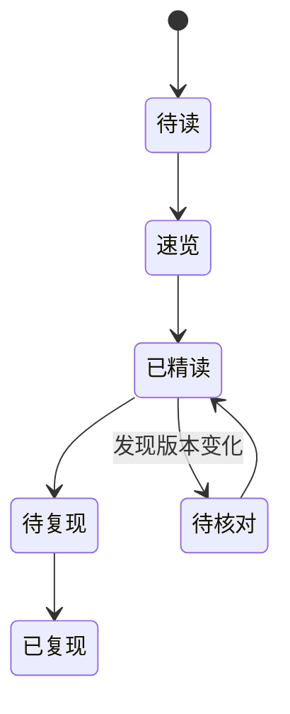

# 内容维护工作流

## 新增论文

1. 从 [Paper Card 模板](../guides/paper-card.md) 创建 Markdown。
2. 在 front matter 填写 `title/year/venue/resource_type/direction/status/tags`。
3. 资料不足时写“待核对”，不要补猜测。
4. 执行 `python scripts/build_indexes.py` 自动更新论文总索引。
5. 执行 `mkdocs build --strict` 检查导航、链接和配置。
6. 推送到 `main`，GitHub Actions 自动构建并部署。

## 文件命名

- 只使用小写英文、数字与连字符，例如 `vision-aware-head-divergence.md`。
- 文件名保持稳定；标题变化通过 front matter 更新，避免永久链接失效。
- PDF 不默认提交，只保留权威原文链接和版本信息。

## 内容状态

## 质量闸门

- 任何结果数字都能回到原文表格或本地实验记录。
- “visual dependence”与“factual correctness”分开表述。
- 外部 CLIP/detector 的结论不冒充模型内部机制。
- mitigation 必须同时报告 recall 与生成退化。
- 新论文至少给出一个可执行 follow-up experiment。
