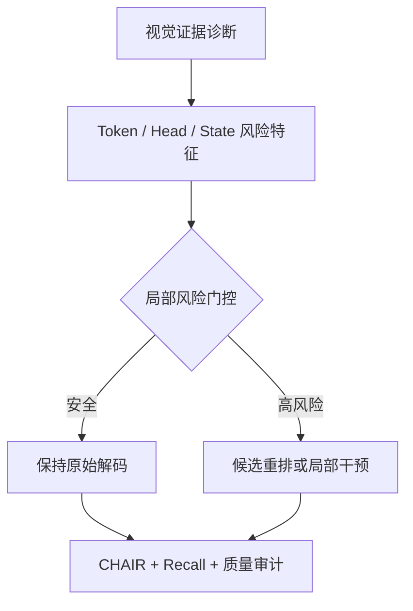

# Method Taxonomy

方法分类优先回答两个问题：**在哪里观察或干预**，以及**它试图修复哪种失效机制**。

| 方法族 | 典型位置 | 机制假设 | 主要风险 |
|---|---|---|---|
| Visual evidence diagnostics | image/token alignment | 幻觉 token 缺少局部视觉支持 | 外部 detector/CLIP 先验被误当作内部机制 |
| Attention head / path intervention | attention output、I2T/T2T path | 部分 head/path 过度放大语言先验或忽略视觉 | attention 不等于因果贡献，静态缩放损害 recall |
| Representation / activation editing | residual stream、MLP、KV | 错误语义在中间表征中被写入或放大 | 全局方向不适合逐样本干预 |
| Contrastive / logit decoding | next-token logits | 有图/无图或强/弱视觉分支的差异可抵消语言先验 | 对比分支可能引入无关噪声与流畅度下降 |
| Output detection / reranking | claim、candidate、sentence | 高风险候选可在不改模型参数时被过滤或重排 | detector 偏差、候选覆盖不足 |
| Training / data alignment | SFT、preference、negative data | 数据与对齐阶段决定视觉忠实度 | 训练成本高、机制解释较弱 |

## 当前重点路线

进一步阅读：[方法论文索引](../library/methods.md)、[研究方向](../directions/index.md)。
