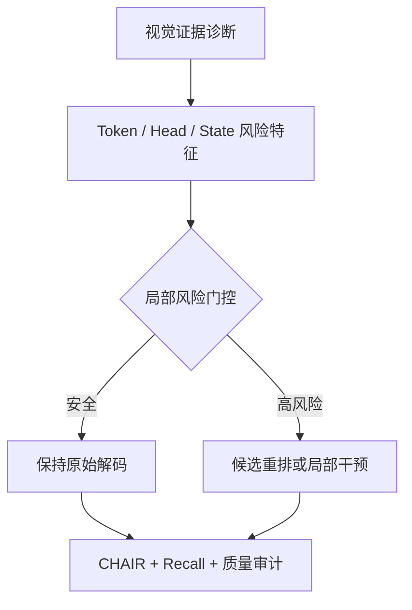

# Method Taxonomy

方法分类优先回答两个问题：**在哪里观察或干预**，以及**它试图修复哪种失效机制**。

| 方法族 | 典型位置 | 机制假设 | 主要风险 |
|---|---|---|---|
| Visual evidence diagnostics | image/token alignment | 幻觉 token 缺少或误读局部视觉支持 | 外部 detector/Logit-Lens 可读性被误当作因果使用 |
| Attention head / path intervention | attention output、I2T/T2T path | 部分 head/path 偏离 faithful role 或过度放大先验 | attention 不等于因果贡献，静态缩放损害 recall |
| Representation / activation editing | residual stream、MLP、KV | 错误语义在中间表征中被写入或放大 | global direction 不适合逐样本，动态探针增加成本 |
| Contrastive / logit decoding | next-token logits | 有图/无图或强/弱视觉分支的差异可抵消语言先验 | 对比分支可能引入无关噪声与流畅度下降 |
| Output detection / reranking | claim、candidate、sentence | 高风险候选可在不改模型参数时被过滤或重排 | detector 偏差、候选覆盖不足 |
| Training / data alignment | SFT、preference、negative data | 数据与对齐阶段决定视觉忠实度 | 训练成本高、机制解释较弱 |

## 当前重点路线

```mermaid
flowchart TD
    A[视觉证据诊断] --> B[Token / Head / State 风险特征]
    B --> C{局部风险门控}
    C -->|安全| D[保持原始解码]
    C -->|高风险| E[候选重排或局部干预]
    D --> F[CHAIR + Recall + 质量审计]
    E --> F
```

进一步阅读：[方法论文索引](../library/methods.md)、[研究方向](../directions/index.md)。

## 新增方法映射

| 论文 | 主要位置 | 诊断 / 干预 |
|---|---|---|
| [HEAL](../papers/heal-synergy-heads.md) | head output + visual/text value vectors | 四状态反事实贡献分解；动态 synergy-head 模态平衡校准 |
| [PatchGate](../papers/patchgate.md) | late-layer patch states + next-token logits | prompt-free 对象 inventory；ESI 召回遗漏、EDE 抑制弱证据提及 |
| [SADT](../papers/same-attention-different-truths.md) | visual token attention + LM head | LLCC 语义一致性；HARM/VEED 分型缓解 |
| [VISOR](../papers/visor.md) | real/null-image logits + layer states | signed visual margin/SNR；Calib/Abstain/Adapt |
| [Beyond Global Editing](../papers/beyond-global-editing.md) | residual hidden states | 多低秩子空间的逐样本 soft projection |
| [Role-Break](../papers/role-break-attention-heads.md) | per-head source allocation | faithful-role residual + linear detector |
| [AdaIAT](../papers/adaiat.md) | per-head generated-text attention | 离线对象级真/幻觉校准；生成时按层门控增强历史文本attention |
| [HulluEdit](../papers/hulluedit.md) | top-layer residual hidden state | 当前视觉低秩子空间 + 正交anti-prior；逐token收缩其余分量 |

## 既有分类内的补齐

| 论文 | 既有方法族 | 观察/干预 | 证据边界 |
|---|---|---|---|
| [FLB](../papers/first-logit-boosting.md) | Contrastive / logit decoding（其中logit editing） | 首步logits逐步回注 | 不运行contrastive分支；语言偏置和视觉作用混合 |
| [PTI](../papers/prefill-time-intervention.md) | Representation / activation editing | prefill KV | 离线标注方向；F1/长度权衡 |
| [AdaIAT](../papers/adaiat.md) | Attention head / path intervention | generated-text attention | 无参数更新但需离线对象标签校准；位置、重复与错误prefix可混淆 |
| [HulluEdit](../papers/hulluedit.md) | Representation / activation editing | online low-rank subspace | 代数正交不等于语义保护；论文硬门控与代码连续门控不一致 |

本轮未改变taxonomy或既有标签；两篇均可由既有方法族表达。
