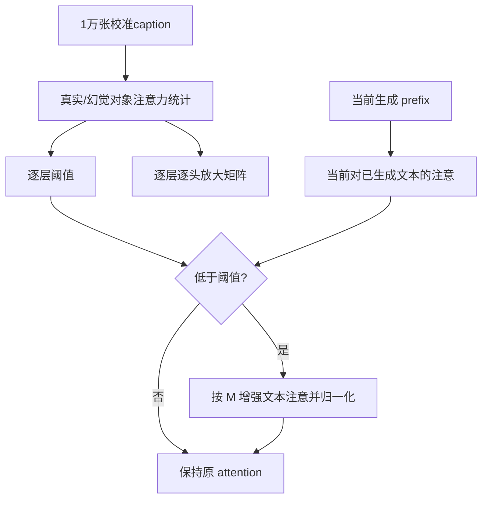

# AdaIAT

CVPR 2026 主会Attention / Head离线监督校准automated

[论文原文](https://openaccess.thecvf.com/content/CVPR2026/html/Zhong_AdaIAT_Adaptively_Increasing_Attention_to_Generated_Text_to_Alleviate_Hallucinations_CVPR_2026_paper.html){ .kb-button .primary } [arXiv v1](https://arxiv.org/abs/2603.04908v1){ .kb-button } [官方代码](https://github.com/XianguiKang/AdaIAT){ .kb-button }

<strong>一句话总结</strong>
不是继续放大图像 token，而是在中层检测“对已生成文本注意不足”时逐头增强文本注意；LLaVA-1.5-7B 的 CHAIRs 49.0→31.4、F1 77.9→79.4、Distinct-1维持0.60，但门控阈值和逐头幅度来自1万张COCO的真实/幻觉对象标签，机制仍受对象位置、重复和前缀质量混淆。

## 官方方法概览图

<figure class="paper-figure"><figcaption>官方 Figure 2 对比 PAI 的图像注意放大、标准解码与 AdaIAT 的文本注意门控。未确认原图独立再分发许可，本页不复制；以下是<strong>本站等价抽象</strong>。</figcaption></figure>

## 1. 论文速览

| 维度 | 内容 |
|---|---|
| 研究对象 | 详细 caption 中的对象幻觉与图像注意干预导致的重复；补充属性/关系评测 |
| 核心归因 | 真对象生成时，对已生成文本 (T_p) 的平均注意显著高于幻觉对象；历史文本包含经LLM重组的视觉信息 |
| 方法类型 | 不更新参数；离线用标签统计阈值/逐头比率，在线条件性改 attention weights |
| 干预位置 | LLaVA 中间层5–18，当前 query 到已生成文本 token 的注意 |
| 外部依赖 | 校准需 COCO ground-truth 对象匹配；OpenCHAIR/HalluBench含外部LLM评价 |
| 主要评测 | CHAIR、OpenCHAIR、HalluBench、IIW-400；四个7B/13B模型设置 |
| 最适合角色 | attention intervention 必比基线；“文本历史也是视觉载体”的机制假设 |

## 2. 研究背景与核心矛盾

### 2.1 研究的 hallucination

主分析把生成对象 token 按 COCO 标注分成真实/幻觉，并聚合它们对图像 token (V) 与已生成文本 (T_p) 的注意。CHAIR只覆盖封闭对象词表；OpenCHAIR用生成数据和LLM判断扩展开放词汇；HalluBench再覆盖属性、位置、关系。三套标签来源不同，不能把某一 attention 相关性无条件解释为所有幻觉的统一机制。

### 2.2 现有方法的缺口

PAI/HGAI 放大图像注意，可能相对压低历史文本注意，导致重复描述。AdaIAT 的反直觉贡献是把 (T_p) 视为模型已经压缩、语言化的视觉上下文。但正确 prefix 能提供真实证据，错误 prefix 也会把早期幻觉自我强化；论文主要评测单轮 caption，没有系统验证错误历史下的 snowball 风险。

### 2.3 核心假设与证据强度

| 假设 | 论文证据 | 证据类型 | 仍可能的混淆 |
|---|---|---|---|
| 真对象更依赖生成文本 | 10k COCO caption：LLaVA层5–18的真/假 attention 比约1.5–2.5；其他模型约2–3 | 分组相关性 | 对象位置、prefix长度、对象重复次数、词频与分词均未匹配 |
| 增强 (T_p) 可降低幻觉 | IAT/AdaIAT跨四模型 CHAIR 下降 | 干预 | 放大历史文本也改变长度、重复和对象提及倾向；不等于增强新视觉证据 |
| 阈值门控保护正常预测 | AdaIAT F1 高于 IAT，Table 4–5 参数扫描 | 组件/超参数 | 阈值由真实/幻觉标签监督得到；同域校准与测试独立性需确认 |
| 逐头比率是可迁移方向 | 每个模型分别统计矩阵并获得改善 | 模型内干预 | 没有跨模型复用矩阵；比率大可能来自分母很小或混淆变量 |

## 3. 方法详解

### 3.1 整体流程

对10,000张 COCO 2014 图像生成 caption，用 ground truth 匹配出真实/幻觉对象 token；统计每层每头从当前 token 到历史生成文本的平均注意 (A^r_{T_p},A^h_{T_p}\in\mathbb R^{L\times H})。在线生成时，只在中层监控当前对 (T_p) 的注意总量，低于层阈值才触发；触发后按每头的真实/幻觉比率放大 (T_p) 的 attention probabilities 并重新归一化。

### 3.2 关键量与公式

设当前预测位置为 (t_{n+1})，已生成文本 token 集为 (T_p=\{t_1,\ldots,t_n\})。论文对层 (l)、头 (h) 定义每 token 平均 attention：

\[
A^{(l,h)}_{T_p}=\frac1n\sum_{i:\mathcal I(i)\in T_p}A^{(l,h)}(i).
\]

按真实/幻觉对象集合分别平均，得到 (A^r_{T_p},A^h_{T_p})。层阈值和逐头幅度为

\[
\mathcal T^{(l)}=\bar A^{h,(l)}_{T_p}+\beta\bigl(\bar A^{r,(l)}_{T_p}-\bar A^{h,(l)}_{T_p}\bigr),\qquad
\mathcal M^{(l,h)}=\frac{A^{r,(l,h)}_{T_p}}{A^{h,(l,h)}_{T_p}}.
\]

若当前层平均文本注意低于 (\mathcal T^{(l)})，则对 (i\in T_p)：

\[
A^{(l,h)}(i)\leftarrow A^{(l,h)}(i)\bigl(1+\alpha(\mathcal M^{(l,h)}-1)\bigr),
\]

再对完整 key 维归一化。LLaVA 主配置为层5–18、α=6、β=0.5。这里的 α 与 IAT/PAI 在 pre-softmax logits 上的放大系数不在同一尺度，不能横向比较数值大小。

### 3.3 实现细节

官方 commit `a0bf78e8c8c98bcc740bdb00a9d43ba05de64798` 提供 LLaVA、Janus、Qwen 分支和预计算 `.pt` 统计。LLaVA 的 `methods/AdaIAT.py` 先 softmax，再按当前层所有 heads 对 (T_p) 的平均/求和与阈值比较；触发后逐头乘因子并归一化。`chair_generate.py` 对已生成文本用固定 token split（LLaVA `[625:]`），因此换聊天模板、视觉token数或 tokenizer 时必须重新确认边界。

代码只为 `llava-v1.5-7b` 的主脚本完整加载预计算文件；其他模型需要各自分支/自行设置。仓库需要替换 Transformers 的 generation/attention 文件，且部分默认路径需用户修改。预计算矩阵存在使最小复现可行，但统计生成脚本、校准图像ID、对象对齐细节与完整环境没有形成单一端到端流程。

补充 Table 1 报告 AdaIAT 114.0 ms/token、Greedy 109.8 ms/token；仓库内500图 timing summary 对应 25,500 tokens，与表格一致到一位小数。该结果只适用于作者硬件/实现；输出每图恰为51 tokens，提示可能触及统一长度上限，仍需在自然终止输出上复测。

### 3.4 方法究竟改变了什么

AdaIAT 增强的是**模型自己已写入 prefix 的信息**，可能同时包含视觉事实、语言连贯性和已有错误。它能减少 PAI/HGAI 因相对忽视 prefix 而产生的重复，但不等于从图像检索新证据。层/头矩阵基于真实与幻觉标签，是监督校准产物；“training-free”仅指不更新权重，而非 zero-data、zero-label 或 zero-tuning。

## 4. 实验设计与关键结果

### 4.1 设置

| 项目 | 内容 |
|---|---|
| Models | LLaVA-1.5-7B/13B、Janus-Pro-7B、Qwen2.5-VL-7B |
| Calibration | 每模型10,000张 COCO 2014 caption；LLaVA-7B 得22,015真对象、9,473幻觉对象 |
| CHAIR | 随机500张 COCO；Please describe the image in detail；max tokens=512；greedy和sampling |
| OpenCHAIR | 2,000张；对象由LLM按ground-truth caption判断；外部 evaluator 版本需冻结 |
| Other | HalluBench 200张 + GPT-4；IIW-400 用 Distinct-1、Self-BLEU、BERTScore |
| Baselines | Greedy、PAI、HGAI；补充 VCD、AGLA、OPERA、LURE |
| Statistical evidence | 未报告多 seed、配对CI或显著性；超参数在500图上广泛扫描，独立验证/测试边界不清 |

### 4.2 主结果

| 设置 / 指标 | Greedy | AdaIAT | 变化 / 解读 | 来源 |
|---|---:|---:|---|---|
| LLaVA-1.5-7B，CHAIRs (C_S) ↓ | 49.0 | 31.4 | −17.6 pp（−35.9%相对） | Table 1 |
| LLaVA-1.5-7B，CHAIRi (C_I) ↓ | 13.3 | 8.3 | −5.0 pp（−37.6%相对） | Table 1 |
| LLaVA-1.5-7B，对象 F1 ↑ | 77.9 | 79.4 | +1.5 pp | Table 1 |
| LLaVA-1.5-7B，Distinct-1 ↑ | 0.60 | 0.60 | 持平；PAI/HGAI均为0.50 | Table 1 |
| LLaVA-1.5-13B，CHAIRs ↓ | 47.8 | 25.2 | −22.6 pp | Table 1 |
| Janus-Pro-7B，CHAIRs ↓ | 25.8 | 19.0 | −6.8 pp | Table 1 |
| Qwen2.5-VL，CHAIRs ↓ | 33.6 | 28.4 | −5.2 pp；PAI为32.0 | Table 1 |
| OpenCHAIR LLaVA-7B，(C_O) ↓ | 0.292 | 0.252 | −0.040；D1 0.61不变 | Table 2 |
| 时间 ms/token ↓ | 109.8 | 114.0 | +3.8%；不含离线统计 | Supplement Table 1 |

### 4.3 消融与分析实验

| 实验 | 对照 / 唯一变量 | 关键结果 | 能支持什么 | 仍不能证明什么 | 来源 |
|---|---|---|---|---|---|
| IAT强度 | α=0.6→1.0 | CS 36.4→13.6，但F1 78.1→68.4、D1 0.62→0.52 | 幻觉—覆盖/语言明确权衡 | 低CS不等于更忠实完整 | Table 4 |
| AdaIAT强度 | α=4→8 | CS 34.6→29.4，F1在α=6最高79.4，D1随后0.59 | 门控缓和强干预退化 | α=6由同一500图选择，泛化需独立检验 | Table 4 |
| 门控阈值 | β=0.1→1.5 | β=0.5时CS31.4/F1 79.4；过高后各项变差 | 条件触发重要 | 未报告实际触发率/错误类型 |
| 层范围 | 0–5、18–31、0–18、5–31、5–18 | IAT跨层强干预可使CS 1.1但F1 30.3、D1 .036；AdaIAT 5–18最平衡 | 中层选择避免模型崩坏 | 固定层号不必跨架构成立 | Table 6 |
| 文本质量 | PAI/HGAI/IAT/AdaIAT | Self-BLEU 0.242/0.247/0.090/0.071；Greedy0.058 | AdaIAT比图像放大少重复 | Self-BLEU与事实正确不同 | Table 3 |
| OpenCHAIR跨模型 | 四模型比较 | Qwen (C_O)：AdaIAT .315，PAI .303 | 并非每个模型/指标最优 | 不能宣称一致SOTA | Supplement Table 2 |

### 4.4 结果应该如何解读

能够支持：在论文的 COCO-derived 校准和 caption 协议中，增强 prefix attention 比增强图像 attention 更能保留词汇多样性，门控/逐头缩放改善了固定 IAT 的 F1。不能支持：attention差异是幻觉根因；(T_p) 总是忠实视觉摘要；方法无需标注或调参；相同统计矩阵可跨模型/语言/模板迁移；属性、关系和推理都由同一机制解决。

## 5. 亮点与贡献

论文揭示了一个对设计很有用的反例：图像注意更多并不自动带来更好 caption，可能压缩历史文本而造成重复。主表同时报告 CHAIR、对象F1和Distinct-1，附录给出强度导致模型崩坏的完整曲线，比只展示最优幻觉率更有价值。

## 6. 局限、指标漏洞与审稿风险

- **相关性混淆**：真对象通常更早、更常重复或有更清晰 prefix；未做位置、对象频率、重复次数和prefix长度分层，注意力均值可能出现聚合偏差。
- **错误放大**：如果 (T_p) 已含幻觉，增强它可能造成 snowball；没有反事实污染 prefix 的实验。
- **监督/泄漏边界**：阈值与矩阵依赖真实/幻觉标签，校准10k COCO与CHAIR 500图是否按 image ID 严格不重叠未公开；超参数也在500图上选择。
- **指标范围**：Distinct-1对长度敏感，不充分描述语义多样性；OpenCHAIR和HalluBench依赖外部LLM，版本/prompt需冻结。
- **迁移成本**：每模型均需重新统计 (L\times H) 矩阵；改变模型、聊天模板或token布局后不能直接复用。
- **代码可移植性**：固定 split、替换 Transformers 文件与不完整多模型入口增加复现风险；主分析数据生成流程需补齐。
- **统计**：无随机seed、配对bootstrap或显著性检验，表中1–2 pp差异不能自动当作稳健提升。

## 7. 与我的研究关系

只比较公开方法；个人未公开研究适配 UNKNOWN。

### 7.1 可直接借鉴

适合用于检验“增强视觉注意是否足够”的反方向基线，也可与 [HEAL](heal-synergy-heads.md)、[Role-Break](role-break-attention-heads.md) 和 [FLB](first-logit-boosting.md) 比较：AdaIAT依赖历史文本的监督统计，HEAL/Role-Break定位 head 功能偏移，FLB复用首步 logits。三者都应同时测重复、coverage和prefix位置混淆。

### 7.2 Baseline 决策

**High（attention intervention/长caption）**。核心运行开销低，且提供预计算统计；但公平复现必须把离线10k图校准成本和标签依赖计入，并使用独立 tuning/test 图像。对短答案或第一输出 token，(T_p) 尚无内容，baseline价值较低。

### 7.3 与已有路线的差异

它不直接增强 image-token mass，而将已生成文本当作视觉信息的语言域代理。与 real/null/counterfactual image 路线不同，AdaIAT没有直接测有图/无图分布差；可用 null/错配图实验判断文本注意收益究竟来自视觉摘要还是纯语言连贯性。

### 7.4 面向 CVPR 投稿的可借鉴证据

**论文实际证据**包括机制观察、图像注意强基线、跨模型、超参数/层范围崩坏曲线与语言质量；**本站建议**是增加分层统计、污染prefix反事实、独立校准集、实际触发率和跨模板迁移。官方 CVPR 2027 CFP要求高质量原创工作，但截至本轮独立 Reviewer Guidelines 未发布；这些建议不是录用保证。

## 8. 可执行的后续实验

| 实验 | Research question | Model / data | Intervention / comparison | Recorded outputs | Expected observation | Failure case | Cost |
|---|---|---|---|---|---|---|---|
| E1 | 注意差异是否由位置/重复混淆？ | 已生成500图attention日志 | 按token位置、对象首次/重复、长度分层 | 分层效应、Simpson反转、bootstrap CI | 分层后仍有稳定差异 | 差异消失或反转 | Low：只需日志分析 |
| E2 | (T_p) 是视觉摘要还是语言记忆？ | 100图 | real/null/错配图，保持同prefix；或交换caption prefix | CHAIR/F1、对象logit、触发率 | real图+匹配prefix最好 | null/错配同效，说明主要是语言先验 | Low–medium |
| E3 | 错误prefix会否雪崩？ | 100图共同前缀 | 注入一个真假对象，再启用/关闭AdaIAT | 错误延续率、纠错率、后续recall | 真prefix增益、假prefix能被抑制 | 假对象被持续强化 | Low |
| E4 | 校准能否跨域/模板？ | COCO→AMBER，2种聊天模板 | 固定矩阵 vs 重新校准 | F1、D1、触发率、层头排序 | 固定矩阵保持排序 | 性能依赖模板/域 | Medium：无需训练 |
| E5 | 低算力最小版是否足够？ | 7B，100图 | 逐层阈值、全局阈值、top-k heads、完整矩阵 | Pareto与时延 | 少数head接近full | 全矩阵不可压缩 | Low |

## 9. 复现清单

- [x] CVF 正文 Tables 1–6 与补充 Tables 1–10、Figures 1–14 已核对。
- [x] arXiv v1、CVPR主会页和官方 commit 已记录。
- [x] 主结果同时登记 F1、Distinct-1、时间与强干预失败区。
- [x] 预计算矩阵、固定 token split 和模型特定入口已核对。
- [ ] 校准/测试 image IDs、seed、对象token对齐与外部 evaluator 快照待冻结。
- [ ] 未运行模型，不声称复现成功。

## 10. 综合评分

| 维度 | 评分（1–5） | 理由 |
|---|---:|---|
| 直接相关性 | 5 | attention干预、对象幻觉与长输出质量直接相关 |
| 新颖性 | 4 | 以生成文本而非图像token作为条件增强目标 |
| 机制证据 | 3 | 干预支持方向，但分组注意统计存在强混淆 |
| 实验完整性 | 4 | 多模型、多质量指标和崩坏曲线；统计/数据隔离不足 |
| 可复现性 / 低算力 | 3 | 在线很轻；离线标签统计和代码移植成本不可忽略 |
| 相对知识库新增信息 | 5 | 补齐“文本历史作为视觉代理”与重复权衡 |

## 11. 检索标签与来源边界

依据 [CVF 正文](https://openaccess.thecvf.com/content/CVPR2026/papers/Zhong_AdaIAT_Adaptively_Increasing_Attention_to_Generated_Text_to_Alleviate_Hallucinations_CVPR_2026_paper.pdf)（pp.11076–11085）、[CVF 补充](https://openaccess.thecvf.com/content/CVPR2026/supplemental/Zhong_AdaIAT_Adaptively_Increasing_CVPR_2026_supplemental.pdf)、arXiv v1 与官方 commit `a0bf78e`。截至2026-10-10未发现可归属的公开评审/rebuttal 页面；第三方论文解读未作为技术结论来源。

所有有关混淆、泄漏、迁移和后续实验的判断均为本站推断。标签：inference-only、offline supervised calibration、attention intervention、no external model online、baseline-high。
