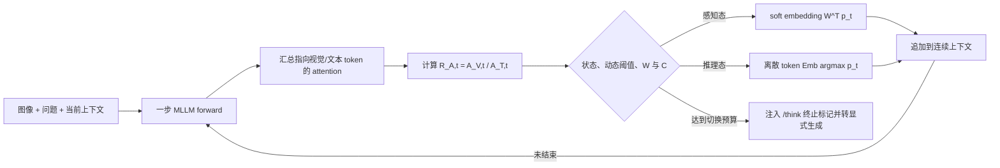

# Balancing Efficiency and Efficacy

ACM MM 2026Token / AttentionTraining-free已精读

[论文原文](https://arxiv.org/abs/2608.03450){ .kb-button .primary } [官方代码](https://github.com/swordAndSnow/MM26-AGS){ .kb-button }

<strong>一句话总结</strong>
AGS 不再用 token entropy 决定何时进入 latent reasoning，而以每步视觉 token 与文本 token 的平均注意力比判断当前更像“感知”还是“逻辑推理”：感知阶段传播概率加权的 soft embedding，推理阶段生成离散 token，并用最小显式窗口和最大切换预算约束振荡与终止。

## 官方方法概览图

<figure class="paper-figure">
  
  <figcaption>官方方法总览（论文 Figure 3）。图片直接转换自 <a href="https://arxiv.org/abs/2608.03450">arXiv v1</a> 官方 LaTeX source package 中的 <code>sections/imgs/Figure3.pdf</code>；左侧是整体推理轨迹，右上给出注意力比的计算，右下展示两个方向的切换条件。点击查看原图。</figcaption>
</figure>

图的输入是视觉 token、问题 token 与已经生成/传播的推理状态。每一步从全层全头 attention 中分别汇总指向视觉上下文和文本上下文的平均质量，形成 (R_{A,t})。当该比值相对当前阶段锚点较高时，路由器把下一步送往 latent perception，不落成单个词；比值下降则回到 explicit logic，输出可读离散 token。图中两个曲线框不是额外分类器，而是同一动态阈值在两个方向上的触发示意；(W) 与 (C) 分别控制最短显式持续时间与最大切换次数。

## 1. 论文速览

| 维度 | 内容 |
|---|---|
| 研究对象 | 显式多模态 CoT 的冗长、视觉信息离散化损失与 hallucination；training-free latent reasoning 的路由不稳 |
| 核心归因 | token entropy 把“看不清”与“想不明白”混成同一种不确定性；跨模态 attention allocation 更接近当前 token 的功能角色 |
| 方法类型 | 纯推理时、逐 token 的显式/潜在混合路由 |
| 干预位置 | 自回归输入 embedding：硬 token lookup 与概率加权 soft embedding 二选一 |
| 外部依赖 | 无 detector、无额外训练；需要模型暴露所有层/头的 attention 与词嵌入矩阵 |
| 主要评测 | MathVerse、MathVision、MathVista、WeMath、M³CoT、ScienceQA、V* 与 POPE；Accuracy + 平均 generation steps |
| 最适合角色 | training-free latent reasoning、attention-guided routing 与效率—正确率联合 baseline |

## 2. 研究背景与核心矛盾

### 2.1 研究的 hallucination

论文主线是多模态推理，不是专为 hallucination 建模：显式 CoT 把连续视觉概念过早压成词，可能遗漏细节并让后续语言链在自身历史上漂移。作者用 POPE 单独检查 object-existence hallucination，其余六个主 benchmark 测量答案准确率，不能把这些 accuracy 增益直接解释成 hallucination 全面下降。属性、关系、计数与长描述中的具体错误并未被逐类标注。

### 2.2 现有方法的缺口

已有 latent-reasoning 方法常需训练、教师监督或额外数据；training-free LLM 路由则常用输出分布 entropy。对 MLLM，高 entropy 既可能来自小物体/角度难辨，也可能来自下一步数学推导有多个候选。若两者一律进入同一种模式，路由信号没有区分感知与逻辑。AGS 的问题重构是：模式选择需要回答“当前在向哪里取证”，而非只问“下一个词有多不确定”。

### 2.3 核心假设与证据强度

| 假设 | 论文证据 | 证据类型 | 仍可能的混淆因素 |
|---|---|---|---|
| 高 (R_A) 对应感知型 token | Figure 2 的几何样例中峰值与角度/空间词对齐 | 相关性可视化 | 个例；词性、位置、序列长度也会改变 attention |
| attention ratio 比 entropy 更适合路由 | Table 3：四任务平均 Acc 70.7→74.7，steps 864→815 | 组件替换消融 | 两种方法的阈值与预算是否完全等算力仍需审计 |
| latent perception 减少离散化损失 | 主表上的准确率与步数联合改善，Figure 4 个例 | 行为结果 + case study | 可能来自截短冗长 CoT、改变采样轨迹或正则化，而非“保真视觉”本身 |
| AGS 降低对象幻觉 | 六个模型在 POPE 上提高 0.1–1.1 点 | benchmark 结果 | 增益小，未报告 seed/CI；POPE 不能覆盖开放式描述幻觉 |

## 3. 方法详解

### 3.1 整体流程

### 3.2 关键量与公式

设视觉、文本位置集合为 (mathcal I_v,mathcal I_t)，层数和头数为 (N_l,N_h)，第 (t) 个 query 在第 (l) 层第 (h) 头对位置 (j) 的 attention 为 (alpha_{t,j}^{(l,h)})。作者先按 token 数、层数与头数归一化：

\[
A_{V,t}=\frac{1}{|\mathcal I_v|N_lN_h}\sum_{l,h}\sum_{j\in\mathcal I_v}\alpha_{t,j}^{(l,h)},\qquad
A_{T,t}=\frac{1}{|\mathcal I_t|N_lN_h}\sum_{l,h}\sum_{j\in\mathcal I_t}\alpha_{t,j}^{(l,h)},
\]

\[
R_{A,t}=\frac{A_{V,t}}{A_{T,t}}.
\]

按位置取平均可削弱视觉 token 通常远多于文本 token 的长度偏差，但它也把所有层和头视为等权。比值高表示当前 query 对单个视觉 token 的平均依赖更强；它不是视觉证据正确性的概率，也不等于视觉 value 经过 (W_O) 后真的写入了相关 logit。

在 latent 模式，模型不做 (argmax) 再查表，而以词表概率 (mathbf p_t\in\mathbb R^{|\mathcal V|}) 和 embedding 矩阵 (mathbf W\in\mathbb R^{|\mathcal V|\times d}) 形成

\[
\tilde{\mathbf e}_t=\mathbf W^\top\mathbf p_t\in\mathbb R^d.
\]

这一步仍需一次完整 forward，只是没有输出可见 token；“少生成词”不等于“零计算”。论文用 generation steps（包含 latent step）而非 visible token count 计成本，较为公平，但端到端 latency、attention 导出开销和显存峰值仍需实测。

### 3.3 路由与终止

每次最近切换发生于 (t_k)，当前阶段阈值取该阶段首 token 的 (R_{A,t_k})。(R_{A,t}\ge\tau_k) 时走 latent perception；更低时走 explicit logic。若刚进入显式模式，则至少保持 (W=512) 步，避免逐步振荡；累计切换达到 (C=4) 时只注入一次 `</think>` 的 embedding，随后保持标准显式生成，以保证终止。统一状态式还把“达到预算”并入显式分支，因此实现时必须精确区分切换计数更新前后，避免重复注入终止标记。

### 3.4 方法究竟改变了什么

AGS 同时改变三件事：是否把当前概率分布压成一个离散 token、后续 KV/context 接收到的 embedding 轨迹、以及可见 CoT 的长度。它并没有直接修正输出 logits，也不选择某个“视觉 head”。因此准确率提高可以支持“该路由策略有效”，但不能单凭结果证明 soft embedding 保存了真实视觉细节。需要 real/blank image 对照、visual-token value patching 和等长度显式 CoT 才能排除长度与轨迹正则化解释。

## 4. 实验设计与关键结果

### 4.1 设置

| 项目 | 内容 |
|---|---|
| Models | Qwen3-VL-Thinking 2B/4B/8B；InternVL3.5 2B/4B/8B |
| Benchmarks | MathVerse、MathVision、MathVista、WeMath、M³CoT、ScienceQA；附加 V* 与 POPE |
| Metrics | Accuracy ↑；平均 autoregressive generation steps ↓，latent step 也计数 |
| Baselines | Explicit CoT；entropy routing；同 checkpoint 的 LEAD |
| Config | RTX A6000；max length 4096；(W=512,C=4)；显式 token multinomial sampling，temperature 0.6 |
| Ablations | routing metric、maintenance window、switch budget；latent trajectory 的相邻 embedding cosine similarity |
| Statistical evidence | 正文/表格未报告多 seed、置信区间或显著性检验 |

### 4.2 主结果

| 设置 | Explicit CoT | AGS | 变化 | 来源 |
|---|---:|---:|---:|---|
| Qwen3-VL-4B，六任务平均 Acc | 45.1 | 56.8 | +11.7 pt | Table 1 |
| Qwen3-VL-4B，平均 steps | 2635 | 1067 | −59.5% | Table 1 |
| Qwen3-VL-8B，六任务平均 Acc | 51.7 | 58.8 | +7.1 pt | Table 1 |
| Qwen3-VL-8B，平均 steps | 2214 | 953 | −57.0% | Table 1 |
| InternVL3.5-8B，六任务平均 Acc | 55.7 | 55.8 | +0.1 pt | Table 1 |
| InternVL3.5-8B，平均 steps | 320 | 258 | −19.4% | Table 1 |
| Qwen3-VL-8B，四任务 entropy→attention ratio Acc | 70.7 | 74.7 | +4.0 pt | Table 3 |
| 同上，steps | 864 | 815 | −5.7% | Table 3 |

POPE 上六个配置均有准确率小幅提升：例如 InternVL3.5-8B 从 82.8 到 83.9，同时 steps 79→76；Qwen3-VL-2B-Thinking 从 86.8 到 87.2，steps 112→104。唯一效率例外是 InternVL3.5-2B，steps 78→79。这里更合理的结论是“未观察到系统性的 object-hallucination 恶化且有小幅改善”，而不是强因果地宣称 AGS 已解决 hallucination。

### 4.3 消融与分析实验

- (W) 呈倒 U 型：过短会在逻辑链完成前返回 latent，过长则恢复冗长文本漂移；作者据此选 512。
- (C) 同样存在中间最优，(C=4) 在其设置中达到较好准确率/成本平衡；它是全局固定超参，不保证跨模型最优。
- 相邻 embedding cosine 未塌到 1，说明 latent trajectory 在变化，但“不塌缩”不等于携带正确视觉信息。
- 同 checkpoint 比较 LEAD 时，AGS 在四个 benchmark 都更省 steps，并在 V*、ScienceQA、M³CoT 更准；WeMath 则 LEAD 72.5 高于 AGS 69.4，不能概括成所有任务全面占优。

### 4.4 结果应该如何解读

论文能够支持：注意力比在所测模型上是比 entropy 更好的 training-free 切换信号；对长 CoT 的 Qwen3-VL 收益尤其明显；显式与潜在混合可以改善准确率—步数 Pareto。论文不能据此证明：所有高 ratio token 都是正确感知、attention 是 causal explanation、latent embedding 保留了图像中正确对象，或方法能迁移到闭源模型、不同 attention 实现及长描述任务。

## 5. 亮点与贡献

- 把 multimodal latent reasoning 的关键问题从“置信度门控”改写成“感知/推理功能门控”，研究问题清晰。
- 指标无需额外训练或外部视觉模型，并显式纠正视觉/文本 token 数量差异。
- 不只报告 visible tokens，还把 latent forward 纳入 generation steps；比只看输出长度更诚实。
- 在两类不同 CoT 长度分布、三个尺度上评估，并含 entropy、LEAD、窗口和预算对照。
- 对本知识库很有价值：它把 attention statistic 直接接到 representation-level intervention，为 token/head/logit 的联合反事实提供天然实验接口。

## 6. 局限、指标漏洞与审稿风险

1. **Attention ≠ evidence contribution**：全头均值可能被大量无关头稀释，也忽略 value/output projection 的方向与符号。
2. **Dynamic threshold 脆弱性**：以阶段首 token 作单点锚，若首步异常，整段路由会偏移；缺少 EMA、分位数或校准集对照。
3. **效率指标不完整**：导出全层全头 attention 会增加内存与 kernel 开销；steps 下降不自动等价于 wall-clock/energy 同比下降。
4. **采样方差未量化**：temperature 0.6 + multinomial sampling 下未报告多 seed/CI，较小的 POPE 增益可能落在随机波动内。
5. **幻觉证据有限**：POPE 是二元 object existence QA；对开放式 caption、attribute/relation 与 reasoning-chain factuality 缺少细粒度标注。
6. **机制替代解释**：soft embedding 可能只是平滑/温度效应；强制 `</think>` 也可能通过缩短链条减少错误，而非增强视觉 grounding。
7. **可部署性边界**：需要 attention 与 embedding 权重，FlashAttention/闭源 API 或仅输出 logits 的服务难以直接使用。
8. **超参数迁移**：固定 (W=512,C=4) 对短链 InternVL 的意义不同于长链 Qwen；当前结果已显示收益幅度依赖模型族。

## 7. 与我的研究关系

### 7.1 可直接借鉴

把 (R_{A,t}) 与 real-image / blank-image 的 token logit 差、head output divergence、residual logit lens 并排记录。若高 (R_A) 但真实/空白图像 logits 几乎不变，说明 attention ratio 把“看向视觉位置”误当成“读取有区分力的视觉证据”；反之，高 ratio 且 counterfactual Δlogit 明显的步骤才更可信。还可把全头均值拆为 head-wise (R_{A,t}^{(l,h)})，用 role-break/hallucination-head 集合加权，再检查路由是否更稳定。

### 7.2 Baseline 决策

**适合度：High。** 它是 training-free latent/explicit routing 的直接 baseline，官方代码已公开，核心 hook 与本项目的 attention/token logging 高度重合。最小复现可先用 Qwen3-VL-4B-Thinking，在 ScienceQA + WeMath 小样本记录 accuracy、steps、latency、peak memory、visible length 与 POPE；避免一开始复跑六模型全矩阵。

### 7.3 与已有路线的差异

AGS 用当前上下文内部的 attention allocation 做门控，而 real/blank 或 counterfactual image 路线用输入干预测视觉依赖。前者便宜、在线，后者证据更接近因果但多一次或多次 forward。最值得探索的是级联：先用 (R_A) 作高召回筛选，只在候选步骤计算 counterfactual Δlogit，再决定是否进入 latent perception，从而减少额外计算并降低 attention proxy 的误报。

## 8. 可执行的后续实验

| 实验 | Research question | Model / data | Intervention / comparison | Recorded outputs | Expected observation | Failure case | Cost |
|---|---|---|---|---|---|---|---|
| E1 反事实校准 | (R_A) 是否真的预测视觉依赖？ | Qwen3-VL-4B；POPE/WeMath | real vs blank/noise image；按 (R_A) 分桶 | token Δlogit、accuracy、AUROC | 高 ratio 桶有更大视觉反事实差 | ratio 只反映位置/词性 | Low |
| E2 Head-output ratio | value-aware 信号是否优于 attention 均值？ | 同上 | 原 (R_A) vs (W_Oh) 投影后的视觉贡献比 | routing trace、Acc/steps/latency | 少数视觉功能头加权更稳 | output 分解成本过高 | Medium |
| E3 等长度对照 | 收益是否只是缩短 CoT？ | Qwen3-VL-8B；四任务 | AGS vs 显式 CoT 强制同 steps/同 stop budget | Acc、错误类型、visible length | AGS 仍优则支持表示解释 | 同长度显式策略不公平 | Medium |
| E4 阈值稳健性 | 单点锚是否易受异常首 token 影响？ | 两模型族 | first-token、EMA、rolling quantile、校准阈值 | switch count、振荡率、Acc/steps | EMA/分位数降低方差 | 阈值延迟错过短感知段 | Medium |
| E5 风险门控融合 | counterfactual 信号能否只在必要处调用？ | POPE + CHAIR caption | AGS、Δlogit-only、(R_A\rightarrow\)Δlogit 级联 | CHAIR/Recall/POPE/latency | 级联改善幻觉—成本 Pareto | 额外 forward 抵消节省 | High |

## 9. 复现清单

- [x] arXiv v1、官方源码图号与公开代码入口已记录
- [ ] 冻结官方代码 commit、依赖版本与 attention backend
- [ ] 记录 prompt、split、seed、temperature 与 sampling RNG
- [ ] 验证 latent steps、visible tokens 与 wall-clock 的计数口径
- [ ] 同时报 accuracy、POPE/CHAIR、recall、输出长度、switch trace 与终止原因
- [ ] 对 (W,C) 做跨模型敏感性扫描，并保存逐 token (R_A)
- [ ] 检查全层全头 attention 导出的 peak memory 与 KV-cache 兼容性

## 10. 综合评分

| 维度 | 评分（1–5） | 理由 |
|---|---:|---|
| 新颖性 | 4/5 | 用跨模态注意力角色替代 entropy 门控，切中 MLLM 特有混淆 |
| 机制证据 | 3/5 | 有 metric ablation 与轨迹分析，但尚无 attention→视觉因果贡献验证 |
| 实验完整性 | 4/5 | 两模型族、多尺度、多任务与效率联合评测；统计报告偏弱 |
| 可复现性 | 4/5 | 公式、超参、源码与代码公开；底层 attention hook 仍可能版本敏感 |
| 与当前研究相关性 | 5/5 | 可直接结合 token logit、head output 与图像反事实信号 |

## 11. 检索标签与来源边界

`requires training: no` · `inference-only: yes` · `external detector: no` · `external evaluator: no for reported accuracy` · `interpretability: medium` · `mitigation: reasoning/hallucination` · `baseline suitability: high`

本文依据 2026-08-20 核对的 arXiv:2608.03450 v1、其官方 LaTeX source package 与作者摘要所列官方 GitHub 仓库整理；论文标注为 ACM MM 2026。方法主图是 source package 中 Figure 3 的直接 PNG 转换，没有重绘或增删。公式、实验数字与配置来自 v1 正文/表格；“attention 不等于证据贡献”、与 real/blank counterfactual 的融合及后续实验是本站分析。未发现可公开访问的同行评审页面，因此不推断审稿意见；代码入口已确认，但本轮尚未冻结具体 commit，也未独立复跑结果。
