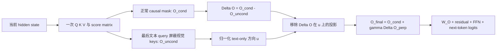

# Attention-Space Contrastive Guidance

CVPR 2026 FindingsAttention-space guidanceTraining-free已精读

[arXiv](https://arxiv.org/abs/2601.13707){ .kb-button .primary } [CVF 论文页](https://openaccess.thecvf.com/content/CVPR2026F/html/Jo_Attention-Space_Contrastive_Guidance_for_Efficient_Hallucination_Mitigation_in_LVLMs_CVPRF_2026_paper.html){ .kb-button }

<strong>一句话总结</strong>
ACG 将 classifier-free / contrastive guidance 从最终 logits 前移到 self-attention output：同一次 QKV 计算中保留正常 conditional path，同时仅对当前文本 query 屏蔽视觉 keys 得到近似 text-only path，再从两者差分中移除与 text-only 向量平行的分量，以单次 forward 强化视觉条件信号。

## 官方方法概览图

<figure class="paper-figure">
  
  <figcaption>官方方法对比总览（论文 Figure 1）。图片取自 <a href="https://arxiv.org/abs/2601.13707">arXiv v2</a> source package 的 <code>figure/main_fig_unbold.png</code>，仅将透明背景展平为白色以保证网页可读性，图内容未重绘。左上为双 forward logit guidance，右下为 ACG 的单-pass attention-space conditional/text-only 对比。</figcaption>
</figure>

图中 ACG 的两个路径并非两次模型运行：它们共享同一个 hidden state、Q/K/V 与 score matrix，只为最后文本 query 重算一份屏蔽视觉 key 的 softmax。这样节省了第二次 LVLM forward，但仍需在被干预层计算第二套 attention softmax/output；因此“single-pass”不等于零额外 FLOPs。

## 1. 论文速览

| 维度 | 内容 |
|---|---|
| 研究对象 | 语言先验压过视觉证据导致的 object/attribute hallucination，以及 multi-pass contrastive decoding 延迟 |
| 核心归因 | hallucination-inducing cross-modal bias 在 self-attention contextualization 中形成，应在输出层前纠正 |
| 方法类型 | training-free、逐 decoding step、single-forward attention-space guidance |
| 干预位置 | 当前 response token 在 self-attention 层的 multi-head output，随后走原 output projection 与 residual/FFN |
| 外部依赖 | 无 detector、无外部模型；需修改 attention implementation 并知道 visual-token span |
| 主要评测 | POPE、CHAIR、MMHal-Bench、MMMU、MathVista；latency/pass 数；$\gamma$/layer-block/orthogonalization 分析 |
| 最适合角色 | 与 VCD/PAI/VISTA 比较的高效 attention-space contrastive baseline |

## 2. 研究背景与核心矛盾

### 2.1 研究的 hallucination

ACG 主要测 object existence（POPE）与开放式 object mention（CHAIR），另用 MMHal-Bench 覆盖 object/attribute inconsistency。MMMU/MathVista 用于检查一般能力不退化，不是 hallucination 标签。CHAIR 对长度高度敏感，所以论文同时报告 F1、max tokens 64/128 和 $\gamma$ sweep 中的平均 caption length。

### 2.2 现有方法的缺口

VCD/PAI 等在 logits 层比较有图与扰动/无图 forward，通常 2-pass；VISTA 等 latent 方法甚至多 pass。已有 attention intervention 多基于经验模式或离线 causal head selection。ACG 希望用显式 conditional–unconditional 目标统一 attention guidance，同时复用一次 forward 的内部量。

### 2.3 核心假设与证据强度

| 假设 | 论文证据 | 证据类型 | 仍可能的混淆因素 |
|---|---|---|---|
| masking visual keys 可近似 text-only path | 图像噪声增强时 T2I attention 整体下降、hallucination 增长；masked path 分析 | 退化曲线相关性 | 早层视觉泄漏已进入 text Q/K/V，mask 不是真正 no-image counterfactual |
| 差分含 textual approximation bias | 正交化与匹配 F1 消融改善 CHAIR | 组件消融 | 单向量 $O_{uncond}$ 未必张成完整“语言子空间” |
| 早层/全层 guidance 最有效 | layer-block sweep：early 1–8 有效，全层最佳 | 层级干预 | 各 block 使用不同 $\gamma$，非严格等强度/等计算 |
| ACG 提升视觉 grounding 而非只缩短输出 | CHAIR 同时报 F1/length、POPE 与一般 benchmark | 多指标行为证据 | 高 $\gamma$ 明显缩短 caption，仍存在保守化路径 |

## 3. 方法详解

### 3.1 整体流程

### 3.2 关键量与公式

正常路径为 $A_{cond}=\operatorname{softmax}(QK^\top/\sqrt{d_k})$、$O_{cond}=A_{cond}V$。对于当前最后一个文本 query $i^*$，若 key $j$ 属于视觉 token，置 $M_{i^*j}=-\infty$，其余为 0：

$$
A_{uncond}=\operatorname{softmax}(S+M),\qquad O_{uncond}=A_{uncond}V.
$$

基础 contrastive guidance 为 $O_{cond}+\gamma(O_{cond}-O_{uncond})$。作者指出 masked surrogate 有 contextual leakage 与 softmax redistribution，于是把 $O_{uncond}$ 归一化为 $u$，从差分中移除平行分量：

$$
u=\frac{O_{uncond}}{\|O_{uncond}\|_2+\epsilon},\quad
\Delta O_\perp=\Delta O-\langle\Delta O,u\rangle u,
$$

$$
O_{final}=O_{cond}+\gamma\Delta O_\perp.
$$

这里的“orthogonal”只相对于当前 $O_{uncond}$ 向量，不是对语言表征子空间做完整正交投影；若文本先验分布在多维子空间，仍可能残留。

### 3.3 实现细节

- 模型：LLaVA-1.5、MiniGPT-4、Qwen-VL；另测 LLaVA-NeXT 7B/13B。
- 默认 $\gamma$：LLaVA 2.4、MiniGPT-4 0.3、Qwen-VL 1.4；MMHal/MMMU/MathVista 与 LLaVA-NeXT 用 2.0。
- 全部 greedy decoding；CHAIR 比较 max new tokens 64/128，LLaVA-NeXT 用 512。
- ACG-Full 干预全部层；ACG-Fast 只干预前 8 层。
- 需要改 attention kernel；若 FlashAttention 不返回/不易重算 score，实际兼容性和显存开销需重新测量。

### 3.4 方法究竟改变了什么

ACG 不是重排最终 top-k，而是在每层改变当前 token 的 contextual representation，因此后续 KV/cache 与所有 logits 都受影响。差分同时包含视觉 value 缺失、softmax 质量重分配和先前层视觉泄漏；正交化只压低一部分 text-aligned component。高 $\gamma$ 时 CHAIR 继续下降但 F1/length 崩塌，说明它也能通过保守/短输出来优化指标。

## 4. 实验设计与关键结果

### 4.1 设置

| 项目 | 内容 |
|---|---|
| Models | LLaVA-1.5、MiniGPT-4、Qwen-VL；LLaVA-NeXT 7B/13B generalization |
| Benchmarks | POPE、CHAIR、MMHal-Bench、MMMU、MathVista |
| Metrics | POPE Acc/P/R/F1；CHAIR$_s$/CHAIR$_i$/F1/length；MMHal GPT-4 score；accuracy；latency/pass |
| Baselines | Regular、VCD、PAI、VISTA；仅在官方实现支持的模型上比较 |
| Ablations | masked path validity、orthogonalization、$\gamma$、layer block、ACG-Fast/Full、efficiency |
| Statistical evidence | 未报告多 seed、CI 或显著性检验；MMHal 仅 96 对且依赖 GPT-4 evaluator |

### 4.2 主结果

| 设置 / 指标（方向） | Baseline | ACG | 变化 / 解读 | 来源 |
|---|---:|---:|---|---|
| LLaVA，POPE 三 split 平均 Acc ↑ | Regular 84.83 | 86.03 | +1.20 pt；adversarial Acc 79.13→83.23 | Table 1 |
| Qwen-VL，POPE 平均 Acc ↑ | Regular 85.51 | 86.98 | +1.47 pt | Table 1 |
| LLaVA，CHAIR max128，CHAIR$_s$/$_i$ ↓ | 56.2 / 18.3 | 21.0 / 4.8 | F1 70.6→74.4 | Table 2 |
| MiniGPT-4，CHAIR max128，CHAIR$_s$/$_i$ ↓ | 35.0 / 10.8 | 10.8 / 3.3 | F1 69.8→68.0，存在质量损失 | Table 2 |
| LLaVA-NeXT 7B，CHAIR$_s$/$_i$/F1 | 31.2 / 8.1 / 72.1 | 25.2 / 5.4 / 73.9 | 长解码 512 仍改善 | Table 4 |
| MMHal / MMMU total / MathVista ↑ | 1.94 / 35.56 / 22.6 | 2.12 / 36.78 / 23.7 | 一般能力未见退化 | Table 3 |

POPE 的 precision/recall 显示 ACG 常提高 precision、降低 recall：例如 LLaVA random precision 89.66→95.92，而 recall 89.00→80.00。平均 Acc 提升不能掩盖这一明显的回答倾向变化。

### 4.3 消融与分析实验

| 实验 | 对照 / 唯一变量 | 关键结果 | 能支持什么 | 仍不能证明什么 | 来源 |
|---|---|---|---|---|---|
| orthogonalization | naive masked contrast vs +orthogonalization，匹配 F1 | 正交化在相近 object fidelity 下进一步降低 CHAIR | correction 缓解部分 approximation bias | $u$ 是否真是语言子空间 | Table 5 |
| $\gamma$ sweep | LLaVA 1.0→3.0 | CHAIR$_i$ 12.8→4.8 at 2.4；F1 77.8→74.4，length 91.6→72.4；3.0 时 F1 51.8、length 25.8 | 存在明确 faithfulness–coverage knee | 最优值跨模型/任务迁移 | Figure 3 / supplement table |
| layer block | early、early-mid、mid-late、late、all | early 1–8 在 $\gamma=2.5$ 得 CHAIR$_i$ 7.1/F1 77.5；all 得 4.8/74.4 | 早层 cross-modal interaction 重要 | block 间不同强度，不是直接 causal ranking | Table 6 |
| efficiency | multi-pass vs ACG-Fast/Full | Regular 2.81s；VCD 5.54s；PAI 6.42s；Fast 2.96s；Full 3.34s | 单-pass 明显低于 multi-pass latency | 硬件/attention kernel 可迁移性 | Table 7 |
| masked surrogate | 增加图像 Gaussian noise | 视觉退化时 T2I attention 下降且 hallucination 上升 | masked visual path 与弱视觉 regime 有关联 | mask 等价 no-image 的因果性 | Figure 2 |

### 4.4 结果应该如何解读

论文能够支持：在所测开源 LVLM 中，attention-space conditional/text-only contrast 可用较低延迟改善 CHAIR/POPE；orthogonalization 和早层 guidance 有额外价值。不能据此证明：mask 得到的是无偏 unconditional distribution、attention weight 本身是 hallucination 起因，或极低 CHAIR 不依赖 recall/length 收缩。

## 5. 亮点与贡献

- 把两次 forward 的 contrastive idea 变成共享 QKV 的单-pass attention computation，工程目标明确。
- 主动承认 masked surrogate 的两类 approximation bias，并给出几何 correction 与消融。
- 同时报 latency、forward-pass 数、per-word latency、F1 与 length，效率—质量边界较透明。
- 覆盖三类连接器/骨干并增加 LLaVA-NeXT 7B/13B，迁移证据优于只测单模型。

## 6. 局限、指标漏洞与审稿风险

1. **unconditional 不纯**：早层视觉信息已写入文本 states，单层 mask 无法消除；它更像“禁止当前 query 直接读视觉 key”。
2. **单向量正交化**：语言先验不是一维；$O_{uncond}$ 与正确语义也可能重合，投影会误删有用分量。
3. **recall/长度权衡**：LLaVA POPE recall 大幅下降；高 $\gamma$ 产生极短 caption，低 hallucination 可能部分来自少说。
4. **超参依赖**：$\gamma$ 跨模型差 8 倍，说明没有统一校准；必须用验证集选 Pareto 点。
5. **kernel 兼容性**：重算 masked softmax 可能破坏 FlashAttention fused path；论文 latency 未涵盖所有部署栈。
6. **统计不足**：无多 seed/CI；MMHal 样本小且依赖 GPT-4。
7. **代码缺口**：截至 2026-08-20 未发现官方代码，复现需改模型 attention 内核。

## 7. 与我的研究关系

### 7.1 可直接借鉴

ACG 的 $O_{cond}-O_{uncond}$ 是 attention-output 级的视觉依赖量，可与 real-vs-blank logits、head-output divergence、VR/PD/RBC 对齐。可把其全头差分拆成 head-wise $\Delta O_h$，再经 $W_O$ 或 logit lens 测量哪些 head 真正推动目标对象 token，而不是只看 attention ratio。

### 7.2 Baseline 决策

**适合度：High（研究价值）/ Medium（工程成本）。** 它是 VCD 与 head intervention 之间的重要中间 baseline；单模型最小实现只需 LLaVA-1.5、CHAIR/POPE、前 8 层和 $\gamma$ sweep，但需要修改 attention forward，官方代码尚未发现。

### 7.3 与已有路线的差异

M3ID/VCD 在 logits 比较有图/弱图分支；ACG 在 attention output 内构造近似分支。CausalLens 根据 head sensitivity 分解 visual/system/text value contribution；ACG 不选择 heads，而对目标层所有 heads 做统一 conditional–unconditional contrast。Role-Break/SADT 更偏检测 evidence quality，ACG 默认差分方向值得放大，可能把错误视觉信号也增强。

## 8. 可执行的后续实验

| 实验 | Research question | Model / data | Intervention / comparison | Recorded outputs | Expected observation | Failure case | Cost |
|---|---|---|---|---|---|---|---|
| E1 真无图对照 | masked path 与真实 no-image/blank 有多接近？ | LLaVA；POPE | mask、blank、remove-image 三分支 | cosine/KL、top-k、CHAIR/Recall | 早层更接近，晚层 leakage 增大 | prompt/template 不可比 | Medium |
| E2 head-wise ACG | 是否只需少数高 causal head？ | LLaVA；CHAIR | all-head、sensitivity top-k、random-k | $W_O\Delta O_h$、F1、latency | top-k 恢复 Recall/效率 | head scores 随 token 漂移 | High |
| E3 风险门控 | 只在低视觉依赖 token 启用能否避免过度保守？ | CHAIR | always-on ACG vs RBC/POT gated ACG | trigger、CHAIR、Recall、length | 门控保持多数收益并恢复长度 | 风险在更早层形成 | Medium |
| E4 正交子空间 | 一维 $u$ 是否不足？ | POPE/CHAIR | 1D、top-r text-only PCA、nullspace projection | Pareto、KL、rank | 低秩子空间更稳 | 过度删除语言流畅性 | High |
| E5 等长度审计 | ACG 收益是否超出少说效应？ | LLaVA；CHAIR | ACG 与 vanilla/PAI 匹配 length/F1 | CHAIR、Recall、coverage | ACG 在等长度仍占优 | stop control 破坏自然生成 | Medium |

## 9. 复现清单

- [x] arXiv v2、CVPR Findings、Figure 1、主表与关键消融已登记
- [ ] 官方代码/commit（截至核对日未发现）
- [ ] 冻结 visual-token span、attention backend、层索引和 $\gamma$
- [ ] 验证 masked softmax 与 KV-cache/FlashAttention 的一致性
- [ ] 同时报 CHAIR、POPE P/R、F1、length、latency 与 peak memory
- [ ] 在等 F1/等 length operating point 比较所有 baseline
- [ ] 冻结 MMHal GPT evaluator 版本与 prompt

## 10. 综合评分

| 维度 | 评分（1–5） | 理由 |
|---|---:|---|
| 新颖性 | 4/5 | 将 contrastive guidance 内嵌进 attention 并做正交 correction |
| 机制证据 | 3/5 | masked path 与层级分析充分，但 unconditional 等价性有限 |
| 实验完整性 | 4/5 | 多模型、多任务、效率与强度/层消融 |
| 可复现性 | 3/5 | source 细节好，但缺官方代码且 attention hook 较底层 |
| 与当前研究相关性 | 5/5 | 直接连接 attention output、head contribution、counterfactual logits |

## 11. 检索标签与来源边界

`requires training: no` · `inference-only: yes` · `single forward: yes` · `detector: no` · `external evaluator: GPT-4 for MMHal` · `interpretability: medium` · `mitigation: yes` · `baseline suitability: high`

本文依据 2026-08-20 核对的 [arXiv:2601.13707 v2](https://arxiv.org/abs/2601.13707)、CVPR 2026 Findings 公开版本与官方 LaTeX source package 整理。方法图为 source package 中 Figure 1，除透明背景展平外未修改。数字来自 Tables 1–7、supplement $\gamma$/layer tables；截至核对日未发现官方代码或公开评审页面。关于一维语言子空间、real/blank 对照及后续实验为本站分析，尚未独立复跑。
