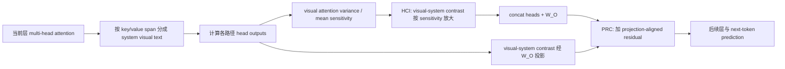

# CausalLens

CVPR 2026Head / causal pathwayTraining-free已精读

[CVF 论文页](https://openaccess.thecvf.com/content/CVPR2026/html/Ji_CausalLens_Sensitivity-Guided_Multi-Head_Causal_Intervention_for_Hallucination_Mitigation_in_Large_CVPR_2026_paper.html){ .kb-button .primary } [官方代码](https://github.com/jijy20/CausalLens){ .kb-button }

<strong>一句话总结</strong>
CausalLens 把每个 attention head 的输出按 system prompt、visual 与 text key/value 区段相加分解，用视觉 attention 的 variance-to-mean 作为 head sensitivity，在 decoder 中层把表示从 system/text prior 推向 visual path；多头融合后再通过共享 $W_O$ 构造 projection-aligned residual，防止干预被输出投影稀释。

## 官方方法概览图

<figure class="paper-figure">
  
  <figcaption>官方方法总览（CVPR 2026 论文 Figure 5）。图片从 <a href="https://openaccess.thecvf.com/content/CVPR2026/html/Ji_CausalLens_Sensitivity-Guided_Multi-Head_Causal_Intervention_for_Hallucination_Mitigation_in_Large_CVPR_2026_paper.html">CVF open-access PDF</a> 第 5 页直接裁切，未重绘。左下展示 HCI 的三类路径和 visual sensitivity，右下是 PRC。</figcaption>
</figure>

图的中部不是另一个训练模块，而是原 decoder self-attention 的可加分解。HCI 在 head fusion 前调节 system/text/visual 三部分；PRC 在 $W_O$ 之后补回同一 visual–system contrast 的投影。二者分别解决“选哪些视觉路径、如何增强”和“多头输出投影后是否被重新混合稀释”。

## 1. 论文速览

| 维度 | 内容 |
|---|---|
| 研究对象 | decoder 中视觉路径从早层强、到中高层被 system/text prior 压制所对应的 object/multimodal hallucination |
| 核心归因 | 少数 spatially selective heads 承担视觉 grounding；多头融合与语言路径主导使其因果贡献衰减 |
| 方法类型 | training-free、single-pass、逐 token 的中层 head/path hidden-state intervention |
| 干预位置 | layers 10–20 的每个 attention head output；head fusion 后增加 projection-aligned residual |
| 外部依赖 | 无 detector/额外模型；需知道 system/image/text token 边界并替换 attention module |
| 主要评测 | POPE、CHAIR、MMHal-Bench、MME、LLaVA-Bench；HCI/PRC、$\lambda$、head ablation、latency/memory |
| 最适合角色 | head sensitivity、path decomposition、single-pass causal intervention baseline |

## 2. 研究背景与核心矛盾

### 2.1 研究的 hallucination

POPE 与 CHAIR 主测 object hallucination；MMHal-Bench 扩展到 attribute、adversarial object、counting、spatial relation 等八类。MME 检查一般 multimodal 能力，LLaVA-Bench 提供定性/GPT-4V 评价。论文声称的“causal”主要指结构化路径干预和 top-k ablation，而不是基于随机化数据的完整 causal identification。

### 2.2 现有方法的缺口

训练方法昂贵；VCD/DeGF 等 contrastive decoding 需 2–4 倍 pass/延迟；VAF 等全局提高视觉 attention 可能不区分可靠和 diffuse heads。CausalLens 先定义每个 head 的 visual sensitivity，再在中层局部修改 head output，目标是在近原始成本下恢复 visual-to-generation pathway。

### 2.3 核心假设与证据强度

| 假设 | 论文证据 | 证据类型 | 仍可能的混淆因素 |
|---|---|---|---|
| 视觉路径随层衰减、system prompt 主导中高层 | Figure 2 layer×head attention heatmaps | 描述性相关 | attention mass 不等于 value/output causal effect；token 数和模板可影响质量 |
| 高 variance/mean heads 是可靠视觉 carriers | Figure 3 spatial maps；Figure 4 top-k sensitivity head ablation 导致 POPE 急降 | 可视化 + 组件干预 | 集中注意也可能锁定错误 region；ablation 未与同范数/output 随机对照完全匹配 |
| HCI 与 PRC 互补 | 完整方法 POPE Acc 86.5，高于仅 HCI 84.9、仅 PRC 84.7 | 组件消融 | 两组件共享同一 $\lambda$ 与路径定义，交互未做更细分解 |
| single-pass 可低成本提升 | latency 0.281→0.293 s，memory ×1.01 | 端到端效率实验 | 单 L40/实现栈；代码示例禁用 KV cache，部署成本可能不同 |

## 3. 方法详解

### 3.1 整体流程

### 3.2 关键量与公式

第 $\ell$ 层第 $i$ 个 head 对 visual keys 的归一化 attention 为 $A_{\ell,i}^{\mathcal V}$，visual sensitivity 定义为：

$$
s_{\ell,i}=\frac{\operatorname{Var}(A_{\ell,i}^{\mathcal V})}{\operatorname{Mean}(A_{\ell,i}^{\mathcal V})+\epsilon},\qquad
\hat s_{\ell,i}=\frac{s_{\ell,i}}{H^{-1}\sum_j s_{\ell,j}+\epsilon}.
$$

将 attention matrix 按 system、visual、text key/value 区间切片，分别得到 $H_{\ell,i}^{sys}$、$H_{\ell,i}^{vis}$、$H_{\ell,i}^{text}$，且原 head output 是三者之和。定义 visual contrast $D_{\ell,i}=H_{\ell,i}^{vis}-H_{\ell,i}^{sys}$、textual prior $T_{\ell,i}=H_{\ell,i}^{sys}+H_{\ell,i}^{text}$。HCI 为：

$$
H_{\ell,i}^*=(1-\gamma)H_{\ell,i}+\gamma\left(T_{\ell,i}+\lambda\hat s_{\ell,i}D_{\ell,i}\right),
$$

其中 $\gamma$ 用 system/visual head-output 能量自适应平衡。多头 concat 后先走原始 $W_\ell^O$；PRC 再把每头 visual–system 差同样经 $W_O$ 投影并残差相加：

$$
\Delta_\ell^{proj}=W_\ell^O\operatorname{Concat}(H_{\ell,1}^{vis}-H_{\ell,1}^{sys},\ldots),\quad
\widetilde H_\ell=H_\ell^{fusion}+\lambda\Delta_\ell^{proj}.
$$

这里将 system path 视为主要语言先验对手，但 user text 与生成历史也可能承载更强语言 prior；公式把 text 合入 $T$，并未对所有文本路径做相同 subtraction。

### 3.3 实现细节

- LLaVA-v1.5-7B/13B、Qwen2-VL-7B；单 NVIDIA L40。
- 默认 layers 10–20，$\lambda=0.15$；官方 README 推荐 `gamma_mix=0.15`、LLaVA `sys_len=35`、`img_len=576`。
- 官方代码通过替换每层 self-attention adapter 和 generation sampling 实现；LLaVA/Qwen2-VL 环境分开。
- 当前公开 README 示例 `use_cache=False`、`output_attentions=True`、`output_hidden_states=True`，若照抄会影响真实部署效率；论文表中的测量配置需与代码复查。
- 官方代码核对 commit：`7d93bf291f8d3052926c4d058a7b4f8435ded407`（2026-08-20 checkout）。

### 3.4 方法究竟改变了什么

CausalLens 改的是 head value aggregation 后的表示，不是简单提高 visual attention weights。它把视觉集中度高的 heads 推向 $H^{vis}-H^{sys}$，并在 $W_O$ 后重复补偿。若一个 head 对错误区域高度集中，敏感度仍可能很高；方法默认“集中 = 可靠”，缺少 semantic correctness 检验。SADT 的 Logit-Lens over attention 可作为互补过滤器。

## 4. 实验设计与关键结果

### 4.1 设置

| 项目 | 内容 |
|---|---|
| Models | LLaVA-v1.5-7B/13B、Qwen2-VL-7B |
| Benchmarks | POPE（MSCOCO/A-OKVQA/GQA 平均）、CHAIR、MMHal-Bench、MME、LLaVA-Bench |
| Metrics | POPE Acc/F1；CHAIR$_S$/$_I$；MME 子项；GPT-4V Accuracy/Detailedness；latency/memory |
| Baselines | Regular、VCD、DeGF、VAF |
| Ablations | high/low sensitivity top-k head removal、HCI/PRC、$\lambda$、layer/head attention 与定性 case |
| Statistical evidence | 未报告多 seed、CI 或显著性检验；LLaVA-Bench 使用 GPT-4V-aided evaluator |

### 4.2 主结果

| 设置 / 指标（方向） | Baseline | CausalLens | 变化 / 解读 | 来源 |
|---|---:|---:|---|---|
| LLaVA-1.5-7B，POPE Random Acc/F1 ↑ | 85.9 / 85.2 | 90.6 / 90.4 | +4.7 / +5.2 pt | Table 1 |
| LLaVA-1.5-7B，POPE Popular Acc/F1 ↑ | 82.3 / 82.1 | 86.5 / 86.8 | +4.2 / +4.7 pt | Table 1 |
| LLaVA-1.5-7B，POPE Adversarial Acc/F1 ↑ | 77.9 / 78.6 | 81.6 / 82.8 | +3.7 / +4.2 pt | Table 1 |
| LLaVA-1.5-13B，POPE Adversarial Acc/F1 ↑ | 79.7 / 80.0 | 83.9 / 84.5 | +4.2 / +4.5 pt | Table 1 |
| LLaVA-1.5-7B，CHAIR$_S$/$_I$ ↓，max64 | 26.4 / 9.7 | 18.7 / 6.2 | 优于 VCD/VAF，接近 DeGF | Table 2 |
| L40 latency / peak memory ↓ | 0.281s / 15898MB | 0.293s / 16111MB | ×1.04 / ×1.01 | Table 4 |

Qwen2-VL 的 POPE random/popular 也改善（Acc 88.8→91.4、86.6→89.0），adversarial Acc 82.6→84.7；但 VAF 在 Qwen2-VL adversarial Acc 84.9 略高于 CausalLens 84.7，论文“所有设置最佳”的表述需细看具体列。

### 4.3 消融与分析实验

| 实验 | 对照 / 唯一变量 | 关键结果 | 能支持什么 | 仍不能证明什么 | 来源 |
|---|---|---|---|---|---|
| sensitivity head ablation | 移除 top-k vs bottom-k $s$ heads | baseline .8793；top-1→.7577、top-5→.5477；bottom-k 约 .873–.879 | 高 $s$ heads 对当前 POPE grounded answers 必要 | “集中”普遍等于正确视觉语义 | Figure 4 |
| HCI/PRC 组件 | none、HCI only、PRC only、both | POPE Acc 82.3/84.9/84.7/86.5；CHAIR$_S$ 9.7/7.2/7.5/6.2 | 两组件互补 | 重复 visual contrast 是否过补偿 | Table 5 |
| $\lambda$ sweep | .05/.10/.15/.20/.25 | POPE Acc 在 .15 达 86.5，过强回落；CHAIR$_S$ 6.2 最低 | 存在强度最优点 | 跨模型统一性 | Table 6 |
| layer/head maps | image vs system attention across depth | early image attention 强，中高层 system attention 60–80% | 形成方法动机 | attention allocation 的因果充分性 | Figure 2 |
| efficiency | Regular/VCD/DeGF/VAF/Ours | 1.00×/2.01×/4.07×/1.03×/1.04× latency | 接近单-pass attention baseline 成本 | 其他硬件与 cache 配置 | Table 4 |

### 4.4 结果应该如何解读

论文能够支持：高 visual-sensitivity heads 对 POPE 输出存在强因果必要性；中层 HCI 与 post-$W_O$ PRC 在所测配置互补；方法在三模型上以低额外延迟改善多项 hallucination 指标。不能据此证明：variance/mean 能识别“正确证据”、system prompt 是唯一 causal confounder、或 attention ablation 的巨大下降不是通用能力损伤。

## 5. 亮点与贡献

- 从 attention weight 前进一步，显式分解各 token group 的 value-weighted head outputs。
- Figure 4 使用 top-vs-bottom sensitivity ablation，机制证据强于仅画 heatmap。
- HCI 在 head space、PRC 在 output-projection space，干预位置与公式清楚。
- 官方代码已公开，并覆盖 LLaVA 与 Qwen2-VL；延迟与显存开销有直接表格。

## 6. 局限、指标漏洞与审稿风险

1. **sensitivity 语义不足**：variance/mean 衡量集中度，不衡量目标区域是否包含正确对象、属性或关系。
2. **“causal”边界**：top-k ablation 证明必要性，但未控制 head output norm、通用语法作用或替代路径；不能等同完整因果识别。
3. **固定 token 边界**：`sys_len=35`、`img_len=576` 与模板/架构绑定，tokenizer 或 chat template 改变会切错路径。
4. **中层固定范围**：layers 10–20 来自 LLaVA 分析，跨 13B/Qwen 的相对深度对齐不充分。
5. **重复 correction**：HCI 与 PRC 都加入 visual–system contrast，可能过度放大；$\lambda$ 必须校准。
6. **效率口径**：README 示例关闭 cache 并导出 attention/hidden states，和论文 latency 表的实际配置需要审计。
7. **质量指标**：CHAIR 未同时报告 Recall/length；低 hallucination 可能伴随更保守或短输出。
8. **统计不足**：无 seed/CI；GPT-4V evaluator 存在版本与 prompt 偏差。

## 7. 与我的研究关系

### 7.1 可直接借鉴

其 $H^{vis}$、$H^{sys}$、$H^{text}$ 分解可直接接到 head-level logit lens：记录 $W_UW_OH_h^{vis}$ 对候选对象 token 的贡献，再与 real/blank image 的 Δlogit、VR/PD/RBC 比较。比仅用 attention weight 更接近“该 head 向 residual 写入了什么”。还可用 SADT 的 region semantic consistency 筛掉“集中但看错”的 heads。

### 7.2 Baseline 决策

**适合度：High。** 官方代码公开、推理时单 pass、与本项目 head/path 研究直接重合。最小复现建议 LLaVA-1.5-7B + POPE popular + CHAIR 64，先验证 token span、Figure 4 top/bottom-k ablation，再跑 HCI/PRC。

### 7.3 与已有路线的差异

Vision-aware Head Divergence 用有图/无图 head output divergence 找视觉 heads；CausalLens 用单次 attention 的空间集中度。Intervene-All-Paths 同时处理 I2I/I2T/T2T，CausalLens 按 system/visual/text key groups 做 value decomposition。ACG 对所有目标层构造 masked text-only contrast，CausalLens 按 sensitivity 自适应加权 heads。三者适合统一在相同 token span、$W_O$ 后 logit contribution 和等 latency 下比较。

## 8. 可执行的后续实验

| 实验 | Research question | Model / data | Intervention / comparison | Recorded outputs | Expected observation | Failure case | Cost |
|---|---|---|---|---|---|---|---|
| E1 semantic sensitivity | 集中注意是否等于正确 evidence？ | LLaVA；POPE + object masks | $s$、SADT region logit consistency、组合分数 | AUROC、top-k ablation、P/R | 组合分数减少错误集中 head | segmentation 标签噪声 | Medium |
| E2 value-aware 对照 | attention $s$ 与 $W_OH^{vis}$ 哪个更 causal？ | POPE | top-k by attention、value norm、target logit contribution | ablation curve、random controls | logit contribution 更具体 | 高范数语法 head 混淆 | Medium |
| E3 real/blank pathway | visual contrast 是否随真实图像证据变化？ | COCO object deletion | real/blank/edited image 的 $H^{vis}-H^{sys}$ | layer/head Δ、token logits | 真视觉 heads 对编辑最敏感 | template path shift | High |
| E4 risk-gated CausalLens | 低风险输入是否无需干预？ | POPE/CHAIR | always-on vs RSP/RBC-gated | Fix/Break、Recall、latency | 门控保留收益并减少副作用 | 风险 signal 与 head sensitivity 不匹配 | Medium |
| E5 token-span robustness | 固定 sys/img len 是否脆弱？ | 多 chat templates | hard-coded vs tokenizer-derived spans | correctness、speed、crash rate | 动态 span 更稳 | 模型插入隐式 tokens | Low |

## 9. 复现清单

- [x] CVPR 2026 PDF、Figure 5、主表、消融和官方代码已登记
- [x] 官方仓库 commit `7d93bf291f8d3052926c4d058a7b4f8435ded407` 已记录
- [ ] 核对论文 latency 配置与 README `use_cache=False` 示例差异
- [ ] 从 tokenizer/chat template 动态解析 system/image/text spans
- [ ] 同时报 CHAIR、Recall、length、POPE P/R 与一般能力
- [ ] 复现 top-k/bottom-k/random-k 等数量等范数 ablation
- [ ] 固定 GPT-4V/4o evaluator 版本、prompt 与采样设置

## 10. 综合评分

| 维度 | 评分（1–5） | 理由 |
|---|---:|---|
| 新颖性 | 4/5 | 组合 path decomposition、head sensitivity、HCI 与 post-projection correction |
| 机制证据 | 4/5 | 有 top/bottom head causal ablation 和组件消融，但 sensitivity 语义仍粗 |
| 实验完整性 | 4/5 | 三模型、多 benchmark、效率和两组件/强度分析 |
| 可复现性 | 4/5 | 官方代码公开；token span 与 generation patch 仍较脆弱 |
| 与当前研究相关性 | 5/5 | 可直接用于 head-output、path attribution 与反事实视觉依赖 |

## 11. 检索标签与来源边界

`requires training: no` · `inference-only: yes` · `single-pass: yes` · `detector: no` · `external evaluator: GPT-4V/4o for qualitative benchmarks` · `interpretability: high` · `mitigation: yes` · `baseline suitability: high`

本文依据 2026-08-20 核对的 [CVPR 2026 open-access paper](https://openaccess.thecvf.com/content/CVPR2026/html/Ji_CausalLens_Sensitivity-Guided_Multi-Head_Causal_Intervention_for_Hallucination_Mitigation_in_Large_CVPR_2026_paper.html)、补充材料与[官方 GitHub](https://github.com/jijy20/CausalLens) 整理。方法图是 PDF Figure 5 的直接裁切；数字来自 Tables 1–6 与 Figures 2–4。代码核对 commit 为 `7d93bf291f8d3052926c4d058a7b4f8435ded407`。对 sensitivity proxy、cache/latency 口径和与现有反事实指标的连接是本站分析，尚未独立复跑。
