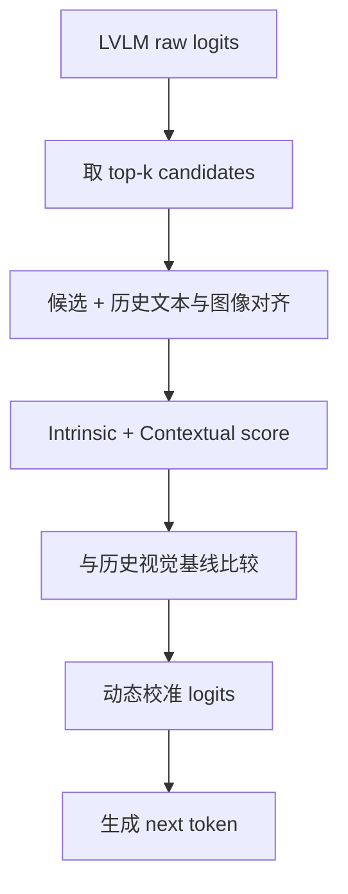

# Curing Semantic Drift: Dynamic Logits Calibration

arXiv 2025Long-form / LogitTraining-free已精读

[arXiv](https://arxiv.org/abs/2506.21509){ .kb-button .primary }

<strong>一句话总结</strong>
论文把长生成幻觉解释为 token selection trajectory 的 semantic drift：正确候选常已在 top-k 中，但 raw logits 偏向语言上顺滑的错误词；DLC 用 CLIP-family 视觉相关性与历史对齐基线动态重排候选。

## 官方方法概览图

<figure class="paper-figure">
  
  <figcaption>官方 DLC 总览图，来自 arXiv v4 source 的 <code>figure/overall.pdf</code>：对 top-k 候选计算视觉对齐分数，再结合历史基线动态校准 logits。</figcaption>
</figure>

## 1. 论文速览

| 维度 | 内容 |
|---|---|
| 研究对象 | 长描述中随位置累积的 object/semantic hallucination |
| 核心归因 | Candidate 已存在但选择错误；视觉一致性随历史文本漂移 |
| 方法类型 | Training-free token reranking / logit calibration |
| 干预位置 | 每步 top-k candidates |
| 外部依赖 | CLIP / SigLIP / FG-CLIP 类视觉-文本对齐模型 |
| 主要评测 | CHAIR、POPE、SHR、MME、LLM-assisted quality |
| 最适合角色 | 外部视觉 referee baseline；long-form drift 分析工具 |

## 2. 研究背景与核心矛盾

### 2.1 从“最终错误”转向“轨迹错误”

在长生成中，错误历史会成为下一步条件。即使视觉编码器保留了正确对象信息，模型也可能在某个关键步选择语言概率更高、视觉支持更弱的 token；该 token 随后又推动下一轮共现，最终形成 semantic drift。论文因此区分：

- **candidate absence**：正确 token 根本不在 top-k；
- **selection failure**：正确 token 在 top-k，但排序输给错误 token；
- **history amplification**：一次 selection failure 被后续文本继续放大。

### 2.2 核心假设与证据

| 假设 | 证据 | 强度 | 风险 |
|---|---|---|---|
| 长文本更容易发生视觉漂移 | 512-token 等长生成对比 | 趋势 | 更长文本天然含更多对象机会 |
| top-k 中存在更 grounded 候选 | 候选级外部 alignment 分析 | 事后分析 | CLIP score 不等于事实性 |
| 动态视觉校准能修复 selection failure | DLC 对多个模型/benchmark 的提升 | 输出干预 | 可能奖励泛化词或改变详细度 |

## 3. 方法详解

### 3.1 Pipeline

### 3.2 三个核心量

1. **CCTA**：把当前文本上下文加上候选 token 后，与图像计算 contextual alignment；回答“这个候选接到当前句子后是否仍视觉一致”。
2. **ITA**：单独评估候选 token 与图像的 intrinsic relevance；避免上下文高相似度掩盖错误对象。
3. **历史基线 ̅Bₜ**：用近期文本与图像对齐表示当前轨迹的正常水平；候选相对基线下降时应受惩罚。

二者组合为候选视觉分数，再与历史基线形成相对视觉增益（RVA），最终乘性或加性地修正 raw logits。准确公式、窗口与 normalization 应锁定所用 arXiv 版本和实现。

### 3.3 方法改变了什么

DLC 直接改变候选排序，但其信号来自外部 encoder。它证明“外部视觉相似度可改善输出”，不等于证明 LVLM 内部视觉依赖增强。CLIP 还可能对单 token、否定、数量、关系和细粒度属性不敏感。

## 4. 实验设计与结果审计

| 项目 | 内容 |
|---|---|
| Models | LLaVA-1.5、InstructBLIP、MiniGPT-4；以 7B 为主并含部分 13B |
| Caption | MSCOCO / CHAIR，强调长生成设置 |
| QA | POPE random/popular/adversarial |
| Fine-grained | SHR sentence/word hallucination |
| General quality | MME 与 GPT-4o assisted correctness/detailedness |
| Baselines | Nucleus、VCD、ICD、SID、OPERA |
| 关键 ablation | alignment backbone、历史窗口、校准组件、生成长度 |

最有意义的结论是 DLC 在长生成设置中优势更明显，与 semantic drift 叙事一致。但应额外报告每张图生成对象数、Recall、caption length 和 CLIP evaluator 与标签的独立一致性；否则可能是“偏向更常见、更视觉相关但不够具体”的输出。

## 5. 亮点与贡献

- 将 hallucination 拆成 candidate absence 与 selection failure，便于设计诊断实验。
- 使用历史视觉基线，让干预随生成轨迹变化，而非固定强度。
- top-k reranking 比对整个 vocabulary 调用外部模型更可行。
- 对 long-form error accumulation 提供了可观测的 token-level onset。

## 6. 局限、指标漏洞与审稿风险

1. **CLIP circularity**：方法和部分分析都依赖外部视觉对齐 proxy，可能把 CLIP 偏好当作事实性。
2. **单 token 语义不稳定**：BPE token、功能词和多 token object phrase 很难被可靠编码。
3. **长生成计数偏差**：文本越长，CHAIRs 越高；必须按对象机会或长度分层。
4. **外部计算**：每步 top-k 候选评分会增加 latency；不同 encoder 成本差异大。
5. **细粒度弱项**：数量、否定、空间关系与属性不是 CLIP 的强项。

## 7. 与我的研究关系

### 7.1 最直接的分析接口

对同一步 top-k 同时记录 raw logit rank、real-vs-blank VR rank、POT/CLIP rank 与最终标签。这样可以区分：LVLM 自身视觉增益是否已经偏向正确 token，还是只有外部 encoder 能找回它。

### 7.2 Baseline 决策

**适合度：High（token/logit 组）**。Training-free、无需 detector，适合有限算力；但需把外部 encoder 的额外成本单独报告。它不宜作为内部机制结论的唯一证据。

### 7.3 与 POT 的关系

DLC 和 POT 都使用外部跨模态语义信号。POT 更强调局部 visual tokens 与 claim/token 的匹配结构，DLC 强调 autoregressive 候选重排。若两者在同一样本上都失败，问题可能来自视觉 encoder/category prior；若 POT 能检测但 DLC 不能缓解，则说明 detection score 不适合直接 guidance。

## 8. 可执行的后续实验

| 实验 | RQ | 设置 | 输出 | 预期 | Failure | Cost |
|---|---|---|---|---|---|---|
| E1 Selection taxonomy | 幻觉中 candidate absence 占多少？ | LLaVA / COCO 500 | GT/hall token top-k rank | selection failure 可观 | GT 未必唯一表达 | Low |
| E2 CCTA vs VR | 外部对齐与内部依赖同步吗？ | object token windows | CCTA/ITA/VR/POT | 相关但存在关键分歧集 | CLIP token score 噪声 | Low |
| E3 Drift onset | 哪个信号最早预警？ | 长 caption | 滑窗 AUROC、lead time | VR/head change 先于文本错误 | label onset 不准确 | Medium |
| E4 Recall gate | detector 门控能否少损 recall？ | risk-gated DLC | CHAIR/Recall/length | 仅风险步校准更平衡 | detector 漏检 | Medium |

## 9. 复现清单

- [ ] 记录 arXiv version、alignment backbone 和 text encoder 模板
- [ ] 固定 top-k、历史窗口、校准强度与 max tokens
- [ ] 报告 latency、候选评分次数与 cache 策略
- [ ] 同时报 CHAIR、Recall/Cover、length、detailedness
- [ ] 对 candidate absence 与 selection failure 分别统计

## 10. 综合评分

| 维度 | 评分 | 理由 |
|---|---:|---|
| 新颖性 | 4/5 | 动态历史基线 + 候选级视觉重排 |
| 机制证据 | 3/5 | 对轨迹解释有用，但依赖外部 proxy |
| 实验完整性 | 4/5 | 多模型、长生成与多 benchmark |
| 可复现性 | 3/5 | Training-free，但外部逐步评分有成本 |
| 与当前研究相关性 | 5/5 | 直接连接 top-k、VR、POT 与 drift onset |

## 11. 来源边界

`requires training: no` · `external encoder: yes` · `object detector: no` · `external LLM evaluator: evaluation only` · `baseline suitability: high`

本页方法概要来自 arXiv 条目和现有精读卡；版本仍可能修订。具体数值、公式系数与实现超参数在用于论文写作前必须按目标 arXiv version 复核。
