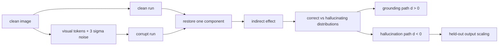

# Dual-Pathway Circuits of Object Hallucination in Vision-Language Models

arXiv 2026Mechanistic interpretabilityComponent / pathway已精读

[arXiv](https://arxiv.org/abs/2605.13156){ .kb-button .primary }

<strong>一句话总结</strong>
作者在五种 VLM 上用 clean–corrupt–patch 三次前向定位组件：正确样本中贡献更大的组件形成视觉 grounding 路径，幻觉样本中贡献更大的组件形成 hallucination 路径；压低后一路径可使 held-out POPE hallucination rate 相对下降 40%–76%，但这仍是静态因果探针，不是完整部署方案。

## 官方方法概览图

<figure class="paper-figure"><figcaption>官方方法总览（arXiv v1 Figure 1），从<a href="https://arxiv.org/pdf/2605.13156">官方 PDF</a>第 3 页直接裁切，未重绘。</figcaption></figure>

图中先对原图运行 clean pass，再对 layer 0 全部视觉 token 加 $3\sigma$ Gaussian noise 得到 corrupt pass，最后逐组件恢复 clean activation。正确答案 logit difference 的恢复量用于估计组件间接效应，并据正确/幻觉子集的效应差异划分双路径。

## 1. 论文速览

| 维度 | 内容 |
|---|---|
| 研究对象 | POPE 二元存在判断中的 object hallucination |
| 核心归因 | grounding 与 hallucination 由位置不同、统计作用相反的 attention/MLP 组件路径共同形成 |
| 方法类型 | 机制定位 + training-free component scaling 因果验证 |
| 模型 | Qwen3-VL-8B、LLaVA-v1.6-7B、Llama-3.2-V-11B、InternVL3-8B/14B |
| 外部依赖 | 每模型大量 patching forward；无外部 detector |
| 主要评测 | POPE adversarial/popular/random、AMBER existence/attribute/relation |
| 最适合角色 | activation-patching 路径发现与随机/静态方向对照基线 |

## 2. 研究背景与核心矛盾

论文问的不是“哪个激活与幻觉相关”，而是同一组件恢复后对正确样本和幻觉样本的输出因果贡献是否不同。核心假设为：视觉 grounding 主要在中后层聚合，hallucination 路径更靠近早层与模块边界；若压制后者而保留前者，应降低幻觉且不显著损伤正确率。

| 假设 | 论文证据 | 证据类型 | 混淆因素 |
|---|---|---|---|
| 存在两条功能相反路径 | 五模型组件效应 Welch 检验 + FDR + $|d|>.3$ | 反事实 patching | Gaussian noise 可能产生 OOD 激活 |
| 路径内存在冗余 | pathway-level causal pathway analysis；联合效应低于个体绝对值之和 | 联合组件干预 | 组合选择依赖同一发现集 |
| hallucination 路径可被定向抑制 | held-out scaling、随机组件与 grounding-path 对照 | 组件干预 | 静态缩放可能改变输出保守度 |

## 3. 方法详解

令 $\Delta=\operatorname{logit}(y^+)-\operatorname{logit}(y^-)$，组件 $(L,C)$ 的间接效应为 $IE=\Delta_{patched}-\Delta_{corrupt}$，并以总效应 $TE=\Delta_{clean}-\Delta_{corrupt}$ 归一化。每模型 1,000 个 POPE-adversarial 样本按最终回答分组；Welch $t$ 检验经 Benjamini–Hochberg 校正，且要求 $|d|>.3$。$d>0$ 归入 grounding path，$d<0$ 归入 hallucination path。验证阶段将目标组件输出改为 $h'_{out}=s h_{out}$，$s\in\{0,.25,.5,.75\}$。

数据严格分离：发现 1,000、路径组合分析 400、logit lens 200、干预选择 100、最终评测 400。LLaVA 的分散路径另做 top-$k$；并与随机组件、grounding path、ITI 与 mean-difference projection 对照。

## 4. 实验设计与关键结果

### 4.1 设置

五模型均在 POPE-adversarial 找路；发现的路径不变地迁移到 POPE popular/random 与 AMBER 三类任务。统计包含 FDR、Cohen's $d$、Fisher exact、Pearson/TOST；但干预只报告单次固定 split，未见多 seed CI。

### 4.2 主结果

| 模型；POPE-adversarial（400 held-out） | Baseline Acc / Hallucination rate | 最佳定向缩放 | 方法后 Acc / Hallucination rate | 相对降幅 | 来源 |
|---|---:|---|---:|---:|---|
| Qwen3-VL-8B | 88.2 / 8.4 | all 12, $s=.25$ | 87.2 / 4.0 | 52% | Figure 4 / main text |
| LLaVA-v1.6-7B | 88.5 / 5.0 | top-10, $s=.5$ | 88.5 / 3.0 | 40% | Figure 4 |
| Llama-3.2-V-11B | 84.8 / 18.4 | all 20, $s=.5$ | 84.6 / 4.4 | 76% | Figure 4 |
| InternVL3-8B | 88.4 / 15.6 | targeted scaling | 86.4 / 5.6 | 64% | Figure 4 |
| InternVL3-14B | 88.0 / 15.5 | targeted scaling | 87.8 / 9.0 | 42% | Figure 4 |

### 4.3 消融与分析实验

| 实验 | 关键结果 | 支持什么 | 仍不能证明什么 | 来源 |
|---|---|---|---|---|
| 路径组成 | 5 模型各发现 26–48 个显著组件；grounding 多在中/后层，hallucination 多在早层/边界 | 跨架构位置规律 | 同一具体组件跨模型同源 | Figure 2 / Table 11 |
| 路径冗余 | 联合/个体效应 magnitude ratio 为 .07–.69，均值 .32 | 路径内高度冗余/非加性 | 是协同还是共享下游瓶颈 | Figure 3 / Table 12 |
| LLaVA top-$k$ | $k=3,5$ 反而把 H 提到 6.5；$k=8,10$ 降到 3.0；全 30 降到 1.5 但 Acc 仅 79.5 | 分散路径需足够覆盖，存在 Pareto trade-off | 可自动选择 $k$ | Figure 4 |
| 随机与 grounding 对照 | 随机抑制无稳定改善；完整 grounding-path 消融把 Acc 拉至约 .50–.51 | 结果并非任意组件缩放 | 所有副作用均已排除 | intervention controls |
| 静态方向 | ITI 收益较小，mean-difference projection 失败；第一奇异方向仅解释 45%–69% 方差 | hallucination 不是单一线性方向 | 非线性子空间的最优形式 | Tables 2–6 |
| 跨 benchmark | 多数 POPE split 保持改善；AMBER 按模型/属性波动，部分任务恶化 | 有迁移但非普适 | 统一 object/attribute/relation 机制 | Table 14 |

### 4.4 结果边界

论文能支持“发现的组件对该二元任务有可重复的因果必要性/调节作用”；不能把 Gaussian corruption 下的 patching 直接解释为自然推理路径，也不能把静态缩放称为已完成的通用 mitigation。作者也明确把 intervention 定位为 causal probe。

## 5. 亮点与贡献

- 首次在五种架构上以统一 patching 接口比较双路径，而非单模型画热图。
- 发现集、选择集与 held-out 评测集分离，并加入随机、grounding-path 与静态方向对照。
- 路径联合效应与 logit lens 提供了比“显著组件列表”更完整的功能验证。

## 6. 局限、指标漏洞与审稿风险

Gaussian noise 的生态有效性、组件而非 head 的粒度、POPE yes/no 的回答倾向、固定 $s$ 的部署可迁移性，以及 AMBER 上方向不一致是主要风险。跨 benchmark 表中存在若干 attribute/relation 恶化，说明路径更接近任务条件化电路，而非普适 hallucination switch。

## 7. 与我的研究关系

**Baseline 适合度：High（机制）/ Medium（缓解）。** 可将其组件 $IE$ 与 real/blank image 的 head logit contribution、RBC/PD 对齐；最重要的新增对照是用语义配对或 object removal 替代 Gaussian corruption，检查双路径是否保留。

## 8. 可执行的后续实验

| 实验 | 问题 | 比较 | 输出 | 成本 |
|---|---|---|---|---|
| E1 semantic corruption | 双路径是否依赖 Gaussian noise？ | noise vs NOTICE SIP vs object removal | component overlap、IE、Fix/Break | High |
| E2 dynamic gating | 仅在高风险 token 压制后一路径是否更稳？ | always-on vs RBC/PAS gated | CHAIR、Recall、length | Medium |
| E3 head decomposition | attention 与 MLP 哪条子路径写入对象 logit？ | component→head/value/logit lens | target-token contribution | High |

## 9. 复现清单

- [x] arXiv v1、Figure 1、主结果、完整附录表已登记
- [x] discovery/selection/test split 已区分
- [ ] 截至 2026-08-21 未发现官方代码；实现细节仍需独立复现
- [ ] 同时报输出长度、yes ratio、coverage 与多 seed CI

## 10. 综合评分

| 新颖性 | 机制证据 | 实验完整性 | 可复现性 | 相关性 |
|---:|---:|---:|---:|---:|
| 4 | 4 | 4 | 3 | 5 |

## 11. 检索标签与来源边界

标签：training-free、activation patching、causal pathway、component scaling、object hallucination、POPE。事实与数字来自 arXiv:2605.13156 v1（2026-05-13）正文/附录；图片为官方 PDF Figure 1 裁切；研究建议与证据边界为本站分析。截至 2026-08-21 未发现官方代码或公开评审页面。
