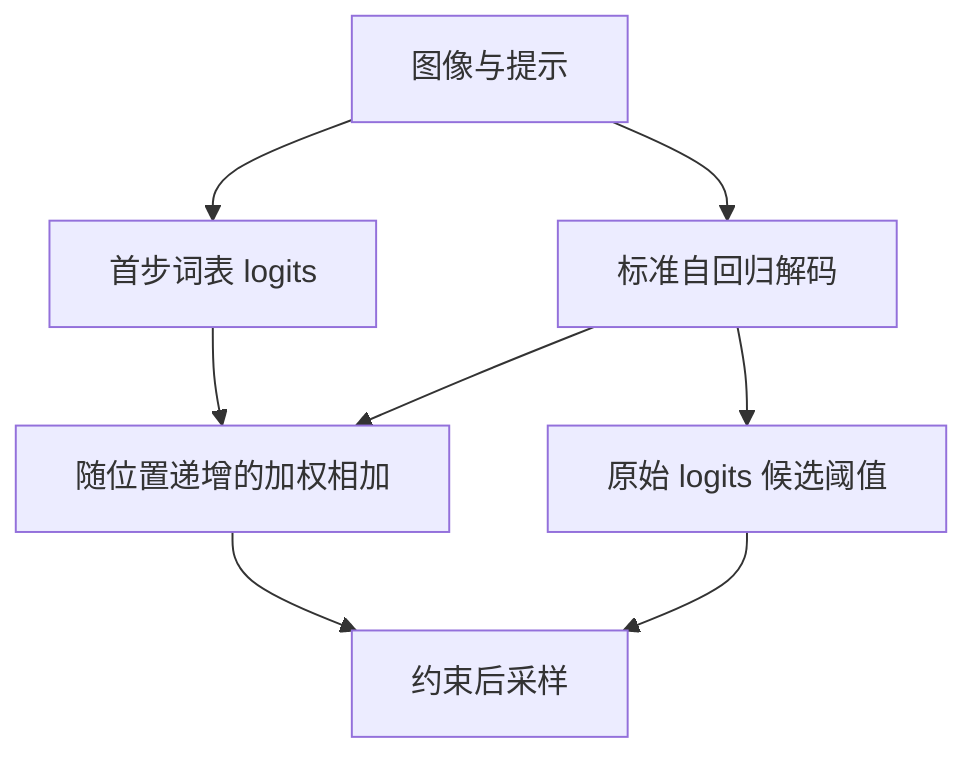

# First Logit Boosting（FLB）

CVPR 2026 主会Logit-levelTraining-freeautomated

[论文原文](https://openaccess.thecvf.com/content/CVPR2026/html/Ha_First_Logit_Boosting_Visual_Grounding_Method_to_Mitigate_Object_Hallucination_CVPR_2026_paper.html){ .kb-button .primary } [arXiv v1](https://arxiv.org/abs/2604.00455v1){ .kb-button } [官方代码](https://github.com/jiwooha20/FLB){ .kb-button }

<strong>一句话总结</strong>
缓存首步完整词表 logits，随后逐渐加权回注，并用原始分布限制候选；LLaVA-1.5 在 CHAIR 上 CHAIRs 57.5→43.5、Recall 73.3→73.6，但较大收益也来自只提升“The”的语言偏置，且 greedy AMBER Cover 50.5→48.8，不能把结果解释成普适的视觉依赖增强。

## 官方方法概览图

<figure class="paper-figure"><figcaption>官方 Figure 1 位于 CVF 正文第一页，展示直接视觉线索与冠词引导两条解释。未确认原图独立再分发许可，本页不复制图片。下图是<strong>本站等价抽象</strong>，不是官方图。</figcaption></figure>

## 1. 论文速览

| 维度 | 内容 |
|---|---|
| 研究对象 | 单图长 caption 中的对象存在性幻觉；补充短问答与多轮任务 |
| 核心归因 | 作者认为随输出位置增加，视觉作用衰减，语言先验更占优势 |
| 方法类型 | inference-time；无参数训练、无额外 detector、无第二条推理分支 |
| 干预位置 | LM head 后完整词表 logits；采样前 plausibility mask |
| 外部依赖 | 主方法无；对象评测依赖数据标注/对象匹配，质量评测使用 GPT-4V |
| 主要评测 | CHAIR、AMBER、MMHalBench、ConvBench；补充 POPE/MME |
| 最适合角色 | 低成本必比解码 baseline；语言形式混淆的对照方法 |

## 2. 研究背景与核心矛盾

### 2.1 研究的 hallucination

CHAIR 测 caption 中没有图像标注支持的对象词，不等价于属性、关系和推理事实全部正确。首步 logits 也不是对象清单：它同时编码图像、指令、聊天模板和句首语言偏好。缓存的是一个词表向量，而非首个被采样 token 的单一数值。

### 2.2 现有方法的缺口

论文将 VCD、ICD 和 M3ID 的双分支成本与长程视觉衰减作为动机。FLB 不构造 real/null 图像差分，而利用原始 prefill 已产生的 logits；节省计算的同时，也失去了显式分离视觉证据和语言先验的识别能力。

### 2.3 核心假设与证据强度

| 假设 | 论文证据 | 证据类型 | 剩余混淆 |
|---|---|---|---|
| 首步包含可用的对象 grounding | Figure 3 的对象 logit 对比；Table 5 名词子集回注有效 | 观察 + 组件干预 | 首步位置、对象频率、指令模板耦合；单例不能建立普适性 |
| 随位置增强回注更好 | Supplement Tables 12–14 权重函数与参数扫描 | 超参数实验 | 最优 object score 递增 72.3、递减 72.2，差距不足以证明唯一机制 |
| “The”促进指代已有对象 | Tables 5–9 的 mask 消融、冠词后对象和熵统计 | 干预 + 条件相关 | 句首选择非随机；缩窄对象集合本身就可能降低幻觉 |

作者把 RoPE/位置距离与视觉衰减联系起来；本文没有提供排除语义、输出选择和 prompt 混淆的因果定理。应把它视作经验机制解释。

## 3. 方法详解

### 3.1 整体流程

对同一图像和 prompt 进行正常 prefill，保存首次 next-token logits；每一步正常解码后，加回随步数增大的缓存向量。在回注前的 logits 上确定可行词表，再进行既有 logits processors、temperature/top-p 和采样。无需 attention hooks 或修改 KV。

### 3.2 关键量与公式

对应正文 Equations (3)–(7)，设词表大小为 \(V\)，\(z_t,z_0\in\mathbb R^V\)，\(z_0\) 是首步 logits，\(t\) 从 0 开始：

\[
w_t=\gamma(1-e^{-\lambda t}),\qquad \widetilde z_t=z_t+w_tz_0.
\]

候选集合为 \(\mathcal C_t=\{u:p_t(u)\geq\beta\max_v p_t(v)\}\)，其中 \(p_t=\operatorname{softmax}(z_t)\) 是未编辑分布。等价的 logits 实现是 \(z_t(u)\geq\max_vz_t(v)+\log\beta\)。集合外设为负无穷，再归一化采样。默认 \(\gamma=0.3,\lambda=0.05,\beta=0.1\)；\(t=0\) 的回注权重为零，但候选截断仍可能起作用。

这些式子不包含视觉证据的独立测量量。\(z_0\) 对真对象的偏好和对冠词的偏好一并被放大，必须通过额外对照区分。

### 3.3 实现细节

核对官方 commit `d32c678c12a8edef428ffe5d9b7de420308ae79b` 的 `vcd_utils/vcd_sample.py`：首次 `outputs.logits[:, -1, :]` 被 detach/clone 到 `image_only_logits`；这个变量名不代表 image-only forward，输入仍含 prompt。逐步缓存成本为每序列 \(O(V)\)，额外向量运算也为 \(O(V)\)，没有第二次模型 forward。

默认 AMBER LLaVA 脚本为 temperature=1、top_p=1、seed=55，调用中 max_new_tokens=1024。该配置是**代码默认值**，论文没有完整冻结每个表对应的三次运行 seed；不能写成原表全部使用 seed 55。与 CD 联用时，源码可能在已经 CD 编辑过的 logits 上计算候选阈值，应与独立 FLB 配置分开。

README 仍列“使用说明、CHAIR code 待更新”。代码存在不等于从干净环境可一键复算所有主表。Figure 5 仅画推理速度，未给可可靠逐项转录的数字，本页不读图猜毫秒数。

### 3.4 方法究竟改变了什么

直接改变候选相对分数、冠词和词汇选择，并可能稳定对已经生成对象的重复引用；没有在参数或 hidden state 中直接注入新的图像信息。“The”提高、熵下降与 grounding 改善不能互相等同，低熵也可能对应自信错误。

## 4. 实验设计与关键结果

### 4.1 设置

| 项目 | 内容 |
|---|---|
| Models | 主表 LLaVA-1.5-7B、InstructBLIP-7B；补充 mPLUG-Owl2 |
| Datasets / splits | CHAIR：MSCOCO 2014 val 随机 500 图；AMBER 全部 1,004 图 |
| Prompt | 两项主生成评测均为 Please describe this image in detail. |
| Generation | 主实验随机采样，三次运行均值；greedy 另表；完整三 seed 和所有表的长度上限未冻结 |
| Baselines | Vanilla、VCD、ICD、M3ID；短任务补 β-only |
| Metrics | CHAIRs/i、Recall、AMBER CHAIR/Cover/Hal/Cog、生成长度、外部 judge |
| Statistical evidence | Tables 1–2 有 ±；本页不将其擅自解释为 95% CI；没有配对图像 bootstrap 证据 |
| Selection risk | Supplement 明确在 AMBER 上选择权重/参数，未证明独立的 tuning/test 分离 |

### 4.2 主结果

数值按 CVF Tables 1–3 转录，变化为百分点或注明单位；各论文不同 split/解码下的数值不可直接横比。

| 设置 / 指标 | Vanilla | FLB | 变化 / 解读 | 来源 |
|---|---:|---:|---|---|
| LLaVA，CHAIRs ↓ | 57.5 ±2.23 | 43.5 ±1.24 | −14.0 pp | Table 2 |
| LLaVA，CHAIRi ↓ | 17.3 ±0.74 | 12.0 ±0.50 | −5.3 pp | Table 2 |
| LLaVA，CHAIR Recall ↑ | 73.3 ±0.90 | 73.6 ±0.48 | +0.3 pp；不能宣称显著提高 | Table 2 |
| InstructBLIP，CHAIRs ↓ | 59.0 ±1.84 | 52.5 ±0.47 | −6.5 pp | Table 2 |
| InstructBLIP，Recall ↑ | 69.4 ±0.90 | 71.3 ±0.49 | +1.9 pp | Table 2 |
| LLaVA，AMBER CHAIR ↓ | 11.5 ±0.29 | 6.1 ±0.37 | −5.4 pp | Table 1 |
| LLaVA，AMBER Cover ↑ | 50.1 ±0.51 | 50.4 ±0.22 | +0.3 pp | Table 1 |
| LLaVA，AMBER Hal ↓ | 48.9 ±0.78 | 31.6 ±0.99 | −17.3 pp | Table 1 |
| LLaVA，平均输出 tokens | 104.67 | 101.40 | −3.27；长度略变 | Table 3 |

### 4.3 消融与分析实验

| 实验 | 唯一变量 / 对照 | 结果 | 支持什么 / 不能证明什么 | 来源 |
|---|---|---|---|---|
| 首步向量的词汇子集 | 只保留名词或只保留 The 的回注 | CHAIR：Vanilla 11.9，名词 9.2，The-only 6.5，full 5.7 | 两路均有贡献；更大效果来自语言 token，不能全归因于视觉增强 | Table 5 |
| 句子级幻觉 | 同一消融 | Hal：The-only 29.9，full 30.7 | full 并非每项指标最好 | Table 5 |
| greedy | 改为确定性解码 | CHAIR 7.1→4.9，Cover 50.5→48.8，Hal 32.4→25.2 | 减少幻觉但丢覆盖，反驳无条件保召回 | Supplement Table 16 |
| 短输出任务 | β-only 对比 FLB | POPE 三 split 和 MME 结果逐项相同 | 短问答收益可来自截断；不支持首步回注独立贡献 | Supplement Table 19 |
| 去掉 mask | β=0 vs 0.1 | Figure 9 出现连续 The 等不自然输出 | plausibility 约束必要，不能把 FLB 简化为无约束相加 | Supplement Figure 9 |
| 语言形式 | γ 从 0.1 扫到 0.7 | The 句首占比从 83.1% 到 92.1%，baseline 67.4% | 句法偏置明显；GPT-4V 高分不能排除多样性偏差 | Supplement Table 17 |

### 4.4 结果应该如何解读

能支持：在给定模型与英文 caption 协议中，一次缓存加逐步编辑有效、低开销，采样主表的 recall/coverage 接近或高于原模型。不能支持：所有解码方式保召回；第一步一定是最纯视觉证据；RoPE 是唯一原因；属性/关系全面改善；现代多语言或推理模型同等有效。

## 5. 亮点与贡献

把首步分布作为可复用资源，提供易实现、无需参数训练的比较基线；主动报告长度、Recall、greedy 和短输出失败边界，便于区分方法本体与截断收益。对长输出方法，FLB 是一个成本很低但难以省略的对照。

## 6. 局限、指标漏洞与审稿风险

- **Proxy / language prior**：首步 logits 混合视觉与语言；The-only 已解释很大部分收益，需加入 real/null 首步向量与随机匹配偏置。
- **Prompt bias**：当前主证据来自英文描述提示；其他语言没有相同冠词机制，换聊天模板也可能改变首步分布。
- **Length / coverage / repetition**：greedy Cover 下降；保留已提对象可能减少新对象覆盖。平均长度接近不等于信息量相同。
- **Annotation noise**：CHAIR 类别词匹配与 AMBER 标注不是完备事实 oracle；统计显著性应按图像聚类，而非把所有 token 当独立样本。
- **Evaluator**：GPT-4V 的精确快照未冻结，Supplement Figure 12 对五个回答仍沿用“两位助手”的说明；位置偏差和裁判波动需检查。
- **数字/排版差异**：Table 1 的 Hal=31.6，Supplement Table 15 同默认参数为31.4；Table 5/17 使用另一组数值，不能跨表拼接。正文有未解析的 `??` 引用，补充 B.1 文本有指数符号排版不一致，公式(5)和官方实现共同支持负指数。以上不影响论文身份，但限制精确复算。

## 7. 与我的研究关系

本节只比较公开方法，个人未公开研究适配为 UNKNOWN。

### 7.1 可直接借鉴

与 token/logit 路线直接相关；适合和 [M3ID](m3id.md)、[OPERA](opera.md) 及 [PTI](prefill-time-intervention.md) 在同一生成协议比较。FLB 原文明确对比 M3ID；与 PTI 的关系是本站按“早期证据再利用”所作比较，不是作者互引。POT 等外部视觉支持 proxy 可以用于独立审计，但 FLB 本身未使用这些分数；VR/PD/RBC 若未定义，不能自动映射成该论文的变量。

### 7.2 Baseline 决策

**High（长 caption） / Low（只回答 yes/no）**。最小实现为缓存向量、递增权重与原始分布 mask；必须保留 β-only 和 The-only，避免把通用截断改进归功于新机制。官方评测脚本尚不完备，需要独立冻结数据与 seed。

### 7.3 与已有路线的差异

FLB 不测 per-token 风险、不寻找 head、不需要 real/null 第二分支。相对 [PatchGate](patchgate.md) 的对象证据编辑，它是全词表混合偏置。相对 [Same Attention, Different Truths](same-attention-different-truths.md) 的语义诊断，它缺少 token 对局部区域的验证。

### 7.4 面向 CVPR 投稿的可借鉴证据

**官方层面**：截至 2026-10-03，2027 CFP 已公开；独立 Author/Reviewer Guidelines 尚未成功获取，不把本站建议冒充官方打分规则。**论文实际证据**：两类视觉连接器、独立对象基准、冠词消融和速度比较。**本站建议**：新解码方法应控制 β、首步语言偏置、长度与覆盖，同时加入模型/语言迁移及配对 CI；达到这些并不保证录用。

## 8. 可执行的后续实验

以下均为本站建议，未执行；成本是 forward/生成次数估计，不是实测 GPU 小时。

| 实验 | Research question | Model / data | Intervention / comparison | Recorded outputs | Expected observation | Failure case | Cost |
|---|---|---|---|---|---|---|---|
| E1 | 回注是否超越截断？ | 单个7B，100张独立图 | Vanilla/β-only/The-only/FLB | CHAIR、recall、长度、重复，图像配对CI | full 在同覆盖下有增益 | β-only已解释全部 | Low：4×100生成 |
| E2 | 是否使用图像相关首步证据？ | 同100图 | real/null/错配图的首步向量，固定后续真实图 | 对象变化与正确率 | real优于null和错配 | null效果相同 | Low：额外约200次prefill、3组生成 |
| E3 | 是否依赖语言/模板？ | 50图，英文/中文、两模板 | 相同γ/β，禁用调参 | cover、错误类型、首步词分布 | 跨模板方向一致 | 仅英文The有效 | Low：至少4×50生成 |
| E4 | 输出预算能否解释收益？ | 100图，独立校准集 | greedy/sampling，固定预算和β | recall—CHAIR曲线、完整长度分布 | 保召回区域存在 | 只通过少说对象降低幻觉 | Low–medium：4–8组生成 |

## 9. 复现清单

- [x] CVF 正文 Tables 1–11 与补充 Tables 12–19、Figures 8–13 已读。
- [x] arXiv v1（2026-04-01）与 CVF 主会身份交叉核对。
- [x] 官方 commit、首步缓存和 mask 代码已核对。
- [x] 主结果与至少一项反向/失败消融已登记。
- [ ] 三次运行完整 seed、CHAIR 子集 ID 和清洁环境流程待冻结。
- [ ] 独立于 AMBER test 的调参方案、配对统计与裁判快照待补。
- [ ] 未运行模型，未宣称复现成功。

## 10. 综合评分

| 维度 | 评分（1–5） | 理由 |
|---|---:|---|
| 直接相关性 | 5 | 对象幻觉与低开销 logit 解码直接相关 |
| 新颖性 | 3 | 简单的首步锚点，主要价值在低成本与可审计性 |
| 机制证据 | 3 | 组件消融明确，但视觉归因受冠词和模板混淆 |
| 实验完整性 | 4 | 多模型、recall、长度、短任务和greedy；统计和调参分离不足 |
| 可复现性 / 低算力 | 4 | 核心实现很轻；官方CHAIR使用流程未补齐 |
| 相对知识库新增信息 | 5 | 补齐首步logit复用及语言偏置反例 |

## 11. 检索标签与来源边界

依据 [CVF 正文](https://openaccess.thecvf.com/content/CVPR2026/papers/Ha_First_Logit_Boosting_Visual_Grounding_Method_to_Mitigate_Object_Hallucination_CVPR_2026_paper.pdf) 与 [官方补充](https://openaccess.thecvf.com/content/CVPR2026/supplemental/Ha_First_Logit_Boosting_CVPR_2026_supplemental.pdf)，页码18241–18250；所有表号均归属该版本。arXiv v1 仅用于版本/身份交叉核对，不假设和最终排版字节一致。

官方代码固定为 [d32c678](https://github.com/jiwooha20/FLB/tree/d32c678c12a8edef428ffe5d9b7de420308ae79b)。截至2026-10-03未发现公开评审页面；没有可归属的 reviewer concern 或 author rebuttal 可引用。检索到的自动摘要、无独立技术核验的聚合文章不作为权威博客评价。本文所有“审稿风险”、评分与后续实验均为本站推断，不冒充同行评审意见。标签：inference-only、无外部detector、外部quality evaluator、baseline-high。
