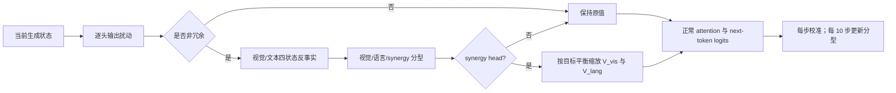

# MLLMs Hallucinate when Information Distribution Drifts in Synergy Heads

arXiv v1 · PreprintHead / ValueTraining-free已精读

[论文原文](https://arxiv.org/abs/2609.09206){ .kb-button .primary }

<strong>一句话总结</strong>
HEAL 先用 head-output 扰动排除因果冗余头，再以视觉/文本各自保留或加噪的四种反事实状态，把非冗余头分成视觉、语言与协同角色，并逐步重标定 synergy heads 的 value 信息占比；在 LLaVA-1.5-7B 上 POPE F1 85.4→87.7、CHAIRs 51.0→36.7、Recall 75.2→79.1，但 2×RTX 4090 的逐样本墙钟时间 11.36s→70.74s，机制价值高于即插即用效率。

## 官方方法概览图

<figure class="paper-figure">
  
  <figcaption><strong>本站等价抽象，不是作者原图。</strong>依据 <a href="https://arxiv.org/abs/2609.09206">arXiv v1</a> Sections 3.1–3.3 制作。公开版本包含分析示意，但没有确认可独立再分发的方法图许可，因此本站不复制作者图片；符号与实现判断以正文和附录为准。</figcaption>
</figure>

## 1. 论文速览

| 维度 | 内容 |
|---|---|
| 研究对象 | 对象幻觉与较长开放式回答中的事实错误；把错误归因到多模态信息在 decoder attention heads 中的分配漂移 |
| 核心归因 | 关键不是视觉 attention 总量单独变小，而是本应融合图文的 synergy heads 中视觉/语言贡献失衡 |
| 方法类型 | training-free、inference-time 机制诊断与 value calibration |
| 干预位置 | decoder self-attention head output；KV 更新之后、attention kernel 之前的 visual/text value vectors |
| 外部依赖 | 无 detector；MMHal-Bench 结果依赖外部 judge；主流程需四种反事实状态与周期性全层 head 分型 |
| 主要评测 | POPE、CHAIR、MME、LLaVA-Bench、MMHal-Bench、BLINK-Twice |
| 最适合角色 | head-level counterfactual attribution、动态干预与效率—忠实度权衡 baseline |

## 2. 研究背景与核心矛盾

### 2.1 研究的 hallucination

主实验覆盖两类协议：POPE 的对象存在性二元问答与 CHAIR 的开放式 caption。前者主要测 absent-object false positive，并同时报告 precision/recall/F1；后者用 CHAIRs/CHAIRi 测句子级和对象提及级幻觉，同时记录对象 Recall 与输出长度。MMHal-Bench 扩展到知识、属性、计数和关系等长回答，但依赖外部 evaluator。因而最强结论仍是**对象级视觉忠实度**，不能直接外推到任意多步视觉推理。

### 2.2 现有方法的缺口

仅按视觉 attention weight 排序 heads，容易把 token 位置、重复与序列长度等结构因素误认为视觉 grounding；全程增强同一批“视觉头”又可能损坏语言组织。HEAL 将问题改写为两个阶段：先判断一个 head 的输出对多头聚合结果是否不可替代，再问其不可替代信息来自视觉、语言还是两者联合。只有需要联合信息的 synergy heads 被校准，且 head taxonomy 随生成过程更新。

### 2.3 核心假设与证据强度

| 假设 | 论文证据 | 证据类型 | 仍可能的混淆因素 |
|---|---|---|---|
| 一部分 heads 对当前输出因果冗余 | 用矩匹配 Gaussian noise 替换单头输出，比较聚合输出相似度；不同遮蔽形式的分型一致率为 92.13%–95.36% | head-output intervention + robustness | 加噪是分布外操作；输出相似不代表最终生成等价 |
| hallucination 伴随 synergy heads 的视觉贡献下降 | 正确与幻觉样本的 synergy-head 视觉/语言比例系统性不同 | 条件相关性分析 | 错误标签、token 位置与对象词 onset 仍可能共同变化 |
| 恢复视觉/语言平衡可降低幻觉 | 只对 synergy heads 缩放 visual/text values，多个模型上 CHAIR↓、POPE F1↑ | 定向组件干预 | 预设平衡系数按模型/任务调参，不证明存在唯一自然平衡 |
| 动态分型优于静态头集合 | 更新间隔 2→20 步时 POPE F1 87.9→87.1 | 调度消融 | 未与等算力的事件触发或局部 onset 策略比较 |

## 3. 方法详解

### 3.1 整体流程

输入是 decoder 当前步各层 multi-head attention 的 head outputs 与视觉/文本 token values；中间量依次为非冗余性、四状态贡献和模态比例；干预只重标定 synergy heads 的 value vectors；输出仍由原模型 attention、residual 与 LM head 生成。

### 3.2 关键量与公式

在生成步 $t$、层 $l$、head $i$，记单头输出为 $o^{t,l,i}$，多头聚合前后的残差抽象为：

$$
y=x+W_O[o_1;\ldots;o_H].
$$

将第 $i$ 个 head output 替换为与其矩匹配的 Gaussian noise 得到 $\tilde y_{(-i)}$，以

$$
I_i=1-\operatorname{Sim}(y,\tilde y_{(-i)}),\qquad
\operatorname{Sim}(a,b)=\frac{1+\cos(a,b)}{2}
$$

衡量该头对聚合输出的影响。低于当步/层分布均值减 $3\sigma$ 的 heads 被视为冗余，不进入后续分型。这里的“因果”只指受控替换对局部张量的影响，并不等于完整的生成因果中介证明。

对非冗余 head 构造四种状态：$H_{11}=H(V,T)$、$H_{01}=H(\bar V,T)$、$H_{10}=H(V,\bar T)$、$H_{00}=H(\bar V,\bar T)$；下标表示视觉/文本 token 是否保留，横线表示用噪声反事实替换。论文定义：

$$
\begin{aligned}
I_{total}&=1-\operatorname{Sim}(H_{11},H_{00}),\\
I_{lang}&=\operatorname{Sim}(H_{11},H_{01})-\operatorname{Sim}(H_{11},H_{00}),\\
I_{vis}&=\operatorname{Sim}(H_{11},H_{10})-\operatorname{Sim}(H_{11},H_{00}),\\
I_{syn}&=1+\operatorname{Sim}(H_{11},H_{00})-\operatorname{Sim}(H_{11},H_{01})-\operatorname{Sim}(H_{11},H_{10}).
\end{aligned}
$$

这些量是受 PID 启发的 operational decomposition，并非满足 Shannon partial information decomposition 全部公理的信息量。论文再结合符号、logit modality ratio 与 MAD 阈值把 heads 标成 visual、language 或 synergy。

对 synergy head，视觉占比 $\alpha_{vis}=I_{vis}/(I_{vis}+I_{lang})$，语言占比 $\alpha_{lang}=1-\alpha_{vis}$。给定目标平衡 $\alpha$，校准因子为 $\beta=\alpha/\alpha_{vis}$ 与 $\gamma=(1-\alpha)/\alpha_{lang}$，分别缩放该头的 $V_{vis}$ 与 $V_{lang}$。实现位置在 KV 更新后、attention kernel 前，因此不直接改 attention logits 或最终 vocabulary logits。

### 3.3 实现细节

- 分析全部 decoder layers；head taxonomy 默认每 10 个生成步更新一次，synergy value calibration 每步执行。
- LLaVA/InternVL 在 POPE、CHAIR 上默认 $\alpha=0.5$，其他任务为 0.6；Qwen 在简单任务为 0.4、其他任务为 0.5，说明超参不是跨模型固定常数。
- Appendix 的 $\alpha$ 扫描显示 0.4–0.6 较稳；继续提高会出现性能下降与不通顺输出。
- 论文以四种反事实状态批处理减少调度开销，但仍需周期性全层、多头分析。2×RTX 4090、batch size 1、50 张 CHAIR 图的测量中，HEAL 只有 5.02 token/s，baseline 为 17.25 token/s。
- 截至 2026-09-12 未发现公开官方代码，因此 noise 构造、MAD 分型边界、特殊 token 划分和精确 cache 操作仍需自行复原。

### 3.4 方法究竟改变了什么

HEAL 改变的是 self-attention value 聚合时的**模态相对增益**，而不是重新编码图像，也不验证视觉内容本身是否正确。若视觉 encoder 已漏掉对象、图像证据含糊，放大 $V_{vis}$ 不能创造新证据；若错误来自对象词已经写入 residual/MLP，head-level 校准也可能太晚。它的结果同时可能来自抑制语言先验、改变回答长度或整体置信度，因此必须联合看 Recall、Length、重复率和通用能力。

## 4. 实验设计与关键结果

### 4.1 设置

| 项目 | 内容 |
|---|---|
| Models | LLaVA-1.5-7B、LLaVA-NeXT-7B、Qwen2-VL-7B、Qwen2.5-VL-7B、Qwen3-VL-8B、InternVL-7B、InternVL3.5-8B |
| Datasets / splits | POPE、CHAIR；MME、LLaVA-Bench；MMHal-Bench；BLINK-Twice，按论文官方评测协议 |
| Metrics | Accuracy/Precision/Recall/F1、CHAIRs/CHAIRi/Recall/Length、MME totals、MMHal score/hallucination rate、吞吐/时延/显存 |
| Baselines | 原始 beam/greedy 与 VCD、OPERA、EAH 等 training-free 方法；跨 backbone 原模型对照 |
| Ablations | Gaussian/zero/uniform/swap 替换、冗余阈值、$\alpha$、taxonomy 更新间隔、静态/动态成分、模型迁移、效率 |
| Statistical evidence | Table 1 的 HEAL 主结果报告均值±波动；多数跨模型表、效率表与附录扫描未给置信区间或显著性检验 |

### 4.2 主结果

| 设置 / 指标（方向） | Baseline | HEAL | 变化 | 来源 |
|---|---:|---:|---:|---|
| LLaVA-1.5-7B，POPE F1 ↑ | 85.4 | 87.7 ± 0.3 | +2.3 pt | Table 1 |
| LLaVA-1.5-7B，POPE Accuracy ↑ | 84.0 | 88.3 ± 0.2 | +4.3 pt | Table 1 |
| LLaVA-1.5-7B，CHAIRs ↓ | 51.0 | 36.7 ± 0.4 | −14.3 pt | Table 1 |
| LLaVA-1.5-7B，CHAIRi ↓ | 15.2 | 10.7 ± 0.03 | −4.5 pt | Table 1 |
| LLaVA-1.5-7B，CHAIR Recall ↑ | 75.2 | 79.1 ± 0.1 | +3.9 pt | Table 1 |
| LLaVA-1.5-7B，MME total ↑ | 565.34 | 669.76 ± 1.72 | +104.42 | Table 1 |

同一表中 caption length 102.2→99.8 ± 0.7，表明 CHAIR 改善并非简单靠显著拉长输出换 Recall；但较短回答仍可能减少可犯错机会，不能只看 hallucination rate。

### 4.3 消融与分析实验

| 实验 | 对照 / 唯一变量 | 关键结果 | 能支持什么 | 仍不能证明什么 | 来源 |
|---|---|---|---|---|---|
| 替换稳健性 | Gaussian vs zero/uniform/swap | 分型一致率 92.13%/93.21%/95.36%；POPE F1 87.84/87.12/86.93/87.53 | 主要结论不只依赖一种噪声 | 四种替换都可能偏离自然激活流形 | Tables 4–6 |
| 跨 backbone | 原模型 vs HEAL | LLaVA-NeXT CHAIRs 29.9→24.6；Qwen2.5-VL 27.2→23.3；InternVL 46.6→39.2，POPE F1 均提高 | 改善不局限于 LLaVA-1.5 | 每模型/任务分别选 $\alpha$，不等于零调参迁移 | Table 2 |
| 平衡扫描 | $\alpha$ 从语言侧向视觉侧移动 | 0.4–0.6 最稳；过高出现退化和语病 | 模态增益存在可测 trade-off | 最优点是否可从样本自适应推导 | Table 13 |
| 更新频率 | 每 2/5/10/20 步更新 taxonomy | LLaVA-1.5 POPE F1 随间隔扩大约 87.9→87.1 | 生成阶段中的角色变化有实用影响 | 收益是否抵得过额外计算 | Table 14 |
| 新模型/长回答 | Qwen3-VL、InternVL3.5，原模型 vs HEAL | MMHal hallucination rate 17.5→16.6、19.4→18.3；score 4.82→4.91、4.53→4.71 | 在较新 backbone/较长回答有小幅趋势 | 外部 judge 偏差、效果量小且无 CI | Table 16 |
| 系统成本 | 相同 2×RTX 4090、50 张 CHAIR 图 | 17.25→5.02 token/s；57.98→199.26 ms/token；11.36→70.74 s；显存 14.56→14.82 GB | 显存增量有限但计算/墙钟成本显著 | 不同 kernel、batch 与量化下成本 | Table 12 |

### 4.4 结果应该如何解读

**论文能够支持：**在其反事实 noising 与分型协议下，synergy heads 的模态贡献与对象幻觉相关；对这些 heads 的 visual/text values 做目标化动态重标定，可在多个 7B–8B VLM 上降低 CHAIR 并保持或提高对象 Recall/POPE F1。多种替换与阈值消融提高了诊断的稳健性可信度。

**论文不能据此证明：**synergy drift 是所有 VLM hallucination 的首要因果机制；$I_{vis}/I_{lang}/I_{syn}$ 是唯一或信息论上严格的贡献分解；人工设定的 $\alpha$ 恢复了真实自然状态；方法对视觉 encoder 漏证据、属性/关系推理或数据分布外长文本同样有效；当前收益足以抵消约 6.22× 的墙钟成本。

## 5. 亮点与贡献

- 把“注意力看了多少图像”推进到 head output 的反事实贡献与 value 信息来源，能够与 attention-weight heuristic 明确区分。
- 先做冗余筛除，再在非冗余头内分模态角色；实验逻辑比直接 top-k 视觉头增强更接近可证伪机制假设。
- 同时报告 CHAIR hallucination、Recall、Length、通用能力、替换稳健性与系统成本，避免只展示单一下降率。
- 分型随生成过程更新，提出了与实体 onset、局部风险窗口及 selective intervention 直接相连的研究接口。

## 6. 局限、指标漏洞与审稿风险

1. **Proxy validity：**局部 head-output cosine change 是因果扰动 proxy，不是完整计算图的 natural indirect effect。
2. **Counterfactual validity：**Gaussian/zero/uniform/swap 都不保证落在真实图文激活分布；多替换一致只能缓和、不能消除该问题。
3. **Language-prior confound：**视觉/文本 token 分组并不自动把 value 中已混合的跨模态信息解耦；视觉 token value 也可能携带 prompt 语义。
4. **Operational PID：**公式借用了 redundancy/synergy 语言，但相似度差分可为负，不能按 Shannon information 原义解释。
5. **任务与标注：**CHAIR/POPE 偏对象闭集，caption annotation 不完备；Recall 提升也可能受到同义词映射与长度影响。
6. **外部 evaluator：**MMHal-Bench 依赖外部 judge，论文未把 judge prompt/version 的不确定性纳入统计结论。
7. **超参迁移：**$\alpha$ 随模型与任务调整，削弱真正 plug-and-play 的说法；每个 head 共用目标也忽略异质性。
8. **动态边界：**固定 10-step 更新可能错过 noun onset 附近的急剧 visual→language 转移，论文未给事件触发对照。
9. **计算成本：**显存几乎不变不代表低成本；Table 12 的墙钟时间约为原模型 6.22×，部署代价显著。
10. **公开复现：**无可核对官方实现、commit 或环境锁定；分型规则和 cache 注入细节可能造成实现漂移。

## 7. 与我的研究关系

### 7.1 可直接借鉴

$I_{vis}$、$I_{lang}$ 与 $I_{syn}$ 可作为 POT/VR/PD/RBC 之外的 head-level visual-dependence signal：在同一对象生成 onset，比较 real image、null image 与 object-removed counterfactual 的 chosen-token logit、rank、head output 和贡献分解。如果 $I_{vis}$ 对对象删除不敏感，却能区分 caption 标签，说明它更像语言状态 proxy；反之才支持具体图像证据路径。

### 7.2 Baseline 决策

**论文价值 High；完整复现成本 High；低算力子实验适合度 Medium。**机制拆解值得作为 NOTICE、CausalLens、Dual-Pathway 与 Intervene-All-Paths 的 comparison；但完整 HEAL 要周期性执行四状态全层分析，公开代码又缺失，不适合作为最低成本默认 baseline。优先复现离线分型和少量选层版本，再决定是否实现逐步校准。

### 7.3 与已有路线的差异

NOTICE 关注分布内腐蚀是否改变“关键头”结论，HEAL 进一步分解关键头的模态来源；Role-Break 以 faithful 样本的 head role residual 做检测，HEAL 用样本内反事实状态；Dual-Pathway/Intervene-All-Paths 在组件与 I2T/T2T 路径上定位，HEAL 在单 head value 内调比例。它与 POT/VR/PD/RBC 互补，但若标签和 $\alpha$ 都由同一 benchmark 选择，联合预测时要防止循环校准。

## 8. 可执行的后续实验

| 实验 | Research question | Model / data | Intervention / comparison | Recorded outputs | Expected observation | Failure case | Cost |
|---|---|---|---|---|---|---|---|
| E1 三图反事实效度 | synergy 指标是否追踪具体对象证据？ | LLaVA-7B；100 个原图/null/对象移除三元组 | 固定 object onset，比较 $I_{vis}/I_{lang}/I_{syn}$ 与 VR/PD/RBC | paired Δ、AUROC、rank/logit、bootstrap CI | 删除对象后 $I_{vis}$ 与 chosen-token visual gap 同降 | 指标只随 prompt/position 变化 | Low–Medium，离线 300 个短序列 |
| E2 最小选层复现 | 全层扫描是否必要？ | POPE 200 问题 | 全层、middle-only、late-only、随机等量层 | F1/Recall、ms/token、显存 | middle/late 子集保留大部分收益 | head role 跨层分散 | Medium |
| E3 onset 触发更新 | 固定 10 步是否漏掉角色转移？ | CHAIR 200 图 | 10-step vs noun-probability/event-triggered taxonomy | CHAIRi/s、Recall、Length、更新时间 | 局部触发以更少扫描保留效果 | onset detector 自身不稳定 | Medium |
| E4 随机头与静态头对照 | 收益来自 synergy 定位还是一般增益缩放？ | POPE/CHAIR 各 200 | dynamic synergy、静态 synergy、随机等量 heads、language heads | Fix/Break、F1、CHAIR、重复率 | dynamic synergy 的 Fix/Break 更优 | 任意视觉增益都有相同收益 | Medium |
| E5 平衡—质量前沿 | $\alpha$ 收益是否由更短/模板化回答换来？ | CHAIR 200 图；$\alpha\in\{base,.4,.5,.6\}$ | 同 prompt/解码，配对评测 | CHAIR、Recall、Length、RE-2、Dist-2、人工盲评 | .4–.6 存在非支配区间 | 忠实度改善伴随严重重复/语法退化 | Medium |

## 9. 复现清单

- [x] arXiv v1（2026-09-05）正文、完整附录、Tables 1–16 已核对
- [x] 主结果、跨模型结果、mask 稳健性、平衡/间隔扫描与 2×RTX 4090 效率已登记
- [ ] 官方代码仓库、公开 archive 与 commit（截至 2026-09-12 未发现）
- [ ] 固定 Gaussian noise 的矩估计范围、随机 seed、MAD 阈值与特殊 token 划分
- [ ] 核对每个 backbone 的 conversation template、生成配置和 cache 注入位置
- [ ] 用公开 evaluator 锁定 MMHal judge 模型、版本和 prompt
- [ ] 复算 CHAIR synonym mapping，并同时报告 paired bootstrap CI、Length 与 repetition

## 10. 综合评分

| 维度 | 评分（1–5） | 理由 |
|---|---:|---|
| 与主线直接相关性 | 5 | 直接研究 object hallucination、head-level visual dependence 与推理时校准 |
| 方法/理论新颖性 | 5 | 四状态模态贡献分解与动态 synergy-head value calibration 形成清晰新机制 |
| 机制证据强度 | 4 | 有局部因果扰动、替换稳健性和定向干预；仍缺自然反事实/路径中介 |
| 实验完整性 | 4 | 多模型、多 benchmark、消融和成本较全；统计检验与开放域人工评测不足 |
| 可复现性/低算力适配 | 2 | 无公开代码且完整流程约 6.22× 墙钟成本 |
| 相对知识库新增信息 | 5 | 首篇把视觉/语言协同贡献漂移与逐步 head calibration 直接连接的 Note |

## 11. 检索标签与来源边界

`requires training: no` · `inference-only: yes` · `detector: no` · `external evaluator: MMHal only` · `interpretability: perturbation-level` · `mitigation: dynamic value calibration` · `baseline suitability: high mechanism value / high full-runtime cost`

本文依据 2026-09-12 核对的 [arXiv:2609.09206 v1](https://arxiv.org/abs/2609.09206) 正文和附录整理；该版本是 2026-09-05 提交的预印本，不代表正式录用。截至 2026-09-12 未发现官方代码仓库或公开 OpenReview/评审页面。所有定量数字均转录自 v1 Tables 1–16，不从曲线或低清图猜数；SVG、Mermaid、PID 边界解释、与 POT/VR/PD/RBC 的联系及后续实验为本站分析。
