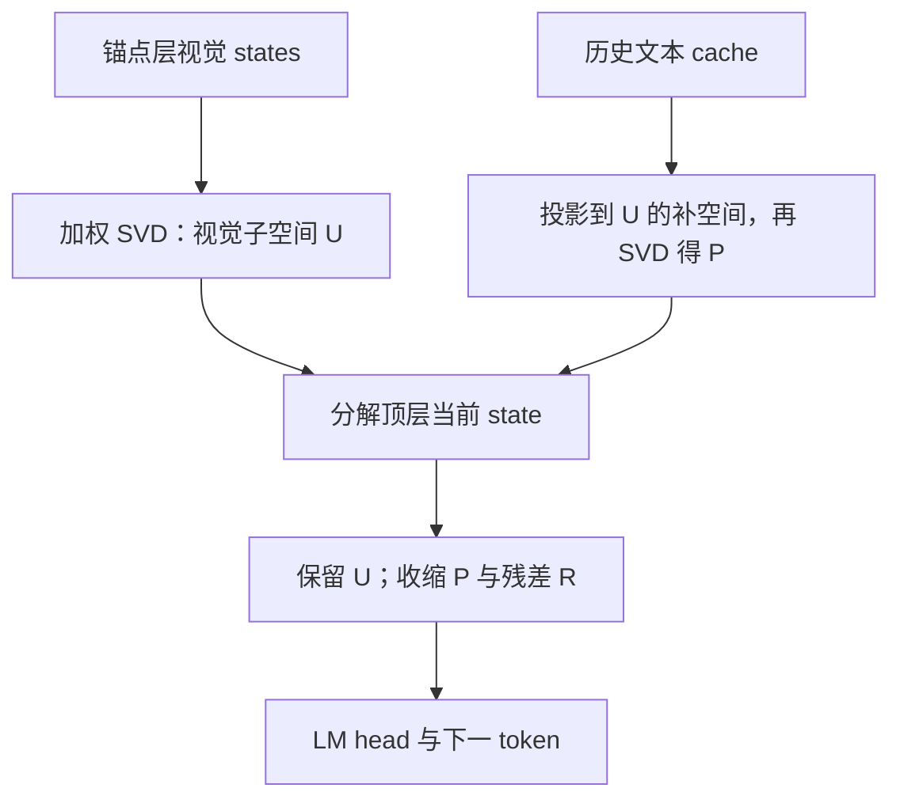

# HulluEdit

CVPR 2026 主会Residual / SubspaceTraining-freeautomated

[论文原文](https://openaccess.thecvf.com/content/CVPR2026/html/Lin_HulluEdit_Single-Pass_Evidence-Consistent_Subspace_Editing_for_Mitigating_Hallucinations_in_Large_CVPR_2026_paper.html){ .kb-button .primary } [arXiv v1](https://arxiv.org/abs/2602.22727v1){ .kb-button } [官方代码](https://github.com/VioAgnes/HulluEdit){ .kb-button }

<strong>一句话总结</strong>
每一步用视觉 token 与历史文本在线构造低秩正交子空间，再收缩“反先验”和残差分量；LLaVA-1.5 的 CHAIRs 20.40→13.00，但新模型补充实验的 Recall 46.0→45.2，且数学保证只保护方法自己定义的视觉投影，不能证明真实视觉语义完全无损。

## 官方方法概览图

<figure class="paper-figure"><figcaption>官方 Figure 2 展示视觉子空间、文本补空间和闭式编辑。未确认原图独立再分发许可，本页不复制图片；下图是<strong>本站等价抽象</strong>，不是作者原图。</figcaption></figure>

## 1. 论文速览

| 维度 | 内容 |
|---|---|
| 研究对象 | caption 与 yes/no 问答中的对象存在性幻觉 |
| 核心归因 | 深层 state 中视觉证据、语言先验和不确定成分纠缠；静态方向会误伤真实证据 |
| 方法类型 | 每个生成步在线估计子空间并编辑当前 hidden state；不更新模型参数 |
| 干预位置 | 中高层提取视觉/文本 states，顶层 LM head 前编辑当前 token residual |
| 外部依赖 | 在线不调用外部模型；评测依赖 COCO/POPE/AMBER 等标注与脚本 |
| 主要评测 | POPE、CHAIR、MME；补充 AMBER、Hallu-Bench、MMVet |
| 最适合角色 | 动态低秩表征编辑 baseline；“投影保证是否等于语义保证”的反例 |

## 2. 研究背景与核心矛盾

### 2.1 研究的 hallucination

主结果主要测对象提及错误。POPE 的 Accuracy/F1 是存在性问答，CHAIRi/s 是 caption 中对象词错误比例；它们不能直接外推到属性、关系或多步推理。补充材料的 AMBER `Cog` 和 MMVet 扩大了任务范围，但没有把“视觉子空间”与每种推理能力逐项对齐。

### 2.2 现有方法的缺口

VCD 等对比分支增加 forward，Nullu 等全局子空间不随图像和 prefix 变化。HulluEdit 试图同时满足逐样本、逐 token 与单分支：视觉 token 形成 (U)，历史非视觉文本在 (U) 的正交补中形成 (P)，剩余成分归入 (R)。真正的审计问题是：**线性代数上的不相交是否足以说明 (U) 就是全部真实视觉证据、(P) 就是有害先验。**论文没有给出语义可识别性定理。

### 2.3 核心假设与证据强度

| 假设 | 论文证据 | 证据类型 | 仍可能的混淆 |
|---|---|---|---|
| 加权视觉主成分可代表当前视觉证据 | Table 4：uniform SVD 的 CHAIRs 13.68，高于 full 13.00 | 组件消融 | 0.68 pp 无配对 CI；视觉 token 中也含位置/模板信息 |
| 文本补空间主成分是冲突先验 | 去掉正交补时 CHAIRs 15.90；只抑制 (P) 为14.66 | 干预 | 历史文本包含正确视觉摘要；高方差方向不等于有害方向 |
| 编辑不损害视觉信息 | (U^TP=0)，且 Δh 在 (U) 上投影远小于在 (P) 上 | 代数保证 + proxy | 只保证所定义的 (U) 分量不变，不保证所有视觉语义都在 (U) 中 |
| 自适应门控优于固定强度 | Table 4：fixed 13.88、w/o gating 22.90、full 13.00 | 组件干预 | 发布代码的门控实现与正文 Eq. 17 不同，需先对齐实现 |

## 3. 方法详解

### 3.1 整体流程

锚点层（LLaVA-1.5-7B 取第26层）提供视觉 token states，并维护一个历史非视觉文本滑动窗口。每个输出步先以当前顶层 state 对视觉 token 做余弦加权 SVD 得 (U\in\mathbb R^{d\times r})；把文本 cache 投影到 (I-UU^T)，再做 SVD 得 (P\in\mathbb R^{d\times q})。当前 state 分成 (h_U,h_P,h_R)，仅收缩后两项，然后送入 LM head。

### 3.2 关键量与公式

对当前 state (h\in\mathbb R^d) 与视觉 token (v_i)，正文 Equations (1)–(5) 的意图可写为：

\[
w_i=\operatorname{softmax}_i\frac{v_i^Th}{\lVert v_i\rVert\lVert h\rVert+\epsilon},\qquad
U=\operatorname{TopRightSVD}_r(W^{1/2}V).
\]

正文把 SVD 输出记号写成左奇异向量后又声明 (U\in\mathbb R^{d\times r})，维度不一致；官方代码实际取数据矩阵的**右**奇异向量，才得到 hidden-space basis。文本 cache (T\in\mathbb R^{n_t\times d}) 类似：

\[
\widetilde T=T(I-UU^T),\qquad P=\operatorname{TopRightSVD}_q(\widetilde T),
\]

从而 (U^TP\approx0)。令

\[
h_U=UU^Th,\quad h_P=PP^Th,\quad h_R=h-h_U-h_P,
\]

以及 (\mathrm{VCR}=\lVert h_U\rVert^2/(\lVert h\rVert^2+\epsilon))、(\mathrm{PCR}=\lVert h_P\rVert^2/(\lVert h\rVert^2+\epsilon))。正文的闭式编辑为

\[
h'=h_U+\frac{h_P}{1+\lambda_n+\lambda_p}+\frac{h_R}{1+\lambda_n}.
\]

由分母不小于1，可推出所定义 VCR 不降、PCR 不升；这是**按同一投影定义的比例单调性**，不是事实正确率或真实视觉证据单调提高的定理。

### 3.3 实现细节

核对官方 commit `6bc38b2a89dcae5be5681b949bf2b1272ad291d4`：`hulluedit/steer.py` 用中心化后的右奇异向量；LLaVA 默认 (r=8,q=5)，锚点层26、编辑顶层。代码按步重算与当前 (h) 有关的权重和两个 SVD，不是“一图只算一次”的静态方向。

论文与代码存在必须冻结的差异：正文 Eq. (17) 是由阈值 γv/γp 决定的二值 gate；发布代码没有使用该二值式，而是连续计算并截断 λn/λp，同时加入 `pcr_threshold`、norm restoration、与原 state 的 `blend_tau` 混合。正文闭式解因此不是代码最终输出的完整等式。不同配置文件的强度也不同，不能用一组参数替代所有模型/benchmark。

论文称低秩操作小于单层 (O(d^2)) 的2%，但每步 SVD、hidden-state 输出、Python hook 和 cache 管理仍需墙钟测量。Figure 3 没有可可靠转录的具体 TPS；本页不从柱图猜数。代码仓库提供 LLaVA、mPLUG-Owl2 等 engine 与评测脚本，但包含需要用户修改的路径和模型特定 token 区间，不能称一键跨架构复现。

### 3.4 方法究竟改变了什么

它保留一个低秩视觉-token主成分投影，同时整体压缩其正交补中的文本高方差与残差成分；这会改变 logits 范数、词汇竞争和输出保守程度。它没有证明 (P) 是“语言先验的因果方向”，也没有从图像新增证据。补充 Table 9 的 Recall 下降和主文案例中 “sign signifying / signpost sign” 的重复，说明视觉投影保持与信息覆盖/语言质量并非等价。

## 4. 实验设计与关键结果

### 4.1 设置

| 项目 | 内容 |
|---|---|
| Models | LLaVA-1.5-7B/13B、MiniGPT-4、mPLUG-Owl2、Qwen-VL-Chat；补充 Qwen2.5-VL、Intern2.5-VL |
| Datasets / splits | POPE Random/Popular/Adversarial；CHAIR 使用500张 MSCOCO；AMBER、Hallu-Bench、MME、MMVet |
| Generation | POPE greedy；caption nucleus，temperature=0.05、top-p=1.0、max length=64 |
| Baselines | VCD、ICD、VAF、DeCo、DoLa、OPERA、HALC、Nullu 等 |
| Statistical evidence | 正文称结果为3个随机 seed 均值，但 Tables 1–3 未报标准差/CI；补充 Table 10 是超参数区间统计 |
| Compute | 作者报告单张 A100；未给峰值显存，Figure 3 只给图形吞吐比较 |

### 4.2 主结果

| 设置 / 指标 | Baseline | HulluEdit | 变化 / 解读 | 来源 |
|---|---:|---:|---|---|
| LLaVA-1.5，CHAIRs ↓ | Greedy 20.40 | 13.00 | −7.40 pp | Table 2 |
| LLaVA-1.5，CHAIRi ↓ | Greedy 7.08 | 4.18 | −2.90 pp | Table 2 |
| LLaVA-1.5，BLEU ↑ | Greedy 15.72 | 15.49 | −0.23；并非质量全面提升 | Table 2 |
| mPLUG-Owl2，CHAIRs ↓ | Greedy 22.90 | 13.60 | −9.30 pp | Table 2 |
| LLaVA-1.5-7B，POPE Adversarial F1 ↑ | Greedy 79.4 | 83.4 | +4.0 pp | Table 1 |
| LLaVA-1.5，MME Count ↑ | 118.33 | 105.00 | −13.33；明确能力代价 | Table 3 |
| Qwen2.5-VL，CHAIRs ↓ | Greedy 15.6 | 13.2 | −2.4 pp | Supplement Table 9 |
| Qwen2.5-VL，Recall ↑ | Greedy 46.0 | 45.2 | −0.8 pp | Supplement Table 9 |
| AMBER Cover ↑ | Vanilla 48.9 | 47.0 | −1.9 pp | Supplement Table 6 |

### 4.3 消融与分析实验

| 实验 | 对照 / 唯一变量 | 关键结果 | 能支持什么 | 仍不能证明什么 | 来源 |
|---|---|---|---|---|---|
| 锚点/编辑层 | 26→last、20→last、30→last、last→last | CHAIRs 13.00 / 19.72 / 13.80 / 18.20 | 跨层读取有效 | 没有跨模型统一层规律或独立校准 |
| 子空间构造 | full vs uniform SVD vs 无正交补 | 13.00 / 13.68 / 15.90 | 加权和正交约束均有增量 | (U/P) 的语义命名仍未被识别 |
| 自适应性 | full / fixed / w/o gating | 13.00 / 13.88 / 22.90 | 自适应强度重要 | 论文 gate 与代码 gate 不同，复现前需对齐 |
| 抑制对象 | residual-only / anti-prior-only | 16.82 / 14.66 | 两分支组合最好 | residual 不是纯不确定性、(P) 不是纯有害先验 |
| 新模型 | greedy vs HulluEdit | Qwen Recall −0.8 pp；Intern Recall 51.6→50.9 | 幻觉改善可迁移 | 不支持“视觉 grounding 完全不受损” |
| 子空间改变量 | Δh 投影到 (U/P) | 约 (10^{-3}) vs (10^1) | 实现几乎不直接改 (U) | 只验证代数行为，不验证 (U) 覆盖全部视觉语义 |

### 4.4 结果应该如何解读

能够支持：在线低秩编辑在多种旧/新 LVLM 上降低对象幻觉，逐 token 自适应和正交构造比相应消融更好。不能支持：视觉信息在语义上完全无损；方法对所有 caption 质量、计数、recall 和 coverage 均提升；低秩主成分就是因果视觉证据；发布代码严格实现了论文给出的全部理论映射。

## 5. 亮点与贡献

HulluEdit 的价值不只是分数：它把“保护哪些方向”写成显式投影约束，并同时给出 residual、先验与门控消融；补充材料还报告了新模型 Recall/AMBER Cover，允许发现改善并非无代价。对于 CVPR 投稿，论文—代码一致性和“数学代理量到语义结论”的边界是比再加一个主表更关键的审查点。

## 6. 局限、指标漏洞与审稿风险

- **Proxy validity**：(U) 是视觉 token 的局部主成分，不是经过对象标注验证的完整视觉语义；正交不干扰是定义内保证。
- **Recall / coverage**：Qwen2.5/Intern2.5 Recall 与 AMBER Cover 均下降；正文标题式表述“without interfering”不能覆盖这些经验代价。
- **语言质量**：BLEU 略降，定性案例有明显重复；64-token上限可能掩盖长输出退化。
- **论文—代码差异**：二值 gate、最终 blend/norm restore 和阈值细节不同；理论保证是否仍适用于最终代码变换需要逐项重证。
- **统计**：主表无配对 CI，超参数通过 held-out dev 选择但未公开完整 image IDs、seed 与选择协议。
- **复杂度**：每 token SVD 的实际成本、显存和 batch scaling 没有数值表；“single-pass”不等于和 greedy 等墙钟成本。
- **维度记号**：正文 SVD 左/右奇异向量记号与声明形状不一致，代码澄清了实现，但增加独立复现歧义。

## 7. 与我的研究关系

这里只比较公开方法；个人未公开研究适配为 UNKNOWN。

### 7.1 可直接借鉴

它与 residual/activation editing、逐 token 门控以及 visual dependence 直接相关。可与 [Beyond Global Editing](beyond-global-editing.md)、[MESA](mesa-mitigating-entangled-steering.md) 和 [PTI](prefill-time-intervention.md) 比较：前两者关注子空间的逐样本性/纠缠，PTI只编辑 prefill KV；HulluEdit每步重建当前 state 的投影。

### 7.2 Baseline 决策

**Medium–High（表征编辑论文）**。核心 `steer.py` 逻辑可独立实现，但全模型 hook、token 区间和代码—公式对齐成本高于普通 logit baseline。公平比较至少需要 greedy、只做 norm/blend、随机同秩子空间、静态 (U/P) 和 matched-recall 对照。

### 7.3 与已有路线的差异

它不使用 real/null 图像差分，不定位 attention head，也不训练 detector。VCR/PCR 是由当前投影能量定义的内生 gate；如果以同一投影定义风险和干预方向，容易出现循环解释，因此事实标签和错配图像必须作为外部验证。

### 7.4 面向 CVPR 投稿的可借鉴证据

**论文实际证据**包括多模型、组件消融、新模型迁移和能力指标；**本站建议**是把证明对象写清楚、公开公式—代码映射、报告匹配 coverage/长度后的 Pareto 曲线，并用对象区域/错配图像验证子空间语义。CVPR 2027 的官方评审细则截至本轮仍未独立发布，以上不是官方录用条件。

## 8. 可执行的后续实验

| 实验 | Research question | Model / data | Intervention / comparison | Recorded outputs | Expected observation | Failure case | Cost |
|---|---|---|---|---|---|---|---|
| E1 | (U) 真能识别图像相关语义吗？ | 单个7B，100图 | real/null/错配图构造 (U)，固定相同 prefix | (U) 投影、对象logit、CHAIR/recall | real (U) 优于错配 | 错配同样有效，说明是通用收缩 | Low–medium：3组生成 |
| E2 | 增益来自子空间还是 norm/blend？ | 100图 | full、只norm/blend、随机同秩、uniform | recall—CHAIR、长度、重复 | full在同长度下占优 | 简单收缩解释全部 | Low：4×100生成 |
| E3 | 正文 gate 与代码 gate 是否等价？ | 50图 | 二值 Eq.17、发布连续 gate、固定强度 | 触发率、强度、配对结果 | 连续 gate更稳 | 两者排序不一致且需重调 | Low–medium |
| E4 | 单步 SVD 是否真低开销？ | 7B，batch 1/4 | greedy、静态子空间、逐步HulluEdit | wall time、显存、tokens/s | 开销随输出稳定 | batch/长输出显著退化 | Low：不需训练 |
| E5 | 是否保留对象覆盖？ | COCO 500或100 | 按 caption 长度匹配/截断 | CHAIR、Recall、Cover、Distinct、重复 | 同覆盖仍改善 | 主要靠少说/重复 | Medium |

## 9. 复现清单

- [x] CVF 正文 Tables 1–4 与补充 Tables 5–10、Figures 5–7 已核对。
- [x] arXiv v1 身份、CVPR 2026 主会页和官方代码 commit 已记录。
- [x] 主结果同时登记 hallucination、Recall/Cover 与能力下降项。
- [x] 论文公式与发布实现的 gate、norm/blend 差异已登记。
- [ ] held-out dev image IDs、三 seed、每个模型最终配置与 Figure 3 原始吞吐数字待冻结。
- [ ] 未运行生成，不声称复现成功。

## 10. 综合评分

| 维度 | 评分（1–5） | 理由 |
|---|---:|---|
| 直接相关性 | 5 | 动态 residual 子空间编辑与对象幻觉直接相关 |
| 新颖性 | 4 | 逐 token 正交分解与自适应收缩组合清晰 |
| 机制证据 | 3 | 组件干预较全，但子空间语义存在循环定义 |
| 实验完整性 | 4 | 多模型/多基准并报告 recall；主表统计和长度审计不足 |
| 可复现性 / 低算力 | 3 | 代码公开、单卡可跑；实现差异与模型适配增加成本 |
| 相对知识库新增信息 | 5 | 提供“代数保护不等于语义保护”的关键边界 |

## 11. 检索标签与来源边界

依据 [CVF 正文](https://openaccess.thecvf.com/content/CVPR2026/papers/Lin_HulluEdit_Single-Pass_Evidence-Consistent_Subspace_Editing_for_Mitigating_Hallucinations_in_Large_CVPR_2026_paper.pdf)（pp.11086–11095）、[CVF 补充](https://openaccess.thecvf.com/content/CVPR2026/supplemental/Lin_HulluEdit_Single-Pass_Evidence-Consistent_CVPR_2026_supplemental.zip)、arXiv v1 与官方 commit `6bc38b2`。截至2026-10-10未发现可归属的公开评审/rebuttal 页面；没有把作者自述或第三方自动摘要当作独立审稿意见。

正文声称、实验证据、代码观察和本站推断已分别表述。所有“审稿风险”和后续实验均为本站分析。标签：inference-only、online-SVD、residual editing、no external detector、baseline-medium-high。
