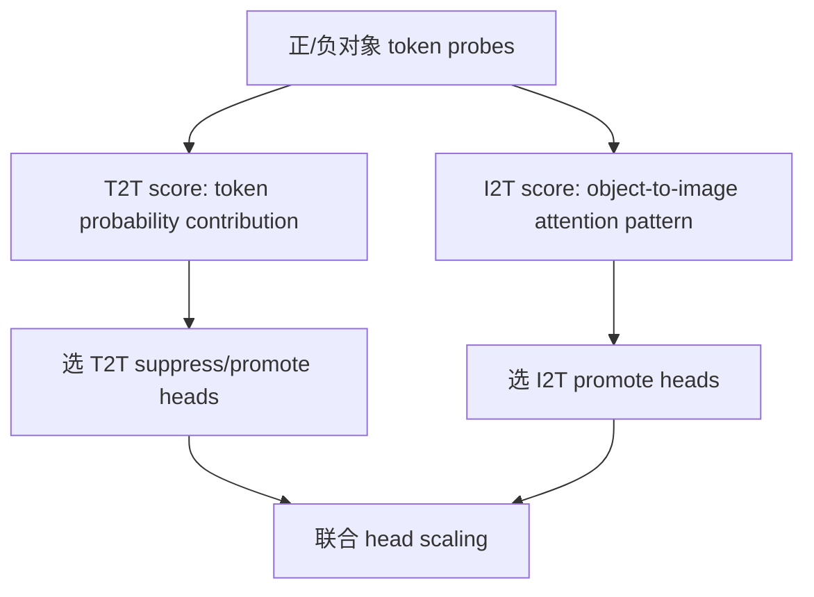

# Intervene-All-Paths（AllPath）

NeurIPS 2025Head / Causal PathTraining-free已精读

[OpenReview](https://openreview.net/forum?id=HRBhNqkG03){ .kb-button .primary } [官方代码](https://github.com/SooLab/AllPath){ .kb-button }

<strong>一句话总结</strong>
AllPath 认为不同 alignment format 会调用不同信息路径：POPE 式短答案更依赖 image-to-input-text 与 text-to-text，CHAIR 生成还需要 image-to-output-text；因此分别探测 T2T/I2T heads，再联合压制坏路径与增强好路径。

## 1. 论文速览

| 维度 | 内容 |
|---|---|
| 研究对象 | POPE、MCQ-POPE 与 CHAIR 中跨格式 object hallucination |
| 核心归因 | 单一路径 intervention 不能覆盖 discriminative QA 与 open-ended generation 的不同依赖 |
| 方法类型 | Offline head probing + training-free head scaling |
| 干预位置 | T2T 与 I2T attention heads |
| 外部依赖 | Probing 需要正/负对象 token 集与 attention；生成阶段无需 detector |
| 主要评测 | POPE、MCQ-POPE、CHAIR、MME |
| 最适合角色 | Static multi-path intervention 主 baseline |

## 2. 研究背景与核心矛盾

POPE 只输出 Yes/No，回答 token 可能主要读取 prompt 中的对象词和已经注入到输入文本表示的视觉信息；CHAIR 要持续生成新对象词，output tokens 还需在每一步回看 image tokens。论文据此拆出三类路径：

1. image → input text；
2. image → output text；
3. text → text。

### 核心假设与证据

| 假设 | 证据 | 强度 | 风险 |
|---|---|---|---|
| alignment format 改变关键路径 | 屏蔽 image-to-input/output attention 后 POPE 与 CHAIR 的不同退化 | 路径干预 | attention mask 会改变整体归一化 |
| T2T 与 I2T heads 功能可分 | 两套 score 排名相关系数仅约 0.1233 | 探测相关 | 低相关不等于功能独立 |
| 联合干预跨格式更稳定 | 多 benchmark 主表与 pathway ablation | 组合干预 | head set/scale 可能 benchmark-specific |

## 3. 方法详解

### 3.1 Head probing

**T2T score** 比较 head 对真实对象与不存在对象 token 的 log-probability influence，寻找促进正确文本路径或推动幻觉的 heads。**I2T score** 利用当前 object token 到 image tokens 的 attention：真实对象期望在相关视觉区域形成较集中支持，不存在对象则更可能呈弥散模式。最终取正负样本分数差做 head ranking。

论文强调这些 score 可在单次 forward 中获得各 heads 的相对行为，而不必逐 head 完整生成；但具体 modified log-probability、attention aggregation 和 token 分组公式应按代码实现复核。

### 3.2 联合干预

构造需抑制的集合 (Z^{-}) 与需增强的集合 (Z^{+})：前者主要来自促进 hallucination 的 T2T heads，后者联合 grounded I2T heads 与有益 T2T heads。生成时对所选 head output/attention path 使用固定比例缩放。

### 3.3 最重要的格式结论

论文路径消融显示：移除 output-token→image-token 路径时，POPE 退化较小，而 CHAIR 显著变差。这意味着短判别答案可能在进入解码前已把视觉信息写入文本位置；开放生成则持续需要 image-to-output path。不能用 POPE 上有效的机制结论直接外推 CHAIR。

## 4. 实验设计与结果审计

| 项目 | 内容 |
|---|---|
| Models | LLaVA-1.5-7B 为主，并扩展 Qwen-VL-Chat 等架构 |
| POPE | Accuracy/F1，random/popular/adversarial |
| MCQ-POPE | Accuracy/Macro-F1，改变对齐格式 |
| CHAIR | COCO val 随机 500 图；CHAIRs/CHAIRi、Recall/F1/length 相关结果 |
| MME | existence/count/position/color 等相关子集；3 次测试平均 |
| Baselines | Vanilla、VCD、ICD、PAI、AD-HH 等 |
| Ablations | T2T only、I2T only、不同 path mask、head 数与 scale |

论文报告 AllPath 在三类核心 benchmark 上均取得最优或稳定提升，且强调部分 baseline 会通过缩短 CHAIR 生成（例如 Qwen-VL-Chat 上 PAI 长度明显下降）换取表面指标。该点与当前 recall-preserving 研究高度相关。

## 5. 亮点与贡献

- 不把 hallucination 简化成“增强 image attention”单一路线，而是显式比较多条 causal path。
- 用 POPE/MCQ-POPE/CHAIR 组成 alignment-format 对照，实验问题设计强于只堆 benchmark。
- 同时保留 Recall/F1/length 视角，暴露生成变短造成的伪改善。
- 为当前 static head intervention 提供直接可复现 anchor。

## 6. 局限、指标漏洞与审稿风险

1. **Head score 依赖 probe data**：对象词表、正负样本和 prompt format 会决定 head ranking。
2. **I2T proxy 不充分**：attention 集中到正确区域仍不代表 value/output 含正确语义。
3. **Static scaling**：所有 token step 使用同一强度，容易在无需视觉对象 grounding 的功能词阶段破坏语言质量。
4. **因果路径非独立**：屏蔽一条路径会触发其他路径补偿；简单加和不能证明路径贡献可分。
5. **跨任务范围**：核心仍是 object existence，属性/关系/推理路径可能不同。

## 7. 与我的研究关系

### 7.1 对当前实验的直接解释

你观察到 suppress heads 能显著降低 CHAIR，但 Recall 下降、循环率上升；反向干预恢复流畅度却增加幻觉。这与 AllPath 的路径竞争一致：被压制 heads 可能同时承担 text continuation 与对象覆盖，而 enhanced heads 未必在每个 step 都应持续放大。

### 7.2 Baseline 决策

**适合度：High。** AllPath 应作为 head intervention 主 baseline，但主比较必须包含 CHAIRi/s、Recall、F1、length、循环率与 max-token rate，不能只复现论文的幻觉下降。

### 7.3 最有价值的改进方向

将固定 (Z^{-}/Z^{+}) 保留为 head set，将固定 scale 改为 token-risk gate：只有候选对象 token、低 VR、高 prior 或 detector 高风险时才增强 I2T/抑制坏 T2T；其他 step 维持原模型。

## 8. 可执行的后续实验

| 实验 | RQ | Comparison | Outputs | Expected | Failure | Cost |
|---|---|---|---|---|---|---|
| E1 Dynamic AllPath | 固定 scale 是否造成 recall/loop？ | static vs entity-risk gate | CHAIR/Recall/loop/length | gate 改善 Pareto | detector 延迟/误报 | Medium |
| E2 Format transfer | 同一 head set 能跨 POPE/CHAIR 吗？ | fixed vs re-probed | head overlap、gain | T2T/I2T 部分迁移 | prompt 主导 | Low |
| E3 Output validation | I2T attention 是否携带正确语义？ | attention vs (W_Oh) logit attribution | alignment、Δlogit | 部分 heads 为伪视觉 | value 不可解释 | Medium |
| E4 Path counterfactual | real/blank 对各 path 影响如何？ | path mask × image counterfactual | VR、T-VHD、score | 区分输入注入与持续回看 | mask OOD | Medium |

## 9. 复现清单

- [ ] 记录 probe dataset、正负 token 构造和 head ranking
- [ ] 固定 head index、干预位置、scale 与 token steps
- [ ] 加入随机/同层/同 norm heads 对照
- [ ] 同时报 CHAIR、Recall、F1、length、loop 和 max-token rate
- [ ] 对 POPE、MCQ 与 CHAIR 分开解释，不混合 format 结论

## 10. 综合评分

| 维度 | 评分 | 理由 |
|---|---:|---|
| 新颖性 | 4/5 | 多路径 + alignment-format 统一分析 |
| 机制证据 | 4/5 | path mask、head probing 与干预组合 |
| 实验完整性 | 4/5 | 三种格式、多个模型、关键副作用讨论 |
| 可复现性 | 4/5 | 有官方代码；需严格复刻 probe |
| 与当前研究相关性 | 5/5 | 直接对应 static/dynamic head scaling 与 recall trade-off |

## 11. 来源边界

`requires training: no` · `inference-only: yes` · `object detector: probing-stage labels/proxies` · `external LLM evaluator: no for core method` · `interpretability: high` · `baseline suitability: high`

路径相关系数、CHAIR 500 图、MME 三次平均和格式消融结论来自论文；动态门控及对当前 G×A 结果的解释属于研究延伸。
