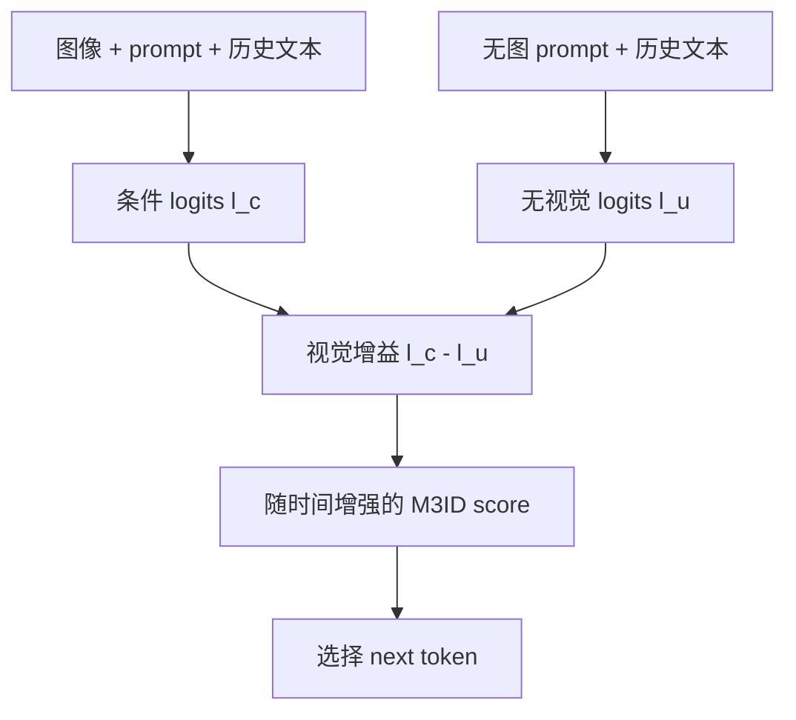

# Multi-Modal Hallucination Control by Visual Information Grounding

CVPR 2024方法论文Token / LogitTraining-free已精读

[CVF 原文](https://openaccess.thecvf.com/content/CVPR2024/html/Favero_Multi-Modal_Hallucination_Control_by_Visual_Information_Grounding_CVPR_2024_paper.html){ .kb-button .primary } [arXiv](https://arxiv.org/abs/2403.14003){ .kb-button }

<strong>一句话总结</strong>
M3ID 把“有图条件分布减去无图分布”视为视觉条件带来的信息增益，并随生成步推进逐渐加强这项对比，从 logit 层抵消视觉条件被历史文本稀释的问题。

## 官方方法概览图

<figure class="paper-figure">
  
  <figcaption>官方 M3ID 方法图，来自 arXiv v1 source 的 <code>figures/splash_cr.pdf</code>：放大有图与无图分布的差异，抑制语言先验支持但视觉证据不足的对象。</figcaption>
</figure>

## 1. 论文速览

| 维度 | 内容 |
|---|---|
| 研究对象 | Caption / VQA 中的 object hallucination |
| 核心归因 | Autoregressive generation 中视觉条件逐渐被文本历史稀释，language prior 占优 |
| 方法类型 | Training-free contrastive decoding |
| 干预位置 | 每个生成步的 vocabulary logits |
| 外部依赖 | 无 detector、无外部 evaluator 参与生成；需要额外无图分支 forward |
| 主要评测 | MS COCO / CHAIR、POPE；同时关注 Cover / 输出质量 |
| 最适合角色 | Logit-level baseline、visual-dependence conceptual baseline |

## 2. 研究背景与核心矛盾

### 2.1 研究的 hallucination

论文主要研究模型描述或确认图像中不存在物体的 **object hallucination**。Caption 侧由 CHAIR 将生成文本中的对象词与 COCO 标注对齐；POPE 将其改写为物体存在性 Yes/No 判断。因此证据最直接地适用于 object existence，而非属性、关系、计数或多步推理幻觉。

### 2.2 现有方法的缺口

标准 LVLM 在每一步使用图像、prompt 与已生成文本预测下一个 token。随着文本历史变长，图像在条件上下文中的相对影响可能下降；高频共现对象则可从语言模型先验获得稳定优势。论文把这个现象称为 **conditioning dilution / fading memory**。仅用 greedy 或普通 sampling 不会显式补偿这一变化。

### 2.3 核心假设与证据强度

| 假设 | 论文证据 | 类型 | 尚存 confound |
|---|---|---|---|
| 生成越长，视觉条件影响越弱 | Prompt Dependency Measure 随生成位置变化 | 相关性 | token 位置同时改变句法角色、对象密度和不确定性 |
| 幻觉来自 language prior 压过视觉条件 | 条件/无条件分布对比与 M3ID 干预 | 分布反事实 + 干预 | “无图分支”不一定是纯语言先验，也包含格式分布偏移 |
| 放大视觉增益可降低幻觉 | 多模型、CHAIR/POPE 上的 decoding 结果 | 输出干预 | 降低幻觉可能部分来自更保守或更短的生成 |

## 3. 方法详解

### 3.1 整体流程

### 3.2 条件分布与视觉增益

在生成步 (t)，条件分支与无视觉分支分别为：

\[
l_c(y)=\log p_\theta(y\mid v,x,y_{<t}),\qquad
l_u(y)=\log p_\theta(y\mid x,y_{<t}).
\]

其中 (v) 是图像 tokens，(x) 是指令，(y_{<t}) 是已经生成的文本。二者差值

\[
\Delta_v(y)=l_c(y)-l_u(y)
\]

表示加入图像后候选 token (y) 获得或失去的相对支持。它不是 correctness score：一个错误 token 也可能因为错误视觉对齐获得正增益。

为便于与其他 decoding 方法统一比较，可把 M3ID 写成如下等价抽象：

\[
s_t(y)=l_c(y)+\alpha_t\bigl(l_c(y)-l_u(y)\bigr),
\]

其中 (alpha_t) 随生成推进增大，用来抵消后期更强的 conditioning dilution。具体 schedule 与系数应以官方实现为准，不能把此统一写法当成逐字论文原式。

### 3.3 PDM：测量分布是否依赖视觉 prompt

Prompt Dependency Measure（PDM）从 distribution level 比较有图与无图预测。它回答“加入视觉条件后整个 next-token distribution 改变了多少”，而不是“选中的 token 是否真实”。因此：

- PDM 高：模型对图像敏感，但可能敏感于错误或捷径特征；
- PDM 低：当前预测接近无图语言分布，但未必一定 hallucinate；
- PDM 与 CHAIR 标签的关系需要 token-level 条件分析，不能直接画等号。

### 3.4 计算与实现

M3ID 每步需要条件与无条件两套 logits。若不能复用 cache，解码代价接近双分支方法。最小复现必须保持 tokenizer、prompt template、历史文本和 generation configuration 一致，只改变视觉条件，否则 (Delta_v) 会混入格式差异。

## 4. 实验设计与关键结果

### 4.1 设置

| 项目 | 内容 |
|---|---|
| Models | 论文覆盖多种当时主流 MLLM；复现应优先固定 LLaVA-family 单一实现 |
| Datasets | MS COCO caption；POPE 的 random / popular / adversarial object queries |
| Metrics | CHAIRs↓、CHAIRi↓、Cover↑；POPE Accuracy / F1 / Yes ratio |
| Baselines | 标准 decoding 与同期 training-free hallucination mitigation |
| 关键控制 | 输出长度、对象覆盖率、不同 decoding strength |
| Statistical evidence | 具体 split、seed 与显著性需按 CVF 正文/补充材料复核 |

### 4.2 指标真正衡量什么

| 指标 | 解释 | 主要漏洞 |
|---|---|---|
| CHAIRi | 被提及对象中 hallucinated object 的比例 | 依赖对象词表与 COCO 标注完整性 |
| CHAIRs | 含至少一个 hallucinated object 的 caption 比例 | 对文本长度高度敏感 |
| Cover | 覆盖标注对象的程度 | 标注不全；不能代表描述质量全部维度 |
| POPE | 二元 object existence QA | Yes/No bias、否定理解、prompt format confound |

### 4.3 结果应如何解读

论文结果支持“分布对比可作为有效 decoding control”。它尚不能证明所有 hallucination 都源自低视觉依赖，也不能证明无图分支精确等于 language prior。若 CHAIR 改善但 Cover、Recall、长度下降，就可能是保守化而非 grounding 真正增强。

## 5. 亮点与贡献

- 将多模态 mutual-information 视角落到可执行的 next-token decoding，而不是只做事后分析。
- 提供了与真实图像 vs 空白图像 logits 对比几乎同构的研究接口。
- 不依赖 detector 或额外训练，适合小规模机制实验和统一 baseline。
- 论文同时讨论覆盖率，意识到单独降低 CHAIR 会奖励“少说少错”。

## 6. 局限、指标漏洞与审稿风险

1. **反事实不纯**：no-image、blank-image、noise-image 与 mismatched-image 对模型而言是不同 OOD 条件；任何一个都不能天然代表纯 language prior。
2. **视觉依赖不等于事实性**：模型可能强烈依赖错误区域或视觉编码器偏差，产生高 (Delta_v) 的错误 token。
3. **双分支成本**：需要额外 forward；长生成中 latency 与显存 cache 需要真实测量。
4. **适用范围窄**：主要证据来自 object hallucination，关系、计数、属性和 reasoning 尚需独立验证。
5. **Recall trade-off**：增大对比强度可能压低不确定但正确的长尾对象，必须同时报告 recall / cover。

## 7. 与我的研究关系

### 7.1 可直接借鉴

M3ID 是 real-vs-blank token logit 实验最直接的 baseline。可在同一 token 上并列计算：

\[
VR_t(y)=l_{real,t}(y)-l_{blank,t}(y),
\]

并与 PDM、probability difference（PD）、rank-based change（RBC）比较。若 hallucinated token 的 (Delta_v) 低、无图 logit 高，支持 prior dominance；若 (Delta_v) 高却仍错误，更像视觉编码或对齐失败。

### 7.2 Baseline 决策

**适合度：High。** 最小实现只需暴露两分支 logits 与解码 hook，不需要 detector 或训练。建议作为 logit-level anchor，与 SID（内部弱视觉分支）、VHD/VHR（head output）和 AllPath（path intervention）组成层级对照。

### 7.3 与 POT 的差异

POT/CLIP support 是外部跨模态相似度，M3ID 的差分来自 LVLM 自身输出分布。前者可检测显式 grounding，后者测模型内部条件敏感性；二者一致时证据更强，不一致样本则是最有价值的 failure subset。

## 8. 可执行的后续实验

| 实验 | Research question | Model / data | Comparison | Outputs | Expected | Failure case | Cost |
|---|---|---|---|---|---|---|---|
| E1 多反事实分支 | 哪种分支最接近 language prior？ | LLaVA-1.5-7B / COCO 500 | no/blank/noise/mismatch | Δlogit、rank、KL、CHAIR label | 幻觉 token 对视觉替换更不敏感 | prompt/OOD 主导差异 | Low |
| E2 指标一致性 | PDM 与 VR/PD/RBC 是否同义？ | 同上 | token-level correlation + AUROC | 各指标、CI | 部分相关但不等价 | 对象 token 稀疏 | Low |
| E3 Candidate absence | 错误来自候选缺失还是选错？ | CHAIR object steps | 检查 real branch top-k | GT rank、hallucination rank | 两种 failure 可分离 | GT object tokenization 多义 | Low |
| E4 Recall-preserving schedule | 动态强度能否减少 recall 损失？ | COCO 500 | static vs risk-gated α | CHAIRi/s、Recall、length | 仅高风险步干预更平衡 | detector 误报 | Medium |

## 9. 复现清单

- [ ] 固定论文/代码版本和 prompt template
- [ ] 明确无视觉分支的构造方式
- [ ] 记录两个分支是否共享 KV cache
- [ ] 同时报 CHAIRi、CHAIRs、Recall/Cover、length
- [ ] 保存每个对象 token 的两分支 logits 与 rank
- [ ] 对 (alpha_t) 做统一范围扫描

## 10. 综合评分

| 维度 | 评分 | 理由 |
|---|---:|---|
| 新颖性 | 4/5 | mutual-information decoding 与多模态 grounding 结合清晰 |
| 机制证据 | 3/5 | 有分布反事实与干预，但无图分支含 confound |
| 实验完整性 | 4/5 | 覆盖 caption/QA，并意识到 coverage trade-off |
| 可复现性 | 4/5 | Training-free，核心接口简单；成本约双分支 |
| 与当前研究相关性 | 5/5 | 与 real/blank logits 反事实直接同构 |

## 11. 检索标签与来源边界

`requires training: no` · `inference-only: yes` · `detector: no` · `external LLM evaluator: not required for decoding` · `interpretability: medium` · `mitigation: yes` · `baseline suitability: high`

本页元数据与方法主张依据 CVF 论文入口；研究连接、风险判断和统一公式写法属于个人分析。引用具体定量结果时应回查 CVF 正文与补充材料中的对应表格。
