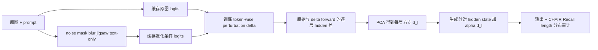

# Mitigating Entangled Steering

arXiv 2026Representation steeringOffline direction learning已精读

[论文原文](https://arxiv.org/abs/2604.07914){ .kb-button .primary }

<strong>一句话总结</strong>
MESA 认为传统 latent steering 由随机噪声/遮挡构造的差分方向同时混入了“幻觉变化”和“正常生成分布变化”；它先学习一个受控的视觉 token 扰动，使主导候选更接近退化图像下的 hallucination distribution、其余候选仍贴近原始分布，再从原始/受控扰动 hidden-state 差分中做 PCA，得到逐层方向用于推理时注入。

## 官方方法概览图

<figure class="paper-figure">
  
  <figcaption>官方方法总览（论文 Figure 3）。图片由 <a href="https://arxiv.org/abs/2604.07914">arXiv v1</a> 官方 LaTeX source package 中的 <code>figs/overview_mesa_v2.pdf</code> 直接转换；点击查看原图。</figcaption>
</figure>

图中 Stage I 用原图与多种视觉退化得到 $z_{orig}$ 和多个 $z_{hall}$；Stage II 学习受限扰动 $\delta$，同时优化 hallucination enhancement 与 distribution preservation；Stage III 比较原始与 $\delta$-perturbed forward 的逐层 hidden state，并用 PCA 提取 $d^{(l)}$；Stage IV 才是部署阶段，将离线方向加到生成 token 的逐层表示。故 MESA 并非严格的“零训练”方法：基础 LVLM 冻结，但 perturbation MLP 和方向需要离线数据与优化。

## 1. 论文速览

| 维度 | 内容 |
|---|---|
| 研究对象 | latent-space steering 降低幻觉时同时缩短输出、移动 EOS 竞争和 token frequency distribution 的纠缠问题 |
| 核心归因 | 随机图像扰动产生的差分包含 hallucination component 与 non-hallucination generation shift，单一方向不能选择性控制 |
| 方法类型 | 离线学习受控视觉扰动和逐层方向；推理时 plug-and-play activation steering |
| 干预位置 | projector 后的 visual embeddings 用于学习 $\delta$；部署时对 decoder 生成 token hidden state 逐层加方向 |
| 外部依赖 | 无 detector；需要缓存原图/五类退化条件的首步 logits、训练轻量 MLP、逐层 hidden states 与 PCA |
| 主要评测 | CHAIR、POPE、AMBER、LLaVA-Bench；hallucination、Recall、Cover、length、EOS margin、Zipf 与吞吐量 |
| 最适合角色 | 与 VTI/Nullu/全局 steering 对比的 distribution-preserving representation baseline |

## 2. 研究背景与核心矛盾

### 2.1 研究的 hallucination

论文覆盖开放式 caption 的 object hallucination（CHAIR）、二元存在性判断（POPE）以及 AMBER 的 existence/attribute/relation。核心研究对象不是“是否能找到一个降低 CHAIR 的方向”，而是干预是否通过正常机制减少错误，还是通过少说、提前 EOS、移动常用词分布获得指标收益。这个问题对所有 activation steering 都关键：低 CHAIR 若伴随 Recall、coverage 或长度下降，并不能证明视觉 grounding 增强。

### 2.2 现有方法的缺口

VTI 等方法比较原图与噪声/遮挡图的 hidden states，Nullu 等方法也从正负条件提取子空间。随机扰动不仅削弱真实视觉证据，还改变序列终止、词频和整体语义；因此差分 $d^{(l)}$ 可能同时包含 $\Delta_{hall}^{(l)}$ 与 $\Delta_{non-hall}^{(l)}$。MESA 将目标改写为选择性控制：最大化幻觉相关变化，同时惩罚非幻觉分布变化。

### 2.3 核心假设与证据强度

| 假设 | 论文证据 | 证据类型 | 仍可能的混淆因素 |
|---|---|---|---|
| 传统方向与生成行为纠缠 | Figure 2：VTI 随强度增加出现长度/EOS shift，Nullu 改变 Zipf 分布 | 参数扫描 + 分布分析 | 不同方法超参和实现未必在等 CHAIR/Recall 点比较 |
| 受控扰动能得到更选择性的方向 | Table 5：双 loss 完整版优于单项 loss 与简单 perturbation | 组件消融 | 改善也可能来自更强监督、更大离线计算或多扰动 ensemble |
| MESA 不靠极端保守输出降幻觉 | CHAIR 同时报 Recall/length；Figure 6 检查 EOS margin 与 Zipf | 行为审计 | length 与边际分布接近不保证句法、语义覆盖逐样本保持 |
| 方向确实对应幻觉机制 | 多 benchmark 与幻觉词频下降 | 跨任务结果 | 缺少 token-level causal mediation；训练目标仍以退化图 logits 作 proxy |

## 3. 方法详解

### 3.1 整体流程

### 3.2 关键量与公式

轻量两层 MLP $f_\phi$ 接收投影后的 visual embeddings，并受元素级界限约束：

$$
\delta=\operatorname{clip}(f_\phi(E_v(V)),-\epsilon,\epsilon),\qquad \epsilon=1.
$$

原图 logits 给出 $P_{orig}$；对 Gaussian noise、patch mask、blur、jigsaw、text-only 等退化条件得到 $P_{hall}^{(k)}$。诱导分布 $P_{ind}$ 的 hallucination loss 只在 top-50 候选上计算，并按退化条件相对原分布的 KL 大小动态加权：

$$
\mathcal L_{hall}=\sum_k w_k D_{KL}(P_{ind}\|P_{hall}^{(k)}),\quad
w_k\propto D_{KL}(P_{hall}^{(k)}\|P_{orig}).
$$

preservation loss 排除最高概率的 top-5，再约束剩余高概率区域贴近 $P_{orig}$：

$$
\mathcal L=\mathcal L_{hall}+\mathcal L_{preserve}.
$$

这不是直接把模型训练成 hallucinate，而是用 hallucination-inducing distribution 作为探针，得到原始与诱导状态差 $\Delta h^{(l)}=h^{(l)}-\tilde h^{(l)}$，再跨样本 PCA 得到 $d^{(l)}$。推理时使用 $\hat h^{(l)}=h^{(l)}+\alpha d^{(l)}$。符号方向来自“原始减诱导”，因此实现时不能颠倒差分。

### 3.3 实现细节

- LLaVA-v1.5 与 Qwen-VL；基础模型冻结。
- 每个退化条件运行一次并缓存 first-step logits；perturbation MLP 训练 10 epochs，AdamW，学习率 $10^{-3}$。
- $\mathcal L_{hall}$ 用 top-50，$\mathcal L_{preserve}$ 排除 top-5；PCA 默认 rank 1。
- CHAIR 上方向注入所有 transformer layers，$\alpha=1.4$；除 VCD/ICD 外用 greedy decoding，max new tokens 512。
- 方向是离线、全局、逐层的，并非按样本/风险 token 动态路由；训练开销与缓存规模应计入复现成本。

### 3.4 方法究竟改变了什么

MESA 直接改变 residual/hidden trajectory，也间接改变 logits、EOS margin 与词频。论文对“正常生成行为”的定义主要是平均长度、EOS margin 与 Zipf/token distribution；它并未证明每个输入上的非幻觉内容完全不变。若方向抑制高频对象词，也可能同时损伤真实对象 recall，因此 CHAIR、Recall 与 coverage 必须联合报告。

## 4. 实验设计与关键结果

### 4.1 设置

| 项目 | 内容 |
|---|---|
| Models | LLaVA-v1.5、Qwen-VL；主要消融为 LLaVA-v1.5-7B |
| Datasets / Benchmarks | MSCOCO CHAIR 1000 images；POPE on MSCOCO/A-OKVQA/GQA；AMBER；LLaVA-Bench |
| Metrics | CHAIR$_S$/CHAIR$_I$ ↓、Recall/Cover/length ↑；POPE Acc/F1 ↑；AMBER；GPT-4o-aided Accuracy/Detailedness；throughput |
| Baselines | Vanilla、VCD、ICD、VAF、ICT、VTI、Nullu |
| Ablations | loss、扰动集合与权重、$\alpha$、decoding、PCA rank、top-$m$、EOS/Zipf 与 hallucinated-word 频率 |
| Statistical evidence | greedy decoding 降低采样方差，但未报告多 seed、置信区间或显著性检验；LLaVA-Bench 依赖 GPT-4o evaluator |

### 4.2 主结果

| 设置 / 指标（方向） | Baseline | MESA | 变化 / 解读 | 来源 |
|---|---:|---:|---|---|
| LLaVA-v1.5，CHAIR$_S$ ↓ | Vanilla 48.8 | 31.0 | −17.8 pt；Recall 77.7→75.8，平均长度 98.7→93.5 | Table 1 |
| LLaVA-v1.5，CHAIR$_I$ ↓ | Vanilla 13.4 | 8.6 | −4.8 pt | Table 1 |
| Qwen-VL，CHAIR$_S$ / CHAIR$_I$ ↓ | 38.7 / 14.3 | 29.0 / 8.2 | 同时 length 82.4→83.7、Recall 72.7→72.7 | Table 1 |
| LLaVA-v1.5，POPE MSCOCO Random Acc/F1 ↑ | 85.53 / 88.80 | 90.27 / 90.20 | +4.74 / +1.40 pt | Table 2 |
| AMBER generative CHAIR / Hallucination ↓ | Vanilla 10.6 / 36.4 | 6.4 / 27.4 | Cover 50.9→50.4 | Table 3 |
| AMBER discriminative Acc/F1 ↑ | Vanilla 71.4 / 77.2 | 84.3 / 87.8 | +12.9 / +10.6 pt | Table 3 |

主表表明 MESA 在所测配置中不仅降低 CHAIR，也比 VTI/Nullu 更接近原始输出长度。但 LLaVA CHAIR 的 Recall 仍下降 1.9 pt，所以“无生成质量损失”应改写为“相对其他 steering 更好保存若干行为统计”，不能绝对化。

### 4.3 消融与分析实验

| 实验 | 对照 / 唯一变量 | 关键结果 | 能支持什么 | 仍不能证明什么 | 来源 |
|---|---|---|---|---|---|
| 双目标消融 | 单独 $L_{preserve}$、单独 $L_{hall}$、完整 MESA | CHAIR$_S$: 41.6 / 46.4 / 31.0；完整方法最好 | 两个目标互补 | 不能隔离多扰动监督和模型容量贡献 | Table 5 |
| 扰动设计 | less/more perturbation vs controlled MESA | CHAIR$_S$: 41.4 / 39.2 / 31.0 | 受控目标不等同于简单增加扰动种类 | “more perturb.” 细节与等计算公平性仍需复查 | Table 5 |
| steering strength | 扫描 $\alpha$ | 强度增大时 hallucination 降低、长度较稳；$\alpha=1.6$ Recall 明显下降，取 1.4 | 存在 mitigation–coverage 边界 | 最优强度是否跨数据迁移 | Figure 5b |
| decoding robustness | greedy/top-p/top-k/temperature | 各策略下均降低 CHAIR，但 sampling 下 Recall/length 也有变化 | 效果不只依赖 greedy | 未报告随机 seed 与方差 | Table 6 |
| PCA rank | rank 1–5 | rank 1 CHAIR$_S$ 31.0；rank 4 为 30.1，差异很小 | leading component 已捕获主要方向 | 小差异可能是噪声 | Table 12 |
| generation behavior | EOS margin、Zipf、词频、吞吐 | 相比 VTI/Nullu 更接近原模型；A800 上低 CHAIR 且高吞吐 | 选择性审计比只看 CHAIR 更完整 | 分布级接近不等于逐样本语义保持 | Figure 6/7 |

### 4.4 结果应该如何解读

论文能够支持：随机扰动式 steering 会带来可测的生成行为漂移；受控扰动 + preservation objective 在两个 LVLM 上改善幻觉—长度/Recall 的联合权衡。论文不能据此证明：退化图 logits 是纯粹 hallucination ground truth、PCA 第一方向具有唯一因果语义、或部署阶段对所有样本都选择性无害。

## 5. 亮点与贡献

- 把 latent steering 的评价从“方向能否降幻觉”提升为“方向是否与正常生成解纠缠”。
- 同时报 CHAIR、Recall、coverage、length、EOS 与 Zipf，指标审计比多数 steering 工作完整。
- 受控扰动的训练目标与推理方向分离，部署时不需要额外 forward。
- 多扰动 supervision、动态权重与 top-token 区域约束给出较明确的复现路径。

## 6. 局限、指标漏洞与审稿风险

1. **training-free 表述边界**：LVLM 参数冻结，但 MLP 训练、离线缓存、PCA 与超参选择都需要数据和计算。
2. **proxy 循环性**：把视觉退化下 logits 视为 hallucination-inducing target，可能混入识别失败、语言风格和 uncertainty，而非纯幻觉。
3. **首步监督**：实现只缓存 first-step logits，却将方向用于整段生成；早期分布是否代表后续实体风险未验证。
4. **全局逐层注入**：对低风险 token 也持续 steering，仍可能损害真实对象；Recall 已有小幅下降。
5. **统计证据不足**：无多 seed/CI；sampling ablation 的差异可能含随机方差。
6. **外部 evaluator**：LLaVA-Bench 依赖 GPT-4o，prompt/version 变化会影响结果。
7. **版本与代码**：截至 2026-08-20 仅 arXiv v1，未找到官方代码，复现需从公式重建大量细节。

## 7. 与我的研究关系

### 7.1 可直接借鉴

将 $\Delta h^{(l)}$ 与 real/blank/noise image 的 token-logit gap、VR/PD/RBC 并排记录，检查“分布保持方向”是否真的更保留视觉依赖。尤其可把 MESA 的 $L_{preserve}$ 改成反事实约束：对非目标 token 保持 real-image logits，对候选 hallucination token 才允许沿 real-vs-blank 差分移动。

### 7.2 Baseline 决策

**适合度：High（概念）/ Medium（复现）。** 它是检验 global steering 是否 entangled 的直接 baseline；但未公开代码，完整复现包含多次缓存、MLP 训练和 PCA。低算力版可只用 LLaVA-1.5-7B、500–1000 COCO 图、noise/mask/text-only 三种监督和 rank 1。

### 7.3 与已有路线的差异

Beyond Global Editing 解决“单一 global subspace 无法覆盖样本异质性”；MESA 解决“方向混入生成行为漂移”。DMAS/HIRE 用动态检索或 Router 做逐样本/逐 token 选择，MESA 则仍是静态方向，但其 preservation loss 可作为这些动态方法的训练约束。它与 real-vs-blank 反事实的共同点是利用条件差，区别是 MESA 主动学习诱导条件而非直接把 blank/no-image 当最终 causal contrast。

## 8. 可执行的后续实验

| 实验 | Research question | Model / data | Intervention / comparison | Recorded outputs | Expected observation | Failure case | Cost |
|---|---|---|---|---|---|---|---|
| E1 等 CHAIR 对齐 | MESA 是否在相同幻觉率下更保留生成行为？ | LLaVA-1.5；CHAIR | 调 $\alpha$ 使 MESA/VTI/Nullu CHAIR$_I$ 匹配 | Recall、length、EOS、KL、distinct-n | MESA 的行为漂移更小 | 无代码导致实现偏差 | Medium |
| E2 token 风险门控 | 全程注入是否多余？ | POPE + CHAIR | static MESA vs 仅高 RBC/POT token 注入 | pre/post logits、trigger rate、CHAIR/Recall | 门控恢复 Recall | 风险信号漏掉早期错误 | Medium |
| E3 反事实纯度 | 受控方向比 noise/blank direction 更“视觉语义纯”吗？ | COCO object deletion | 对象删除、blank、MESA $\delta$ 三种方向 | target/non-target logit、head output、cosine | MESA 提高 target specificity | $\delta$ 学到数据集词频 | Medium |
| E4 跨阶段稳定性 | first-step supervision 能否控制后续 token？ | 长 caption | 按 decoding step 分桶做 causal patch | 方向效应、KL、EOS margin | 早中段稳定、晚段衰减 | 全局方向仅首步有效 | High |
| E5 低秩动态化 | 多个 MESA 方向能否按样本选择？ | CHAIR/AMBER | rank-1 global vs cluster directions + router | Pareto、cluster usage、latency | 动态子空间改善异质性 | router 过拟合校准集 | High |

## 9. 复现清单

- [x] arXiv v1、Figure 3、主表与关键消融已登记
- [ ] 官方代码与 commit（截至核对日未发现）
- [ ] 冻结五类视觉退化参数、缓存样本与 prompt
- [ ] 记录 MLP 架构、batch size、seed、PCA 样本/归一化方式
- [ ] 同时报 CHAIR、Recall、length、EOS、KL 与吞吐量
- [ ] 在等 CHAIR/等 length 条件下比较 VTI、Nullu 与 MESA
- [ ] 复算 GPT-4o evaluator prompt/version 或增加人工小样本审计

## 10. 综合评分

| 维度 | 评分（1–5） | 理由 |
|---|---:|---|
| 新颖性 | 4/5 | 将方向纯度和 generation preservation 明确写入 steering 目标 |
| 机制证据 | 3/5 | 有 EOS/Zipf/消融，但退化 logits proxy 与因果语义仍未闭环 |
| 实验完整性 | 4/5 | 多模型、多 benchmark、Recall/length/成本联合审计 |
| 可复现性 | 2/5 | v1 细节尚可，但未发现官方代码、训练流水线较长 |
| 与当前研究相关性 | 5/5 | 直接连接 representation steering、token distribution 与反事实视觉依赖 |

## 11. 检索标签与来源边界

`requires training: offline lightweight` · `inference-only: no` · `detector: no` · `external evaluator: GPT-4o for LLaVA-Bench` · `interpretability: medium` · `mitigation: yes` · `baseline suitability: high concept / medium reproduction`

本文依据 2026-08-20 核对的 [arXiv:2604.07914 v1](https://arxiv.org/abs/2604.07914)、官方 PDF 与 LaTeX source package 整理。方法图为 source package 中 Figure 3 的直接转换；数字来自 v1 Tables 1–6、12 和 Figures 5–7。论文尚未给出已接受 venue；截至核对日未发现官方 GitHub 或公开评审页面，因此不把第三方 “request code” 页面当作代码发布。关于 proxy 循环、与 real/blank 指标的连接及后续实验属于本站分析，尚未独立复跑。
