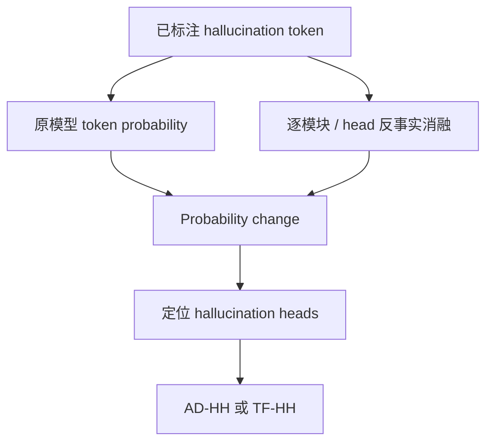

# Modular Attribution and Intervention

ICLR 2025Module / HeadInference-time已精读

[OpenReview](https://openreview.net/forum?id=Bjq4W7P2Us){ .kb-button .primary } [ICLR Proceedings](https://proceedings.iclr.cc/paper_files/paper/2025/hash/8001c3568152d134d821cd46d4d84768-Abstract-Conference.html){ .kb-button }

<strong>一句话总结</strong>
论文用组件消融造成的 hallucination-token probability change 做模块归因，发现风险集中在少量中后层 attention heads；随后用 AD-HH 动态压制这些 heads 的 text attention，或用 TF-HH 仅微调目标 heads。

## 官方方法概览图

<figure class="paper-figure">
  
  <figcaption>官方 ICLR 2025 proceedings PDF 第 7 页方法区域裁图，包含 Figure 6 与 AD-HH/TF-HH 两个算法。原论文未提供一张独立 pipeline，因此此处保留官方版面并明确为方法页裁图。</figcaption>
</figure>

## 1. 论文速览

| 维度 | 内容 |
|---|---|
| 研究对象 | 开放式 caption 中的 object hallucination |
| 核心归因 | 幻觉影响集中在少量 text-dominant attention heads，而非均匀分布于模型 |
| 方法类型 | Counterfactual attribution + inference-time / light fine-tuning intervention |
| 干预位置 | MHA/MLP 模块与单 attention head；text-token attention path |
| 外部依赖 | Head identification 依赖带 hallucination 标签的分析集；生成不需 detector |
| 主要评测 | COCO/CHAIR、Nocaps、MME/MM-Vet、人评/质量指标 |
| 最适合角色 | Head-level causal attribution 与 intervention baseline |

## 2. 研究背景与核心矛盾

输出层 decoding 方法能降低幻觉，却不回答模型内部哪个组件促成了错误。论文把 residual computation 拆成 MLP、MHA 和单 head，针对已经识别出的 hallucination token 做反事实移除，观察目标 token 概率变化。

### 核心假设与证据

| 假设 | 证据 | 强度 | Confound |
|---|---|---|---|
| 幻觉由少量组件集中驱动 | 模块/head attribution 分布 | 反事实消融 | ablation 可能制造 OOD residual state |
| 目标 heads 偏文本、弱视觉 | text/image attention pattern | 行为相关 | attention weight 不等于 output contribution |
| 抑制这些 heads 可降低幻觉 | AD-HH 与 TF-HH 结果 | 定向干预 | 可能同时降低对象 recall/详细度 |

## 3. 方法详解

### 3.1 归因流程

对组件 (c) 的统一抽象归因可写为：

\[
I_c(y_t)=p_\theta(y_t\mid h_t)-p_{\theta,\operatorname{abl}(c)}(y_t\mid h_t),
\]

其中 (h_t) 表示当前上下文，第二项是移除或替换组件 (c) 后对同一目标 token 的概率。正值大表示该组件原本推动该 token。实际论文的编辑方式和归一化应以原式为准。

### 3.2 AD-HH

AD-HH 在推理时对目标 hallucination heads 的 attention 做动态调整，重点压制它们从生成位置指向 text tokens 的路径，使这些 heads 不再过度放大语言历史。它不等价于增强 image attention：总注意力归一化可能产生相对变化，但视觉 value 是否真正进入 residual stream仍需 head-output 检验。

### 3.3 TF-HH

TF-HH 只更新被识别的 hallucination heads，而非全模型 fine-tuning。它是参数级轻量干预，可检验“风险集中”是否具有可训练性价值；代价是需要训练数据与 checkpoint 管理，不再是纯 inference-only baseline。

## 4. 实验设计与结果审计

### 4.1 设置

| 项目 | 内容 |
|---|---|
| Models | 以 LLaVA-family 7B 为核心 |
| In-domain | COCO caption / CHAIRs、CHAIRi |
| OOD | Nocaps |
| General ability | MM-Vet、MME、文本质量与 human evaluation |
| Baselines | Greedy、DoLA、VCD、OPERA、LURE、HALC 等 |
| Ablations | MLP vs MHA vs head；目标 heads vs其他 heads；AD-HH vs TF-HH |

### 4.2 主结果

| 设置 / 指标（方向） | Greedy | 论文方法 | 变化 / 解读 | 来源 |
|---|---:|---:|---|---|
| LLaVA-7B，COCO，CHAIRs / CHAIRi ↓ | 51.8 / 13.3 | **29.6 / 8.0**（AD-HH） | 纯推理时定向 head 干预 | Table 1 |
| LLaVA-7B，COCO，CHAIRs / CHAIRi ↓ | 51.8 / 13.3 | **35.0 / 8.7**（TF-HH） | 只训练 hallucination heads | Table 1 |
| LLaVA-7B，Nocaps，CHAIRs / CHAIRi ↓ | 43.2 / 14.3 | **35.6 / 9.4**（AD-HH） | COCO 选出的 heads 可 OOD 迁移 | Table 1 |
| MiniGPT-4，Nocaps，CHAIRs / CHAIRi ↓ | 57.4 / 20.0 | **45.2 / 16.8**（TF-HH） | 跨模型与 OOD 均改善 | Table 1 |
| LLaVA-7B，MM-Vet Total ↑ | 31.4 | **34.3**（AD-HH） | 并未以通用能力崩塌换取 CHAIR | Table 2 |

论文结果支持 head-level 稀疏干预在既定 object-caption 场景中有效，并尝试用 Nocaps 与通用 benchmark 检查副作用。最需要补看的结果是：随机 head 等数量/同层对照、不同 head selection data 的迁移、CHAIR 与 object recall/length 的 Pareto curve。

### 4.3 消融与分析实验

| 实验 | 对照 / 唯一变量 | 关键结果 | 能支持什么 | 仍不能证明什么 | 来源 |
|---|---|---|---|---|---|
| Contrastive attribution | non-contrastive vs contrastive influence | AD-HH：CHAIRs 41.8→**29.6**，CHAIRi 11.0→**8.8** | 正确/幻觉对象差分比只看幻觉概率更能定位风险 heads | 仍未与同层随机、matched-norm heads 完整比较 | Table 3 |
| Attribution 样本量 | 50–1000 samples | 500 vs 1000 的 head 排名 Spearman 0.93 | 约 500 样本后排序趋稳 | 单数据集稳定不等于跨域稳定 | Figure 9a |
| Knockout 定义 | probability zero-ablation、log-prob、mean-ablation | 与默认方法的排名相似度约 0.89 / 0.96 | 结论对三种替代定义不太敏感 | 高相关仍可能共享同一 OOD-ablation 偏差 | Figure 9b–c |
| Head 数量 | top-k 扫描 | LLaVA 约 k=20、MiniGPT-4 约 k=10 为质量折中；继续增大会伤害生成质量 | 稀疏干预有强度拐点 | 缺少动态逐 token head budget | Figure 15 |

## 5. 亮点与贡献

- 把“哪个层重要”细化到单 head，并用同一归因框架比较 MLP/MHA/head。
- 同时给出 inference-time 与 restricted fine-tuning 两种干预，机制与应用衔接较好。
- 与真实图像反事实互补：它问“哪个组件推动错误”，而不是只问“图像是否改变输出”。
- 为静态 head set、动态风险门控和 component-level causal tracing 提供直接基线。

## 6. 局限、指标漏洞与审稿风险

1. **Ablation validity**：直接置零 head 会改变 residual norm，概率下降不一定代表正常运行中的 causal responsibility。
2. **Selection leakage**：若在同类 CHAIR 数据上找 heads 并评估，可能学习 benchmark-specific object/prompt bias。
3. **Attention/output 混淆**：压制 text attention 不保证视觉信息贡献增加，需分析 (W_O h^{head}) 和 Δlogit。
4. **Recall/length trade-off**：压低语言扩展能力可能自然减少对象提及；仅看 CHAIR 会奖励保守输出。
5. **跨类型泛化有限**：object heads 不必然解释 attribute/relation/counting hallucination。

## 7. 与我的研究关系

### 7.1 直接连接

对每个 head 同时计算：原论文的 hallucination attribution、真实/空白图像 head-output divergence、image attention mass、以及通过 (W_O) 写入 residual 后对候选 token 的 logit contribution。这样可以区分：

- 高风险且低视觉依赖的 prior head；
- 高风险但高视觉依赖的 misalignment head；
- attention 看图但 output 不携带相关证据的伪视觉 head。

### 7.2 Baseline 决策

**适合度：High。** AD-HH 是 head-level 主 baseline；TF-HH 可作为训练版本附加对照。对有限算力，先在 LLaVA-1.5-7B + CHAIR 500 上复现 head selection 和 inference intervention。

### 7.3 对当前 G×A 结果的启发

只按 gradient×activation 排名再全程固定缩放容易把“有助于抑制对象扩展”的 heads 当成“视觉 grounding heads”，造成 CHAIR 降低但 Recall 与生成质量崩塌。应加入 real/blank divergence 与随机/同层 head 对照，再做 token-risk gated scaling。

## 8. 可执行的后续实验

| 实验 | RQ | Comparison | Outputs | Expected | Failure | Cost |
|---|---|---|---|---|---|---|
| E1 双轴 head taxonomy | 风险 head 是否都低视觉？ | attribution × VHD/real-blank | head scatter、AUROC | 出现多种 head 类型 | 指标受 residual norm 影响 | Low |
| E2 Output-aware attribution | attention 与实际 logit contribution 一致吗？ | attention vs (W_Oh) patching | Δlogit、rank | output 指标更因果 | patching OOD | Medium |
| E3 动态 AD-HH | 仅风险 token 干预能否保 recall？ | static vs gated | CHAIR/Recall/length/loop | Pareto 改善 | detector 误报 | Medium |
| E4 Cross-task transfer | COCO heads 是否迁移 POPE/attribute？ | fixed vs reselected heads | overlap、metric gain | 部分不迁移 | prompt confound | Medium |

## 9. 复现清单

- [ ] 固定 head indexing、layer 范围与 ablation 操作
- [ ] selection/evaluation 数据严格拆分
- [ ] 加入同层随机 heads 与相同数量对照
- [ ] 同时报 CHAIR、Recall、length、循环率和通用能力
- [ ] 保存 head output、attention、residual patch 与 token logits

## 10. 综合评分

| 维度 | 评分 | 理由 |
|---|---:|---|
| 新颖性 | 4/5 | 系统的模块→head 归因与定向干预 |
| 机制证据 | 4/5 | 有反事实消融和干预，但 ablation validity 仍需控制 |
| 实验完整性 | 4/5 | 含 OOD 与通用能力检查 |
| 可复现性 | 3/5 | 需深度 hook 模型并复刻 head selection |
| 与当前研究相关性 | 5/5 | 直接对应 head-level causal intervention |

## 11. 来源边界

`requires training: optional` · `inference-only version: yes` · `object detector: no at generation` · `interpretability: high` · `mitigation: yes` · `baseline suitability: high`

论文身份与公开入口已核对；统一归因公式、与 G×A/real-blank 的连接及风险判断属于本知识库分析。精确 attribution 定义与结果数字引用前应回查 ICLR 版本正文。
