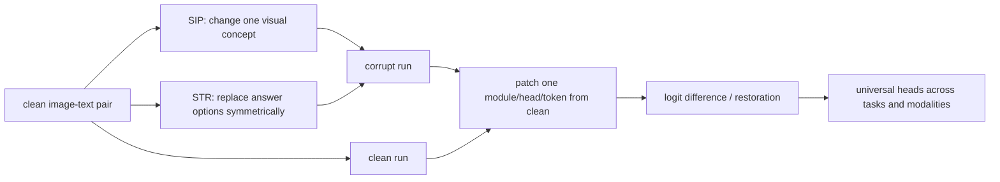

# What Do VLMs NOTICE?

NAACL 2025Mechanistic pipelineSemantic corruption已精读

[ACL Anthology](https://aclanthology.org/2025.naacl-long.571/){ .kb-button .primary } [官方代码](https://github.com/wrudman/NOTICE){ .kb-button }

<strong>一句话总结</strong>
NOTICE 用只改变一个语义因素的 Semantic Image Pairs（SIP）替代图像 embedding Gaussian noise，并用 Symmetric Token Replacement（STR）腐蚀文本；在 BLIP 与 LLaVA 上 patch attention/MLP 后，找出跨三任务、跨模态保持高效应的 universal heads，并显示 BLIP cross-attention 有对象检测/抑制功能，而 LLaVA self-attention 主要表现为 outlier suppression。

## 官方方法概览图

<figure class="paper-figure"><figcaption>官方总览（NAACL 2025 Figure 1），从 <a href="https://aclanthology.org/2025.naacl-long.571.pdf">ACL Anthology PDF</a>第 2 页裁切。三个面板分别展示 SVO-Probes、MIT States 与 Facial Expressions 的语义图像对和对称文本替换。</figcaption></figure>

## 1. 论文速览

| 维度 | 内容 |
|---|---|
| 研究对象 | VLM 中图像/文本信息经 attention/MLP 的因果路径 |
| 核心方法 | SIP image corruption + STR text corruption + activation patching |
| 模型 | BLIP-VQA-Base（cross-attention）、LLaVA-1.5-7B（early-fusion self-attention） |
| 数据 | SVO-Probes、MIT States、Facial Expressions |
| 指标 | correct-vs-incorrect logit difference、restoration probability |
| 角色 | 可靠 corruption 与跨架构机制分析，不是直接 hallucination mitigation |

## 2. 研究背景、核心假设与证据

Gaussian noise 可能将视觉 token 推出训练分布并制造末层假象；SIP 只替换 subject/verb/object、state 或 emotion，使 corrupt input 保持自然。这个假设由 SIP、STR、Stable-Diffusion inpainting 与 Gaussian noise 的 patching heatmap 对比支持，但自然配对图像背景并非完全相同，SIP 仍可能含非目标视觉差异。

## 3. 方法详解

若正确/错误候选为 $\tau,\tau^{inc}$，定义 $L=\operatorname{logit}(\tau)-\operatorname{logit}(\tau^{inc})$，patching effect 为 $L'-L^*$；restoration probability 为 $P'(\tau)-P^*(\tau)$。LLaVA 主要 patch “Assistant:” instruction token，因为仅 patch 正确答案 token 的最大平均 logit difference 只有约 .016；前者有 heads 可达约 .4。

## 4. 实验设计与关键结果

### 4.1 设置

三数据集被改造成二选一 VQA，且只腐蚀一种模态。先做 layer/module patch，再做 BLIP cross-attention 与 LLaVA self-attention head patch。universal head 定义为跨任务/模态 logit difference 均高于总体均值 2 个标准差。计算昂贵：单 RTX 3090 上每个 BLIP patching experiment 约 10–12 小时，LLaVA 约 90–96 小时。

### 4.2 主结果

| 结果 | 数值 / 发现 | 来源 |
|---|---|---|
| BLIP universal heads | L5.H3（vision/object suppression）、L3.H0（multimodal/object detection）、L0.H11（text/outlier suppression） | Table 1 / Table 3 |
| LLaVA universal multimodal heads | L28.H2、L31.H27、L18.H10、L16.H24、L21.H30、L19.H15、L18.H30（正文列 7 个；表格排版需以代码核对） | Section 4.2 / Table 1 |
| BLIP modality effect | image corruption 最大 logit difference 约 20%，text corruption 约 6%（SVO/MIT） | Figure 5 |
| LLaVA token choice | correct-answer-token head patch 最大均值约 .016；“Assistant:” patch 可约 .4 | Appendix G |

论文没有传统 end-task accuracy 主表；核心定量结果就是 head logit effect、阈值筛选与跨任务重复。本站未从 heatmap 猜录逐格数值。

### 4.3 消融与分析实验

| 实验 | 关键结果 | 支持什么 | 风险 | 来源 |
|---|---|---|---|---|
| SIP vs Gaussian | SIP 强调早/中层；Gaussian 主要突出最后 MLP，attention pattern 不一致 | noise 可能产生误导定位 | “中层应重要”本身带先验 | Figure 4 / Figure 10 |
| generative SIP | Stable-Diffusion inpainting heatmap 与自然 SIP 相近 | SIP 可扩展到非配对数据 | 生成图会多手指/改背景 | Figure 4 / Figures 8–9 |
| 跨任务 universal | BLIP 3 heads、LLaVA 多个中后层 heads 跨任务/模态高效应 | 组件复用 | 2-SD 阈值非独立统计检验 | Table 1 |
| 功能可视化 | BLIP L3.H0 object detection，L5.H3 suppression，L0.H11 outlier suppression；LLaVA universal heads 主要 outlier suppression | cross-attention grounding 更可解释 | attention pattern 未必忠实解释输出 | Figures 6–7 |

## 5. 亮点与贡献

- 直接回应 Gaussian corruption 的 OOD 风险，给出图像侧 STR 对应物。
- 同时比较 early-fusion 与 cross-attention 架构，并公开计算成本。
- 将 universal head 的因果效应与 attention pattern 功能分类结合。

## 6. 局限、指标漏洞与审稿风险

NOTICE 是机制工具，不直接证明或降低 hallucination；二选一 VQA 比开放生成简单。自然 SIP 背景不完全控制，生成 SIP 有伪影；universal 的 2-SD 阈值没有多重检验/held-out 验证。作者列表/单位在 PDF 中出现编号不一致（Carsten Eickhoff 标 4，但单位仅列至 3），本站保留姓名、不推断机构编号。

## 7. 与我的研究关系

**Baseline 适合度：High（因果定位）。** 应优先用 SIP/object removal 替代 Gaussian noise，复核 Dual-Pathway、Modular Attribution 等结果；特别适合比较 real/corrupt/blank 下 token、head output 与 residual logit contribution。

## 8. 可执行的后续实验

| 实验 | 问题 | 比较 | 输出 | 成本 |
|---|---|---|---|---|
| E1 corruption audit | 不同 corruption 是否找到同一 hallucination circuit？ | Gaussian/SIP/ROHE removal | overlap、IE、rank corr | High |
| E2 matched nuisance | SIP 的背景差是否混淆？ | segmentation edit vs natural pair | patch maps | High |
| E3 open generation | universal heads 是否影响 CHAIR 对象词？ | head patch/ablation | CHAIR、Fix/Break | High |

## 9. 复现清单

- [x] NAACL 正式版、Figure 1、主要 head 表、Gaussian/SIP 分析与代码 URL 已登记
- [ ] 固定代码 commit、pair construction seed 与所有 prompts
- [ ] 对 universal-head 阈值做 held-out 验证/多重检验
- [ ] 同时报 end-task accuracy 与 patch-induced break rate

## 10. 综合评分

| 新颖性 | 机制证据 | 实验完整性 | 可复现性 | 相关性 |
|---:|---:|---:|---:|---:|
| 5 | 4 | 4 | 4 | 5 |

## 11. 检索标签与来源边界

标签：evaluation-only、activation patching、semantic corruption、SIP、STR、universal heads。事实来自 NAACL 2025 正式论文/附录；Figure 1 为官方图。论文不以 hallucination benchmark 为主，本站没有把其 universal heads 直接写成 hallucination heads。官方代码由论文首页给出；截至 2026-08-21 未登记公开评审页面。
