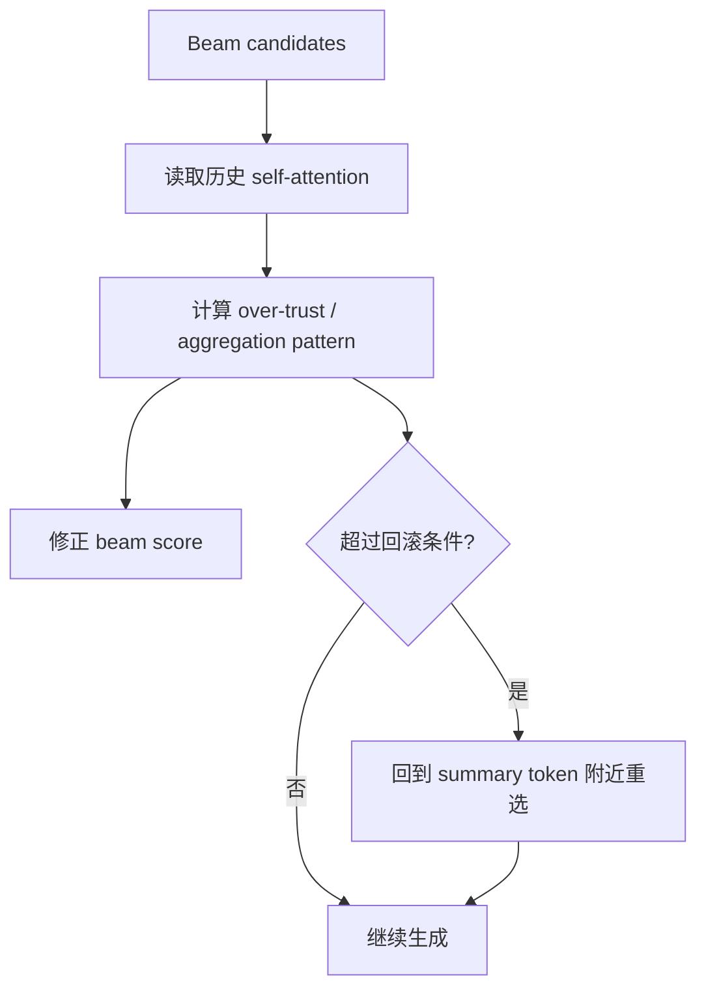

# OPERA: Over-Trust Penalty and Retrospection-Allocation

CVPR 2024 HighlightAttention / DecodingTraining-free已精读

[CVF 原文](https://openaccess.thecvf.com/content/CVPR2024/html/Huang_OPERA_Alleviating_Hallucination_in_Multi-Modal_Large_Language_Models_via_Over-Trust_CVPR_2024_paper.html){ .kb-button .primary } [官方代码](https://github.com/shikiw/OPERA){ .kb-button }

<strong>一句话总结</strong>
OPERA 将幻觉前兆定位为生成 token 对少数历史 summary/anchor token 的异常聚合：先在 beam score 中惩罚 over-trust，严重时再回滚到可疑聚合点重新分配候选，从而在不训练模型的前提下改变错误生成轨迹。

## 1. 论文速览

| 维度 | 内容 |
|---|---|
| 研究对象 | 开放式描述中的 object/fine-grained hallucination 与 POPE existence QA |
| 核心归因 | Self-attention 对少数历史 token 的 over-trust，使视觉证据被文本聚合路径取代 |
| 方法类型 | Training-free beam-search decoding |
| 干预位置 | Beam score、历史 attention pattern、token rollback |
| 外部依赖 | 无 detector；评测部分包含 GPT-4/GPT-4V assisted metrics |
| 代价 | 需读取 attention、维护 beam、检测并回滚，显著重于 greedy decoding |
| 最适合角色 | 机制对比 baseline，而非最轻量工程 baseline |

## 2. 研究背景与核心矛盾

### 2.1 研究问题

视觉 token 通常位于序列前部，而生成文本持续增长。论文观察到，一些后续 token 不再直接或分散地整合视觉上下文，而高度集中到某个已生成 token；该 token 像一个“summary token”承接前文信息。若它包含错误或语言先验偏置，后续生成会沿错误轨迹累积。

### 2.2 为什么普通 decoding 不够

Greedy、sampling 和普通 beam search 只比较模型概率，并不区分候选是由图像证据还是错误历史聚合支持。beam search 甚至可能稳定保留语言上流畅但视觉上错误的序列。OPERA 因而把 attention pattern 引入 decoding score，并加入纠错式回滚。

### 2.3 假设与证据

| 假设 | 证据 | 强度 | 风险 |
|---|---|---|---|
| Hallucination 与 knowledge aggregation pattern 相关 | 幻觉 token 附近的 self-attention 可视化与统计 | 相关性 | attention concentration 也可能是正常复制/指代机制 |
| 少数 summary token 被过度信任 | Over-trust penalty 的干预收益 | 机制干预 | penalty 同时改变 beam diversity 与长度 |
| 回滚可修复错误累积 | Retrospection-Allocation 的消融 | 算法消融 | 不能单独证明视觉依赖提高 |

## 3. 方法详解

### 3.1 Pipeline

### 3.2 Over-Trust Penalty

对每个候选序列，方法从当前 token 指向历史 token 的 self-attention 中寻找异常集中的聚合位置。若多个 heads/steps 持续把质量集中到同一历史 token，则在候选 beam score 中加入惩罚，使“概率高但过度依赖单一历史锚点”的序列失去优势。

关键理解是：OPERA 并未直接奖励 image-token attention；它惩罚一种被认为与 hallucination 相关的 **text-history concentration pattern**。因此它更接近路径风险 proxy，而不是直接 visual grounding score。

### 3.3 Retrospection-Allocation

当聚合风险达到阈值时，方法不只惩罚当前 token，而是定位可疑 summary token 所在的较早步骤，回退并重新分配 beam candidate。这样可以打断 autoregressive error accumulation：错误一旦写入历史，上层 token 会继续把它当作事实；仅改当前步往往太晚。

### 3.4 实现难点

- 需要能返回 generation-time attention；FlashAttention 或部分高效实现需关闭/改写。
- beam cache 的复制、回滚和重新分配容易造成显存峰值。
- 阈值、回滚窗口、beam size 与最大长度共同影响结果，比较时必须锁定 generation config。
- 不同模型 image token 位置和 attention API 不同，跨架构适配成本高。

## 4. 实验设计与关键结果

### 4.1 设置

| 项目 | 内容 |
|---|---|
| Models | InstructBLIP、MiniGPT-4、LLaVA-1.5、Shikra 等 7B 级 MLLM |
| Caption | MSCOCO 2014 validation，CHAIRs/CHAIRi |
| Fine-grained | VG/HalluBench 风格评测；sentence/word-level hallucination |
| QA | POPE random/popular/adversarial，关注 F1 |
| General ability | MME、MMBench，及 GPT-4V assisted correctness/detailedness |
| Baselines | Greedy、Nucleus、Beam、DoLa 等 |
| Ablations | penalty、retrospection、超参数与不同模型 |

### 4.2 关键结论

论文报告 OPERA 在多模型、多指标上降低 hallucination，并通过组件消融显示 penalty 与 retrospection 均有贡献。最可信的结论是“该 decoding 组合在既定评测上有效”；更强的“over-trust 是幻觉根因”仍需真实图像反事实和随机 attention-pattern 对照。

### 4.3 指标审计

- CHAIRs 随长度上升而更容易触发，回滚是否缩短输出必须单独报告。
- GPT evaluator 的 prompt、版本与一致性影响 fine-grained 结论。
- POPE 对 Yes ratio 敏感；更保守地回答 No 可能提高某些 split 的幻觉指标。
- 需要把 correctness、detailedness、object recall 与 latency 放在同一张表中。

## 5. 亮点与贡献

- 将幻觉控制从单步 logit 校正推进到“检测历史错误路径并回滚”的 sequence-level 机制。
- 提供可观察的 attention pattern，方便定位 hallucination onset。
- 不需要训练或 object detector，能用于多种已有 LVLM。
- 明确处理 error accumulation，而非假设每步错误彼此独立。

## 6. 局限、指标漏洞与审稿风险

1. **Attention-as-explanation 风险**：高 attention 不等于高 causal contribution；value/output projection 可改变实际贡献。
2. **替代机制未排除**：收益可能来自 beam diversity、长度变化或重复抑制，而非视觉 grounding 增强。
3. **工程成本高**：attention materialization、beam 与 rollback 对长文本尤其昂贵。
4. **阈值敏感**：不同模型/任务可能需要重新调参，削弱通用性。
5. **评测依赖**：fine-grained 结果部分依赖外部 LLM evaluator；CHAIR 只覆盖受限对象词表。

## 7. 与我的研究关系

### 7.1 可直接验证的机制问题

在每个 token 同时记录 OPERA over-trust score (O_t) 与视觉反事实 gap (VR_t)：若 (O_t) 上升先于 (VR_t) 下降，并在 hallucination onset 前稳定出现，才能支持“文本聚合取代视觉证据”。还应记录 head output contribution，而不只记录 attention weight。

### 7.2 Baseline 决策

**适合度：Medium–High。** 它是公认的 inference-time baseline，但实现复杂、推理慢。建议先复现官方配置用于主表，再在机制子集上做详细 token/head trace；不必在所有大规模 ablation 中运行。

### 7.3 与 M3ID / SID 的差异

M3ID 直接比较有图与无图 logits；SID 构造内部弱视觉对比分支；OPERA 不构造视觉反事实，而是处理历史 attention 聚合和错误累积。三者分别覆盖 **condition sensitivity、counterfactual evidence、trajectory repair**。

## 8. 可执行的后续实验

| 实验 | 问题 | 设置 | 记录 | 预期 | 失败解释 | Cost |
|---|---|---|---|---|---|---|
| E1 Over-trust × VR | over-trust 是否伴随视觉依赖下降？ | LLaVA-1.5 / CHAIR 500 | (O_t)、VR、image attention、标签 | 幻觉前 (O_t↑,VR↓) | 二者无关，proxy 不成立 | Low |
| E2 Head output 替代 | attention concentration 是否有 causal output？ | hallucination windows | head output norm/Δlogit | 少量 heads 贡献集中 | attention 高但 output 小 | Medium |
| E3 Rollback 因果分析 | 回滚后为何变好？ | OPERA trigger steps | 前后 top-k、VR、长度 | 新 token 视觉 gap 更高 | 仅生成更短/保守 | Medium |
| E4 轻量门控 | 只在 detector 高风险步启用 OPERA 是否足够？ | COCO 500 | latency、CHAIR、Recall | 接近收益、成本下降 | detector recall 不足 | Medium |

## 9. 复现清单

- [ ] 固定 beam size、长度、penalty 与 rollback 参数
- [ ] 记录 attention backend 和是否返回所有 heads
- [ ] 报告 latency、峰值显存、输出长度和循环率
- [ ] 同时报 CHAIR、Recall/Cover 与 detailedness
- [ ] 保存 rollback 触发点和前后候选分布

## 10. 综合评分

| 维度 | 评分 | 理由 |
|---|---:|---|
| 新颖性 | 4/5 | 将 over-trust penalty 与序列回滚组合 |
| 机制证据 | 3/5 | pattern 与干预相关，但缺少直接视觉反事实 |
| 实验完整性 | 4/5 | 多模型、多类 benchmark |
| 可复现性 | 3/5 | 有代码但 beam/attention/rollback 复杂 |
| 与当前研究相关性 | 4/5 | 可用于验证 hallucination onset 与错误累积 |

## 11. 检索标签与来源边界

`requires training: no` · `inference-only: yes` · `object detector: no` · `external LLM evaluator: evaluation only` · `interpretability: medium` · `mitigation: yes` · `baseline suitability: medium-high`

本页的公开事实以 CVF 页面和官方仓库为依据；“over-trust 是否等同视觉依赖下降”及其与 VR/head output 的关系属于待验证研究判断。
