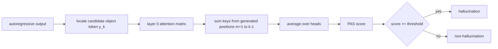

# PAS: Prelim Attention Score

CVPR 2026DetectionToken-level attention已精读

[CVF 论文页](https://openaccess.thecvf.com/content/CVPR2026/html/Hoang_PAS_Prelim_Attention_Score_for_Detecting_Object_Hallucinations_in_Large_CVPR_2026_paper.html){ .kb-button .primary } [官方代码](https://github.com/lanl/pas){ .kb-button }

<strong>一句话总结</strong>
PAS 观察到对象词若更多依赖此前生成的 prelim tokens、而非图像，就更可能是幻觉；直接对 layer 0 所有 heads 的“prelim→对象 token”attention 求和，在三模型×两数据集得到平均 AUROC 85.0，优于最佳基线 SVAR 的 80.3，且无需额外 forward。

## 官方方法概览图

<figure class="paper-figure"><figcaption>官方方法总览（CVPR 2026 Figure 1），从 <a href="https://openaccess.thecvf.com/content/CVPR2026/papers/Hoang_PAS_Prelim_Attention_Score_for_Detecting_Object_Hallucinations_in_Large_CVPR_2026_paper.pdf">CVF PDF</a>第 3 页直接裁切。</figcaption></figure>

## 1. 论文速览

| 维度 | 内容 |
|---|---|
| 研究对象 | 开放图像描述中对象词级 existence hallucination 检测 |
| 核心归因 | unreliable mode 中生成对象过度依赖低信息的 prelim tokens |
| 方法类型 | training-free、reference-free detection；非直接 mitigation |
| 模型 | LLaVA-1.5-7B、MiniGPT-4-7B、Shikra-7B |
| 数据 | MSCOCO val2014 5,000 图、Pascal VOC val2012 5,823 图 |
| 指标 | object-token AUROC；另报 PRC 与 VRAM |
| 依赖 | 需要模型 attention weights 与对象词/ground-truth object matching |

## 2. 研究背景、核心假设与证据

作者将下一对象 token $Y_k$ 的来源拆为 image $v$、instruction $t$ 与 prelim $y_{<k}$。若 $I(v;Y_k\mid y_{<k},t)$ 小，预测更可能缺乏视觉支持。MI 需为每个对象类采 reference images、多次前向；PAS 用单次 attention 近似“对 prelim 的依赖”。注意力仍不是信息或因果贡献的严格度量，且 softmax simplex 会让 image/prelim/instruction 分数天然相关。

## 3. 方法详解

若 $A^{(l,h)}(k,j)$ 表示对象 token $k$ 对此前 token $j$ 的 attention，PAS 为

$$
s_{prel}(y_k,y,x)=\frac1H\sum_{h=1}^{H}\sum_{j=m+1}^{k-1}A^{(l,h)}(k,j).
$$

消融显示 layer 0 最好，因此默认 $l=0$，所有 heads 等权平均。与 MI 近似不同，PAS 不需要为每个输入再跑 $|\mathcal I|$ 个 reference-image passes。

## 4. 实验设计与关键结果

### 4.1 设置

默认 greedy、`max_new_tokens=512`；object mentions 以 CHAIR 式字符串匹配 MSCOCO/Pascal labels。基线为 NLL、Entropy、Internal Confidence、GLSim、SVAR。检测标签本身依赖封闭对象标注，因而“reference-free”指部署打分不输入额外 reference/judge，不代表评测无需 annotation。

### 4.2 主结果

| 方法；AUROC ↑ | LLaVA COCO / VOC | MiniGPT-4 COCO / VOC | Shikra COCO / VOC | 平均 | 来源 |
|---|---:|---:|---:|---:|---|
| NLL | 56.5 / 64.0 | 62.1 / 73.0 | 54.3 / 63.1 | 62.2 | Table 2 |
| SVAR（最佳基线） | 81.5 / 82.9 | 88.0 / 84.5 | 71.9 / 72.9 | 80.3 | Table 2 |
| PAS | 84.2 / 85.1 | 85.6 / 85.4 | 84.5 / 85.3 | 85.0 | Table 2 |

PAS 并非每一格都胜过 SVAR（MiniGPT-4 COCO：85.6 < 88.0），但平均及跨模型稳定性更好。

### 4.3 消融与分析实验

| 实验 | 关键结果 | 支持什么 | 仍不能证明什么 | 来源 |
|---|---|---|---|---|
| MI score variants | entropy diff 74.5、KL 80.2、logit diff 82.2、PAS 85.0 平均 AUROC | prelim-overdependence 假设有多种观测支持 | PAS 是 MI 的一致估计 | Table 1 |
| layer sweep | 三模型 layer 0 最优，深层整体下降 | 早层 attention cue 最强 | 所有新 attention 架构适用 | Figure 5 |
| token type | layer-0 prelim 84.8、image 82.1、instruction 84.7、BOS 83.5 平均 | prelim 略优于 image | prelim 信号独立；instruction 几乎持平 | Table 5 |
| decoding | LLaVA COCO PAS greedy/beam/top-k/nucleus = 84.2/84.0/83.5/84.0 | 对四种解码相对稳定 | 更长对话/采样温度均稳 | Table 4 |
| 显存 | PAS/SVAR 18GB，GLSim 19GB，IC 30GB，entropy 16GB | attention 法成本较低 | attention materialization 在现代 kernel 中免费 | Table 3 |

## 5. 亮点与贡献

- 利用此前被忽略的 generated-prefix attention，单 pass 即得 token-level 风险分数。
- 同时给出昂贵 MI proxy 与轻量 attention proxy，理论动机和工程实现相连。
- layer、token type、decoding、显存四类消融对复现很有价值。

## 6. 局限、指标漏洞与审稿风险

PAS 只检测、不自动修复；对象 token 定位与 CHAIR string matching 对同义词/复数敏感。instruction attention 的平均 AUROC 84.7 与 PAS 84.8 几乎相同，说明“prelim 独有机制”证据有限。Layer 0 在 GQA/MQA、sliding-window 或不返回完整 attention 的模型上未必适用。只测 existence hallucination 与开放 caption；阈值在分布迁移下需重新校准。

## 7. 与我的研究关系

**Baseline 适合度：High（检测）/ Medium（干预）。** PAS 很适合作为 selective intervention gate：只在对象 token 的 PAS 高时启用 head/activation correction，并与 visual attention、logit-lens evidence 与 RBC 做联合校准。

## 8. 可执行的后续实验

| 实验 | 问题 | 比较 | 输出 | 成本 |
|---|---|---|---|---|
| E1 causal prelim | 屏蔽高 attention prelim tokens 会否修复对象？ | prelim ablation vs matched image/instruction | Fix/Break | Medium |
| E2 fused detector | prelim attention 与 visual logit evidence 是否互补？ | PAS/SADT/RBC/ensemble | AUROC/AUPRC/ECE | Medium |
| E3 online gate | 高 PAS 时触发干预是否优于 always-on？ | threshold sweep | CHAIR、coverage、latency | Medium |

## 9. 复现清单

- [x] CVF 正式论文、Figure 1、Tables 1–5 与官方代码 URL 已登记
- [ ] 固定官方仓库 commit 和 object matching 代码版本
- [ ] 记录阈值选择 split、class balance、AUPRC 与 calibration
- [ ] 检查 flash-attention 下返回权重的实际开销

## 10. 综合评分

| 新颖性 | 机制证据 | 实验完整性 | 可复现性 | 相关性 |
|---:|---:|---:|---:|---:|
| 4 | 3 | 4 | 4 | 5 |

## 11. 检索标签与来源边界

标签：detection-only、training-free、reference-free inference、prelim tokens、attention、AUROC。事实来自 CVPR 2026 正式 PDF；Figure 1 为官方图；研究建议和“attention≠causality”边界为本站分析。官方代码由论文给出；截至 2026-08-21 未登记公开评审页面。
