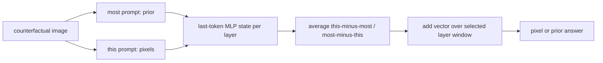

# Pixels Versus Priors

EMNLP 2025Visual counterfactsActivation steering已精读

[ACL Anthology](https://aclanthology.org/2025.emnlp-main.1262/){ .kb-button .primary } [官方代码](https://github.com/rsinghlab/pixels_vs_priors){ .kb-button }

<strong>一句话总结</strong>
Visual CounterFact 用反常颜色和大小让当前像素与常识先验正面冲突；模型常在中后层从 prior 翻转到 pixel。PvP 以同一反事实图上 “most” 与 “this” prompt 的末 token MLP activation 差构造方向，可在错误子集上将 prior→counterfact 的颜色预测翻转 98.6%–99.7%，大小任务则为 71.3%–89.9%。

## 官方方法概览图

<figure class="paper-figure"><figcaption>官方方法图（EMNLP 2025 Figure 3），从 <a href="https://aclanthology.org/2025.emnlp-main.1262.pdf">ACL Anthology PDF</a>第 5 页直接裁切。左侧计算方向，右侧展示注入；图示方向为推向 world knowledge。</figcaption></figure>

## 1. 论文速览

| 维度 | 内容 |
|---|---|
| 研究对象 | 当前视觉属性与预训练常识冲突时，模型选择 pixel 还是 prior |
| 数据 | Visual CounterFact：575+575 color、877+877 size，共 2,904 图 |
| 模型 | LLaVA-Next-7B、Qwen2-VL-7B、Janus-Pro-7B |
| 方法 | early decoding + MLP activation steering |
| 干预位置 | language decoder 最后 instruction token，中后层连续窗口 |
| 外部依赖 | 数据构建用 Google Images、GPT-4o、SAM2 |
| 角色 | knowledge/vision conflict benchmark 与双向 steering baseline |

## 2. 研究背景与核心矛盾

这里的“hallucination”边界与 object existence 不同：若问“most strawberries”，正确答案应是世界知识，即使图中草莓是蓝色；若问“this strawberry”，正确答案应跟随像素。论文发现 VLM 往往不按问题语义选择来源，而被当前图像压过 prior。反事实图是真实感控制后的编辑图，但 GPT-4o 选图、SAM2 mask 和 hue/resize 操作仍可能留下 cue。

## 3. 方法详解

对 $D$ 个图文对，在层 $l$ 取最后文本 token 的 MLP hidden state：

$$S^l_{CF}=D^{-1}\sum_i([h^l_n]^{this}_i-[h^l_n]^{most}_i),\quad
S^l_{WK}=D^{-1}\sum_i([h^l_n]^{most}_i-[h^l_n]^{this}_i).$$

推理时在 $l\in[\ell,\ell+w]$ 将 $S^l_{CF}$ 或 $S^l_{WK}$ 加到末 token hidden state。论文在原本答错的子集上选择有效 layer window，因此 flip rate 是“可修复率”，不是全测试集 accuracy。

## 4. 实验设计与关键结果

### 4.1 设置

Color 用 canonical vs counterfactual hue；Size 用相差至少 10× 的对象对并反转相对大小。四个条件为 CF/WK image × “this/most” prompt。early decoding 以 final layernorm + unembedding 读取逐层答案概率；flip 要求原本较低的候选反超至少 5%。未报告多 seed/CI。

### 4.2 主结果

| 模型 / 任务 | CF + this Acc | CF + most Acc | PvP WK→CF flip（原错误子集） | 最佳层 | 来源 |
|---|---:|---:|---:|---|---|
| LLaVA / Color | 85.19 | 47.26 | 99.5% | 14–16 | Tables 1, 3 |
| Qwen / Color | 84.79 | 60.65 | 99.7% | 17–19 | Tables 1, 3 |
| Janus / Color | 86.00 | 59.23 | 98.6% | 14–16 | Tables 1, 3 |
| LLaVA / Size | 82.12 | 40.30 | 71.3% | 8–16 | Tables 1, 3 |
| Qwen / Size | 91.20 | 28.34 | 89.9% | 16–22 | Tables 1, 3 |
| Janus / Size | 85.14 | 18.02 | 81.2% | 16–19 | Tables 1, 3 |

### 4.3 消融与分析实验

| 实验 | 关键结果 | 支持什么 | 风险 | 来源 |
|---|---|---|---|---|
| layer-wise flips | “most+CF” 中有 flip 的 color 样本：LLaVA/Qwen/Janus 65/29/12% | pixel/prior competition 具有深度动态 | logit-lens 可能受 layernorm mismatch | Table 2 / Figure 4 |
| 双向 steering | color CF→WK 为 86.4/78.8/78.2%；size 为 33.5/61.8/70.37% | 可双向控制但明显不对称 | 不是无副作用的概念方向 | Table 3 |
| prompt vs steering | LLaVA color 改 prompt 的 image attention +13%；steering 可到 +40% | activation 干预强于文字提示 | attention shift 不等于语义正确 | Figure 5 / Appendix Table 5 |
| task差异 | size 需更早、更宽窗口且 flip 更低 | 关系/空间处理更分布式 | 具体 layer window 可泛化 | Table 3 |

## 5. 亮点与贡献

- 把“依赖图像是否总是好事”改造成由问题语义决定的双向选择问题。
- 数据构建、逐层轨迹与干预形成 benchmark→mechanism→control 的闭环。
- 同时报告 pixel→prior 与 prior→pixel，显示显著不对称性。

## 6. 局限、指标漏洞与审稿风险

Visual CounterFact 主要是颜色/大小，不能直接代表开放 hallucination；反事实编辑和 GPT-4o 筛选可能产生数据偏差。PvP 用 prompt 对比同时混入 “this/most” 的词汇与句法差异；缺随机方向、norm-matched、held-out direction construction 和通用能力/副作用表。主 steering 结果只在原错误子集上报 flip，不能与端到端 accuracy 混用。

## 7. 与我的研究关系

**Baseline 适合度：High。** 其 counterfactual image 非常适合测试 real/edited/blank 三条件下的 head logit contribution；PvP 可作为全局 direction，与 per-instance disentangled subspace 和 MESA 的纠缠问题直接比较。

## 8. 可执行的后续实验

| 实验 | 问题 | 比较 | 输出 | 成本 |
|---|---|---|---|---|
| E1 held-out direction | PvP 是否跨对象泛化？ | object-disjoint train/test | flip、break rate | Medium |
| E2 lexical control | 方向是否只是 this/most 词差？ | paraphrase、多模板、text-only | cosine、flip | Medium |
| E3 local vs global | per-instance 子空间能否减少反向 steering 失败？ | PvP vs MESA/PIDS | accuracy、specificity | High |

## 9. 复现清单

- [x] EMNLP 正式论文、Figure 3、Tables 1–3 与代码 URL 已登记
- [ ] 固定代码 commit、数据下载和 GPT-4o/SAM2 版本
- [ ] 独立构造/评测 steering direction 并加入随机、norm-matched 对照
- [ ] 报告全数据 accuracy，而非仅错误子集 flip rate

## 10. 综合评分

| 新颖性 | 机制证据 | 实验完整性 | 可复现性 | 相关性 |
|---:|---:|---:|---:|---:|
| 5 | 3 | 4 | 4 | 5 |

## 11. 检索标签与来源边界

标签：visual counterfactual、knowledge prior、activation steering、early decoding、attribute conflict。事实来自 EMNLP 2025 正式论文/附录；Figure 3 为官方图；关于 flip-rate 口径和潜在混淆为本站审计。官方代码由论文首页给出；截至 2026-08-21 未登记公开评审页面。
