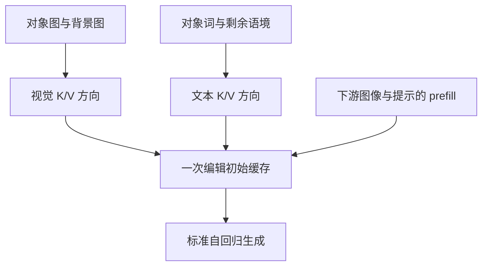

# Prefill-Time Intervention（PTI）

CVPR 2026 主会Prefill / KV无需参数训练automated

[论文原文](https://openaccess.thecvf.com/content/CVPR2026/html/Zhang_Prefill-Time_Intervention_for_Mitigating_Hallucination_in_Large_Vision-Language_Models_CVPR_2026_paper.html){ .kb-button .primary } [arXiv v1](https://arxiv.org/abs/2604.25642v1){ .kb-button } [官方代码](https://github.com/huaiyi66/PTI){ .kb-button }

<strong>一句话总结</strong>
用100个COCO对比样本离线提取视觉/文本K、V方向，只编辑一次初始缓存：LLaVA greedy CHAIRs 47.4→15.4，但同主消融表的F1 75.3→72.7，补充图显示输出变短；应作为低延迟的KV干预强基线，不能称无损保召回。

## 官方方法概览图

<figure class="paper-figure"><figcaption>官方 Figure 3（CVF 第4页，25296页）包含对比输入、方向提取和下游缓存干预。未确认其独立再分发许可，不在本站复制；以下为<strong>本站等价抽象</strong>。</figcaption></figure>

## 1. 论文速览

| 维度 | 内容 |
|---|---|
| 研究对象 | 对象幻觉及错误传播；补充属性、计数、空间关系任务 |
| 核心归因 | 初始图文状态与对象证据错配；只在解码时反复 steering 可能无法阻止错误累积 |
| 方法类型 | 离线方向提取 + inference-time KV 编辑，不更新模型权重 |
| 干预位置 | 全层初始缓存的全部视觉位置与最后文本位置，分别处理 K 和 V |
| 外部依赖 | 离线需要 COCO 对象分割与 captions、词性/实体处理；在线不用 detector |
| 主要评测 | CHAIR、POPE、AMBER、MMHal、MME 的四个感知子任务 |
| 最适合角色 | KV / prefill intervention baseline；时机与模态分离的机制对照 |

## 2. 研究背景与核心矛盾

### 2.1 研究的 hallucination

CHAIR 是对象提及错误，POPE 是二元存在性判断；两者的 F1/recall 与句子级/对象级错误比例不是同一量。论文以 snowball hallucination 动机说明 residual errors 的严重程度，但“少发生幻觉”和“发生后传播更弱”必须分别测量。Figure 2 的 PSH 是条件于已出现幻觉的比例，不能单独推出所有样本总体更差。

### 2.2 现有方法的缺口

作者将 when（prefill/decoding）、what（KV/hidden states）、how（图文分离）共同改变。PTI 的优势是把一次编辑保存在后续每步都会读取的缓存中；它不是只影响第一个输出 token。论文与 VTI、VISTA、PAI 的比较不能自动隔离“时机本身”的净效果，因为方向构造和编辑位置也不同。

### 2.3 核心假设与证据强度

| 假设 | 论文证据 | 类型 | 替代解释 |
|---|---|---|---|
| 初始KV是有效干预点 | Tables 1–4跨模型/解码效果，Supplement Table 9效率 | intervention | 缓存编辑可能使输出更保守，未排除少说对象 |
| 图文需要不同位置 | Table 5：visual-all、text-last最佳组合 | 组件消融 | 不是等范数、等预算、等输出覆盖下的纯位置比较 |
| K控制聚焦，V过滤背景 | Figure 5与Supplement A对象mask注意力分析 | 干预 + proxy | 注意力提高不是事实正确的充分条件；归一化也改变结果 |
| 方向可跨模型 | Table 6 LLaVA/Qwen互换 | 小范围迁移 | 只检查KV维度相同的模型，LLaVA增益仅0.13 pp |

## 3. 方法详解

### 3.1 整体流程

离线从 COCO 构造两个互补图像：仅保留对象的正样本、仅保留背景的负样本，提示相同；再构造只保留对象词与剩余语境的文本对，图像固定。分别运行 prefill，提取缓存差异，做聚合/PCA。下游输入正常 prefill 后，对全层全部视觉位置施加视觉方向，对最后文本位置施加文本方向；之后复用缓存正常生成，新增输出位置不持续施加同样编辑。

### 3.2 关键量与公式

以下为正文 Equations (1)–(8) 的统一记号。层 \(l\) 的缓存 \(K^l,V^l\in\mathbb R^{H\times N_x\times d_h}\)，\(H\) 为头数、\(N_x\) 为输入长度、\(d_h\) 为每头维数；批次维省略。对 \(C\in\{K,V\}\)，视觉方向的平均版本为

\[
S^l_{C,\mathrm{img}}=\frac1n\sum_{i=1}^{n}\operatorname{mean}_{j\in\mathcal I_{\mathrm{img}}}(C^{i,l}_{+,:,j,:}-C^{i,l}_{-,:,j,:})\in\mathbb R^{H\times d_h}.
\]

文本方向取两次输入各自最后文本位置的缓存差，跨样本聚合为 \(S^l_{C,\mathrm{txt}}\)；不能在不同长度的正负文本里机械复用同一绝对索引。论文随后使用 PCA 去噪，平均差式不是完整官方实现。

下游在 \(\mathcal I_{\mathrm{img}}\) 广播加视觉方向，在最后文本位置加文本方向，强度为 \(\lambda_{K,\mathrm{img}},\lambda_{V,\mathrm{img}},\lambda_{K,\mathrm{txt}},\lambda_{V,\mathrm{txt}}\)。实验把图文的 K 强度设相同、V 强度设相同，仅扫描两个系数。

**代码补充（本站等价写法）**：`steer_kv_cache_add` 实际不是原缓存直接加常数。对每个缓存向量 \(c\) 与方向 \(s\)：

\[
a=1+\max(0,\cos(c,-s)),\qquad
c'=\|c\|_2\,\frac{c/\|c\|_2+\lambda a\,s/\|s\|_2}{\|c/\|c\|_2+\lambda a\,s/\|s\|_2\|_2}.
\]

它保留原范数，并根据与负方向的相似度调节强度；复现必须保留这个细节。上述公式只描述非零向量，数值 epsilon 等以官方实现为准。

### 3.3 实现细节

官方 commit `ab72f5d0675b893ce5222186ab4496ac37391362`：`cache_utils/cache_steer.py` 含方向提取、prefill缓存构建、全层/图文位置编辑及 norm-preserving update。LLaVA 文本分支的 PCA 用1个分量，并将 components 与 mean 相加形成方向；不同模型分支并非相同 PCA 配置，不应直接把论文“平均+PCA”替换成手写均值。

README 提供100样本预提取方向，LLaVA示例 \(\lambda_K=0.1,\lambda_V=0.6\)。Supplement Figures 6–8标出的模型选择不同：LLaVA为(0.1,0.6)，Qwen为(0.2,0.2)，DeepSeek为(0.1,0.2)，仅按清晰数字与红框登记。提取数据和下游COCO val应按image ID确认不重叠；论文称holdout training，具体完整ID需另外冻结。

提取阶段约每样本4次prefill（视觉正负、文本正负），另有PCA；在线不额外生成对比分支。以标准全头缓存估计，四组方向存储约 \(4LHd_h\) 元素，缓存本身仍有原有序列内存成本。源码处理不同模型的tuple/cache类和beam复制，迁移到GQA或新版Transformers需要核对KV头数、位置与RoPE，不能直接照搬形状。

### 3.4 方法究竟改变了什么

K编辑影响后续query对输入的注意力分配，V编辑改变被聚合的信息；方向来自有标注对比集，因而“training-free”只表示不优化参数，绝非无数据/无校准。逐样本错误风险没有被显式检测，也没有验证保留的对象就是当前图像全部真实对象。

## 4. 实验设计与关键结果

### 4.1 设置

| 项目 | 内容 |
|---|---|
| Models | LLaVA-1.5、Qwen-VL-Chat、DeepSeek-VL-Chat；模型权重revision需复现时冻结 |
| Direction data | COCO训练侧100样本，对象分割与文本对比；非测试图像在线训练 |
| CHAIR | COCO val随机500图；Please help me describe this image in detail.；max_new_tokens=512 |
| Decoding | greedy；beam=5；nucleus top_p=1.0；temperature=1.0 |
| POPE | Random/Popular/Adversarial各3000问题；sampling；max_new_tokens=32 |
| AMBER | 1004生成问题与14216判别问题；分别沿用CHAIR/POPE设置 |
| Baselines | Vanilla、PAI、VTI、VISTA；VCD只比较sampling，OPERA比较beam |
| General metrics | MMHal的96题由GPT-5评判；MME只取existence/count/position/color |
| Statistics | 主表无多seed CI；代码CHAIR默认seed=1994不等于所有论文表的实验seed均已冻结 |

### 4.2 主结果

| 设置 / 指标 | Vanilla | PTI | 变化 / 解读 | 来源 |
|---|---:|---:|---|---|
| LLaVA，greedy，CHAIRs ↓ | 47.4 | 15.4 | −32.0 pp | Table 1 |
| LLaVA，greedy，CHAIRi ↓ | 13.7 | 5.4 | −8.3 pp | Table 1 |
| Qwen，greedy，CHAIRs ↓ | 39.6 | 20.6 | −19.0 pp | Table 1 |
| DeepSeek，greedy，CHAIRi ↓ | 8.2 | 6.7 | −1.5 pp；PAI为6.5，并非每格最优 | Table 1 |
| LLaVA，sampling，CHAIRs ↓ | 50.2 | 25.8 | −24.4 pp | Table 1 |
| LLaVA，POPE三split平均F1 ↑ | 81.23 | 82.85 | +1.62 pp；PAI为82.95 | Table 2 |
| LLaVA，AMBER greedy CHAIRi ↓ | 6.1 | 3.8 | −2.3 pp | Table 3 |
| LLaVA，MME四子任务总分 ↑ | 611.6 | 651.6 | +40.0；不是全MME总分 | Table 4 / Supplement Table 8 |
| LLaVA，采样延迟 ms/token ↓ | 19.52 | 19.58 | +0.06 ms；4090测量 | Supplement Table 9 |

### 4.3 消融与分析实验

| 实验 | 对照 / 唯一变量 | 关键结果 | 能支持什么 | 仍不能证明什么 | 来源 |
|---|---|---|---|---|---|
| 模态/位置 | 无编辑、visual-all、再加text-last | CHAIRs 47.4→16.8→15.4；F1 75.3→70.3→72.7 | 文本补充可部分恢复F1 | full仍低于Vanilla，不能说无损 | Table 5 |
| 文本位置 | text-last vs text-all | CHAIRs 40.8 vs45.2，CHAIRi12.0 vs14.3 | 精确文本位置更有效 | 不是跨任务普适位置规律 | Table 5 |
| 强度/长度 | K、V系数网格 | LLaVA选中点平均长度79.5，原始98.9；F1 72.7 vs75.3 | 主要结果伴随明显少说，需覆盖审计 | 长度变化不能自动等同信息损失全部原因 | Supplement Figure 6 |
| 背景构造 | random-mask vs object/background contrast | 作者报告后者CHAIRi降幅更大；不从曲线补写逐点数字 | 分割对比有用 | 对象mask和空间/面积混淆未完全排除 | Figure 5(a) |
| 跨模型 | LLaVA/Qwen交换方向 | POPE Adv Acc：LLaVA75.40→75.53，Qwen80.26→81.47 | 小范围兼容性 | 同维度不等于同语义坐标；无CI不能证明稳健迁移 | Table 6 |
| 与其他方法组合 | PAI vs PAI+PTI | LLaVA Adv Acc76.93→78.76 | 可组合 | 性能相加不证明因果机制正交 | Table 6 |

### 4.4 结果应该如何解读

支持：初始缓存值得作为独立干预位置；在三种较早LVLM和多个解码协议上显著降低对象幻觉，在线开销小。不能证明：信息量/召回无损；单独改变干预时机就能解释全部优势；K/V功能严格可分；训练样本与所有调参测试完全无泄漏；对现代任意架构通用。

## 5. 亮点与贡献

干预位置细化到缓存、模态和token位置，便于构造可解释的控制实验；正文给出跨解码对照，附录给出延迟和输出长度，能审计“更少幻觉是否因为更少描述”。对于推理期方法，在线成本比较比简单统计forward次数更有价值。

## 6. 局限、指标漏洞与审稿风险

**核心风险是覆盖损失**：Table 5所谓F1恢复是从70.3恢复到72.7，仍低于75.3；其具体F1评测定义/数据需独立冻结，不能冒充POPE Table 2的F1，更不能替代对象recall。Supplement Figure 6支持输出变短，应测匹配长度/匹配recall的Pareto曲线。

**机制混淆**：注意力mass是proxy；按归一化生成进度对齐不同回答（Supplement A）不保证相同prefix、对象或语义位置。共同前缀、随机方向和同范数对照更能判断KV编辑的因果作用。对象/背景mask造成的分布外输入与标注面积也可能影响方向。

**外部评价与范围**：MMHal依赖GPT-5但精确快照/prompt未在本页冻结；MME仅四个感知子任务，正文称cognition-related不能据此写成通用推理能力提升。CHAIR对象词表与分割漏标会影响结论。

**数据/成本**：离线100样本、分割和PCA不是零成本；主表未提供跨seed方差。参数由网格选取，需明确独立校准集。延迟表为sampling，不应外推到不同硬件、batch、beam或服务场景；没有峰值显存实测证据。

## 7. 与我的研究关系

只讨论公开路线；个人未公开研究适配 UNKNOWN。

### 7.1 可直接借鉴

PTI是real/counterfactual image的**离线表示差**应用，与逐步real/null logit差分不同。可与head、residual、token风险观察组合，但POT等外部proxy不能据此变成内部因果证据；VR/PD/RBC需要独立定义，本文没有同名算法映射。

### 7.2 Baseline 决策

**High（KV/表征/时机干预）**；最小实现先用一个7B模型、公开100样本方向、固定图像子集，保留范数归一化和模态位置。若无法获取分割或迁移缓存API，成本升为medium。与 [ICT](ict.md) 属共享问题/steering比较，原文Related Work明确引用ICT；与 [OPERA](opera.md) 属作者直接比较；[FLB](first-logit-boosting.md) 是本站新增的早期证据复用对照，未声称作者互引。

### 7.3 与已有路线的差异

相对 [HEAL](heal-synergy-heads.md) 动态head角色校准，PTI用固定离线方向、只改初始cache；相对 [HIRE](hire-intermediate-representation-edit.md) 的可学习router/editor，PTI无参数训练但依赖有标注方向数据。性能必须在同数据和解码协议下重测，不能按本站各Note主表排序。

### 7.4 面向 CVPR 投稿的可借鉴证据

**官方标准**：2027 CFP要求原创高质量研究，独立评审指南截至2026-10-03未能获取；不存在本文推定的录用清单。**论文实际证据**：三模型、三解码、模态/位置消融与效率。**本站建议**：至少把时机、位置、方向构造拆开，报告对象recall/length/repetition、范数和随机对照、跨seed与真实错误传播；不能仅凭attention图提出机制证明。

## 8. 可执行的后续实验

均为未执行的本站建议，成本为次数估计。

| 实验 | Research question | Model / data | Intervention / comparison | Recorded outputs | Expected observation | Failure case | Cost |
|---|---|---|---|---|---|---|---|
| E1 | 有无保recall区间？ | 单7B，100独立图 | Vanilla与3个冻结强度 | CHAIR/对象recall/长度/重复，图像bootstrap | 同recall仍降幻觉 | 优势只靠少说 | Low：400生成 |
| E2 | 时机是净原因吗？ | 同一方向和50图 | prefill-only/decoding-only/两者/随机范数方向 | 相同prefix首个对象logit变化和续写 | prefill有独立增益 | 控制位置后优势消失 | Low–medium：约200分支 |
| E3 | mask带来什么信息？ | 100方向样本、50测试图 | 对象mask/等面积随机mask/空图 | 方向范数、CHAIR、recall | 真对象方向优于随机 | 只需任意扰动 | Medium：约400次prefill/方向组 |
| E4 | 能否叠加低成本解码？ | 100图 | PTI/FLB/联合/Vanilla；统一β | 质量、recall、延迟、显存 | 联合在匹配覆盖时有益 | 只进一步缩短输出 | Low：4×100生成 |

## 9. 复现清单

- [x] CVF正文11页及补充7页、主要表和可读消融数字核对。
- [x] arXiv v1（2026-04-28）与CVF作者/标题/主会交叉核对。
- [x] 官方commit、缓存维度、PCA分支与归一化实现核对。
- [x] F1/长度代价及MME范围已明确登记。
- [ ] 离线方向样本ID与校准/测试分离仍需冻结。
- [ ] 全模型checkpoint revision、完整seed与外部judge快照待补。
- [ ] 对象recall、配对CI、峰值显存与现代模型迁移未由本轮实测。

## 10. 综合评分

| 维度 | 评分（1–5） | 理由 |
|---|---:|---|
| 直接相关性 | 5 | 初始KV及对象幻觉干预直接相关 |
| 新颖性 | 4 | 系统拆分干预时机、模态与K/V |
| 机制证据 | 3 | 有组件和对比干预，但多个变量共同变化、attention仍是proxy |
| 实验完整性 | 4 | 三模型三解码和效率；recall与统计缺口限制结论 |
| 可复现性 / 低算力 | 4 | 代码和预提取方向公开，单模型无需训练；需适配cache API |
| 相对知识库新增信息 | 5 | 补上prefill-only干预与其保守输出风险 |

## 11. 检索标签与来源边界

[CVF正文](https://openaccess.thecvf.com/content/CVPR2026/papers/Zhang_Prefill-Time_Intervention_for_Mitigating_Hallucination_in_Large_Vision-Language_Models_CVPR_2026_paper.pdf)（25293–25303页）与[官方补充](https://openaccess.thecvf.com/content/CVPR2026/supplemental/Zhang_Prefill-Time_Intervention_for_CVPR_2026_supplemental.pdf)是数字来源；arXiv v1为版本/身份交叉证据。代码固定为[ab72f5d](https://github.com/huaiyi66/PTI/tree/ab72f5d0675b893ce5222186ab4496ac37391362)。官方Figure 3未复制，以明确标注的本站抽象代替。

截至2026-10-03未发现公开评审页面；不制造reviewer concern或author response。检索到的笔记聚合页面未达到独立署名权威技术评价要求，未纳入证据。机制解释、表格和代码观察分别在正文标出；风险、评分、实验设计与跨论文比较属于本站推断。source status不代表已实际复算。标签：offline direction extraction、inference-only intervention、no online detector、external evaluator、baseline-high。
