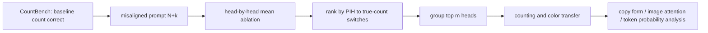

# Mechanisms of Prompt-Induced Hallucination in Vision–Language Models

ACL 2026Prompt–image conflictHead-level已精读

[ACL Anthology](https://aclanthology.org/2026.acl-long.1941/){ .kb-button .primary } [官方代码](https://github.com/michalg04/prompt-induced_hallucinations){ .kb-button }

<strong>一句话总结</strong>
当 prompt 把图中对象数量写高时，三种 7B VLM 在对象数超过约 4 后会大量照抄 prompt；逐 head mean ablation 找到少量早层 PIH heads，联合消融把 prompt match 从 42.6%–64.1% 降至 1.4%–10.2%，并把 true-count match 提到 70.7%–77.8%。

## 官方方法概览图与方法抽象

<figure class="paper-figure"><figcaption>官方 Figure 1，从 <a href="https://aclanthology.org/2026.acl-long.1941.pdf">ACL Anthology PDF</a>第 1 页裁切。论文没有端到端方法总览图；下图是本站依据 Sections 3–6 给出的等价抽象。</figcaption></figure>

## 1. 论文速览

| 维度 | 内容 |
|---|---|
| 研究对象 | prompt 明示错误数量/颜色、视觉证据正确时的 prompt-induced hallucination（PIH） |
| 模型 | LLaVA-OneVision-7B、Qwen2-VL-7B、Janus-Pro-7B |
| 方法 | 逐 head mean ablation；按“从 prompt 数切回真值”的比例排序后联合 knockout |
| 数据 | CountBench 491 图→3,437 prompt 对；Visual CounterFact color 493→2,465 对 |
| 干预 | Qwen top-3；LLaVA/Janus top-10；无再训练 |
| 评测 | prompt match、true-count match、baseline exact match、颜色 PIH、POPE/MM-Vet/CalTech101 |

## 2. 研究背景与核心矛盾

论文先保留 baseline 计数正确的样本，因此 PIH 不是“模型根本不会数”。核心现象是视觉计数置信度随 $N$ 增大而下降，prompt 锚定随之增强。单 head knockout 是干预证据；但“早层且跨 LLaVA/Qwen 重合”只能说明共享 Qwen2 LM 路径可能重要，不能单独排除相同 chat/template 结构。

## 3. 方法详解

对第 $l$ 层 head $h$ 的 $T\times d$ 输出 $H^{(l,h)}$ 求 token 均值 $\mu^{(l,h)}=T^{-1}\sum_tH_t^{(l,h)}$，并在所有位置用该均值替换。这样去掉 token-specific 信息，同时尽量保留整体 activation magnitude。成功率定义为消融后从 $N+k$ 切换到真实 $N$ 的样本比例；先单头排名，再测试 $m\in\{1,3,5,10\}$ 的联合消融。

PIH heads 多落在早层：Qwen 与 LLaVA 的 top-1/top-2 都是 L0H3、L0H6，top-10 有一半重合；Janus top head 为 L0H20。作者进一步把同一 heads 迁移到错误颜色 prompt，并分析数字/单词格式复制、视觉 attention mass 与答案 token probability。

## 4. 实验设计与关键结果

### 4.1 设置

默认 greedy generation。随机对照从 PIH heads 所在层抽取相同数量 heads。一般能力以 CalTech101 条件复制、MM-Vet、POPE 检查；未报告多 seed/CI，top-$m$ 是模型特定超参数。

### 4.2 主结果

| 模型；CountBench | Before prompt / true match | PIH-head ablation prompt / true match | 解读 | 来源 |
|---|---:|---:|---|---|
| LLaVA-OV | 42.58 / 45.68 | 1.42 / 77.80 | prompt copying 下降 41.16 pt | Table 1 |
| Qwen-VL | 56.51 / 37.70 | 3.22 / 70.66 | true count +32.96 pt | Table 1 |
| Janus-Pro | 64.10 / 30.54 | 10.19 / 70.90 | true count +40.36 pt | Table 1 |

baseline count exact match 在 LLaVA 76.89→81.24，Qwen 78.49→79.29，Janus 80.32→79.41；说明改善并非通过整体破坏计数，但 Janus 仍有小幅回落。

### 4.3 消融与分析实验

| 实验 | 关键结果 | 能支持什么 | 仍不能证明什么 | 来源 |
|---|---|---|---|---|
| 同层随机 heads | prompt match 仅小幅降至 37.8/54.6/58.3 | PIH heads 有特异性 | 完全等范数/等功能对照 | Table 1 |
| group size | LLaVA/Janus top-10 成功率 83.08/77.91；Qwen top-3 67.14，top-10 仅 3.43 | Qwen 路径更集中且过度消融有害 | 自动选择最佳 $m$ | Table 10 |
| 颜色迁移 | PIH 99.04→4.79（LLaVA）、85.22→44.58（Janus）、79.73→20.28（Qwen） | heads 不只编码数字 | 对属性幻觉全面泛化 | Table 4 |
| 一般能力 | CalTech101 基本稳定；MM-Vet/POPE 仅小幅波动 | 非普遍输出崩坏 | 长文本、OCR 等全部无副作用 | Table 2 |
| attention mass | 最大层图像 attention 增量 .121/.053/.037 | 消融伴随视觉依赖增加 | attention 是唯一中介 | Figure 4 |
| copy form | ablation 后 digit copying 几乎消失，正确 word form 大增 | 早层 heads 传播内容与格式 | 是语义 copying 还是模板效应 | Table 6 |

## 5. 亮点与贡献

- 控制住 baseline 能力后再诱导图文冲突，标签清晰。
- head knockout、随机对照、跨颜色任务迁移和一般能力检查形成较完整证据链。
- 结果揭示“对象数约 4”之后视觉置信度下降与 prompt 服从迅速增强。

## 6. 局限、指标漏洞与审稿风险

CountBench 规模小且只研究 prompt 高估；prompt 本身可被解释为用户要求生成 $N+k$ 个描述，hallucination 定义依赖“in the image”。head 集合按同数据 ranking，虽有 transfer 但缺独立 discovery split；mean ablation 可能影响格式而非视觉语义。颜色任务仍是封闭属性，未覆盖关系、长描述或开放问题。

## 7. 与我的研究关系

**Baseline 适合度：High。** 适合与 PAS、Role-Break、SADT 对齐：比较 PIH heads 的 prelim attention、视觉 logit contribution 与 real/blank image divergence，检查“复制 prompt”与“忽略图像”是否为同一群 heads。

## 8. 可执行的后续实验

| 实验 | 问题 | 比较 | 输出 | 成本 |
|---|---|---|---|---|
| E1 bidirectional conflict | 低估与高估是否同一路径？ | $N-k$ vs $N+k$ | head overlap、switch matrix | Low |
| E2 semantic controls | 同格式但不冲突时是否仍受影响？ | aligned/misaligned paraphrases | accuracy、copy form | Medium |
| E3 gated knockout | 仅检测到 PIH 风险时消融能否少破坏？ | PAS/RBC gate vs always-on | Fix/Break、MM-Vet | Medium |

## 9. 复现清单

- [x] ACL 正式版、附录、官方代码 URL、主表与消融已登记
- [ ] 固定仓库 commit、seed 与 generation config
- [ ] 用独立 split 选择 heads/$m$ 并报告 CI
- [ ] 同时报输出长度、无数字回答率与 over/under-count

## 10. 综合评分

| 新颖性 | 机制证据 | 实验完整性 | 可复现性 | 相关性 |
|---:|---:|---:|---:|---:|
| 4 | 4 | 4 | 4 | 5 |

## 11. 检索标签与来源边界

标签：prompt-image conflict、mean ablation、attention head、training-free、object counting。事实来自 ACL 2026 正式论文与附录；图片为官方 Figure 1。论文未提供方法总览图，因此 Mermaid 为本站等价抽象。官方代码链接由论文首页给出；截至 2026-08-21 未另行登记公开评审。
