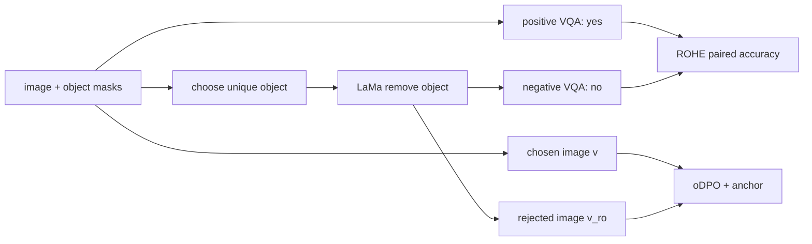

# Can They Still See Removed Objects? — ROHE 与 oDPO

NAACL 2025Benchmark + mitigationObject removal已精读

[ACL Anthology](https://aclanthology.org/2025.naacl-long.349/){ .kb-button .primary }

<strong>一句话总结</strong>
ROHE 不随机询问无关的不存在对象，而是用 LaMa 从原图移除一个真实对象，并要求模型对原图答 yes、移除图答 no；oDPO 再把原图作为 chosen image、移除图作为 rejected image，在不构造 rejected text 的情况下做多模态偏好优化，使 LLaVA-1.5-7B 的 ROHE paired accuracy 39.21→61.65。

## 官方方法概览图

<figure class="paper-figure"><figcaption>官方 oDPO 总览（NAACL 2025 Figure 5），从 <a href="https://aclanthology.org/2025.naacl-long.349.pdf">ACL Anthology PDF</a>第 5 页裁切。ROHE 数据构建另见论文 Figure 3。</figcaption></figure>

## 1. 论文速览

| 维度 | 内容 |
|---|---|
| 研究对象 | 与场景高度相关、但已被移除的 object existence hallucination |
| Benchmark | ROHE：MSCOCO 2017 val，经 LaMa 移除并人工筛选 5,504 个成对单元 |
| 方法 | oDPO：同一 $(x,y)$ 下偏好原图 $v$ 胜过移除图 $v_{r_o}$，加 anchor objective |
| 模型 | benchmark 多种 LVLM；训练主报 LLaVA-1.5-7B/13B，另有 LLaVA-1.6-13B |
| 训练 | Silkie-19K chosen responses 或 LLaVA-17K；1 epoch，A100 80GB |
| 评测 | ROHE、Object HalBench、MME-Hall、AMBER、MMHalBench、通用 VLM benchmarks |

## 2. 研究背景与核心矛盾

传统 yes/no benchmark 常抽到与图像无关的负对象，模型容易答 no；同时 yes-bias 可能掩盖“即使对象被移除仍答 yes”。ROHE 用同一场景的正/负图成对要求同时正确，指标 $acc^+$ 更难被单侧回答偏差投机。代价是 LaMa 伪影可能泄露标签，且只保留人工认为已完全移除、能判断缺失的样本。

## 3. 方法详解

ROHE 单元为 $(\langle v,q(o),yes\rangle,\langle v_{r_o},q(o),no\rangle)$，仅两边都正确才计入 $acc^+$。oDPO 固定同一 text response $y$，优化原图相对移除图的偏好：

$$L_{roDPO}=-\log\sigma\left(\beta\log\frac{\pi_\theta(y\mid x,v)}{\pi_{ref}(y\mid x,v)}-\beta\log\frac{\pi_\theta(y\mid x,v_{r_o})}{\pi_{ref}(y\mid x,v_{r_o})}\right).$$

再加 $L_{AncPO}=-\log\sigma(\beta\log\frac{\pi_\theta(y\mid x,v)}{\pi_{ref}(y\mid x,v)})$，总损失 $L_{oDPO}=L_{roDPO}+\gamma L_{AncPO}$，默认 $\gamma=1$。被移除对象来自 conversation 中最常提及对象。

## 4. 实验设计与关键结果

### 4.1 设置

学习率 $10^{-7}$、cosine schedule、warmup .03、1 epoch、单 A100 80GB。DPO 使用完全相同训练数据和其他设置。ROHE 主指标 $acc^+$；另报 positive accuracy $acc$ 以检查是否只会答 no。实验覆盖 generation 与 discrimination hallucination benchmark，并检查通用 MME/LLaVA-Wild/SQA-Img/MMStar。

### 4.2 主结果

| 设置 / 指标 | Base | oDPO | 变化 | 来源 |
|---|---:|---:|---:|---|
| LLaVA-1.5-7B，ROHE $acc^+$ ↑ | 39.21 | 61.65 | +22.44 pt | Table 2 |
| LLaVA-1.5-13B，ROHE $acc^+$ ↑ | 27.53 | 44.71 | +17.18 pt | Table 2 |
| 7B，Object HalBench CHAIR$_S$/$_I$ ↓ | 53.3 / 15.6 | 34.3 / 9.5 | −19.0 / −6.1 | Table 3 |
| 7B，AMBER HalRate / Cover | 35.6 / 51.8 | 25.1 / 53.4 | −10.5 / +1.6 | Table 3 |
| 7B，MMHalBench Score / HalRate | 2.02 / .61 | 2.50 / .49 | +.48 / −.12 | Table 3 |
| 13B，MMHalBench Score / HalRate | 2.38 / .53 | 2.74 / .45 | +.36 / −.08 | Table 3 |

### 4.3 消融与分析实验

| 实验 | 关键结果 | 支持什么 | 风险 | 来源 |
|---|---|---|---|---|
| standard DPO | 7B ROHE 39.21→38.94，oDPO→61.65 | 视觉对象偏好而非任意 DPO 是关键 | reference/chosen text 质量影响未完全隔离 | Table 2 |
| training data | 7B Silkie-19K 61.65，LLaVA-17K 63.70；但 CHAIR$_S$ 34.3 vs 43.0 | oDPO 跨两数据源有效但 trade-off 不同 | “最佳”依赖 benchmark | Table 4 |
| high-resolution model | LLaVA-1.6-13B ROHE 55.89→63.06、CHAIR$_S$ 30.0→27.7；positive acc 98.46→90.75 | 仍有收益 | 明显损伤 positive recognition | Table 5 |
| $\gamma$ sweep | 小 $\gamma$ 更降 hallucination，但损害通用任务与多样性；取 1 平衡 | anchor 必要 | 曲线未给可转录精确数值 | Figure 7 |
| fine-grained MMHal | adversarial 1.17→3.08（+163%）；relation 2.00→1.75、other 1.08→.92 | 某些类别大增但非全类提升 | 不能称各类全面改善 | Table 6 |

## 5. 亮点与贡献

- 负样本来自同一图像的对象删除，远比随机不存在对象更难且更受控。
- paired metric 同时要求存在/不存在判断正确，有效抑制 yes/no 单侧偏差。
- oDPO 不依赖 rejected text，直接对视觉证据做偏好，并与标准 DPO 严格匹配。

## 6. 局限、指标漏洞与审稿风险

LaMa 可能留下填充伪影，模型可学到“编辑图”而非对象缺失；ROHE 仅 MSCOCO 2017、二元 existence。人工筛选会偏向容易干净移除的对象。oDPO 对 LLaVA-1.6 positive accuracy 有 7.71 pt 回落；MMHal relation/other 也恶化。训练使用 mask annotation，不是无标注方法；未测试更大/闭源模型或多 seed。

## 7. 与我的研究关系

**Baseline 适合度：High（benchmark）/ Medium（training baseline）。** ROHE 是验证 hallucination circuit 的理想 counterfactual：同一对象在 $v$ 与 $v_{r_o}$ 中只差存在性，可直接测 head/path 的因果敏感度，并用于审计 Gaussian corruption。

## 8. 可执行的后续实验

| 实验 | 问题 | 比较 | 输出 | 成本 |
|---|---|---|---|---|
| E1 artifact control | 模型是否利用 LaMa 痕迹？ | object removal、mask-only、background inpaint | paired acc | Medium |
| E2 circuit transfer | POPE 发现的路径能否分辨 ROHE 对？ | real/removed activation patch | IE、AUROC | High |
| E3 positive-break audit | oDPO 是否变得过度答 no？ | yes ratio、positive acc、coverage | calibration | Medium |

## 9. 复现清单

- [x] NAACL 正式版、Figures 3/5、Tables 2–6 与限制已登记
- [ ] 截至 2026-08-21 论文未声明官方代码链接；需独立实现
- [ ] 固定 LaMa 版本、mask/object selection 与人工筛选协议
- [ ] 报多 seed、positive/negative 分项、yes ratio 与伪影对照

## 10. 综合评分

| 新颖性 | 机制证据 | 实验完整性 | 可复现性 | 相关性 |
|---:|---:|---:|---:|---:|
| 5 | 3 | 5 | 3 | 5 |

## 11. 检索标签与来源边界

标签：benchmark、requires training、object removal、counterfactual image、multimodal DPO、ROHE。事实来自 NAACL 2025 正式论文/附录；Figure 5 为官方图。有关 LaMa shortcut 与 positive-accuracy trade-off 为本站审计。截至 2026-08-21 未在论文中发现官方代码或公开评审页面。
