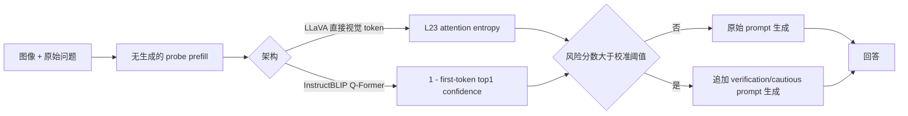

# Risk-aware Selective Prompting

arXiv / ACL ARR 2026 submissionPrompt routingTraining-free + calibration已精读

[论文原文](https://arxiv.org/abs/2605.28123){ .kb-button .primary }

<strong>一句话总结</strong>
RSP 先把 verification prompting 拆成 fix 与 break，发现 always-on 验证在困难样本上修正更多错误、却在各难度都稳定制造新错误；因此它用生成前的 attention entropy（LLaVA）或 inverse top-1 confidence（InstructBLIP）做风险分数，仅对超过校准阈值的输入追加验证提示。

## 官方方法概览图

<figure class="paper-figure">
  
  <figcaption>论文唯一的官方图（Figure 1）：LLaVA-1.5 各层 attention entropy 对 verification effect 的预测 AUROC，作者最终选择 L23 作为 routing signal。图片直接取自 <a href="https://arxiv.org/abs/2605.28123">arXiv v1</a> source package 的 <code>figures/layer_auroc.png</code>。官方版本未提供 pipeline / framework 图；下方 Mermaid 是本站依据 Section 3 给出的等价抽象，并非作者原图。</figcaption>
</figure>

这张图的重要信息不是“L23 在 pilot 上最高”——L30 的 pilot AUROC 反而更高，而是作者强调层选择需在 held-out validation 上稳定。Figure 1 的 pilot $n=100$ 中 L23 AUROC 为 .643、L30 为 .675；附录扩展样本后 L30 不稳定，最终用 L23 和阈值 1.82。该选择本身暴露了小样本 layer mining 的过拟合风险。

## 1. 论文速览

| 维度 | 内容 |
|---|---|
| 研究对象 | verification prompt 对 object-existence QA 的输入依赖收益与副作用 |
| 核心归因 | 提示验证并不统一增强视觉 grounding，而会将 attention 重新分配给 instruction token，形成保守 yes-rate shift |
| 方法类型 | 预生成风险探测 + 二元 prompt router；基础模型不训练，但需要开发集选信号/阈值 |
| 干预位置 | 输入 prompt；风险信号来自 prefill attention entropy 或 first-token confidence |
| 外部依赖 | 无 detector、无辅助模型；需暴露 attention/logits，并为每个输入增加 probe prefill |
| 主要评测 | POPE random/popular/adversarial；Fix/Break、F1/Precision/Recall/Acc、trigger rate、bootstrap CI；CHAIR 仅边界分析 |
| 最适合角色 | dynamic intervention、selective prompting 和“干预副作用”审计 baseline |

## 2. 研究背景与核心矛盾

### 2.1 研究的 hallucination

主实验是 POPE 二元 object presence QA，不是开放式 caption。正确性可被明确拆成 baseline/verification 的四种状态：Fix、Break、unchanged-correct、unchanged-wrong。CHAIR 只在附录用于讨论开放式边界，因此结论主要适用于“是否存在某对象”与简短答案，不能直接外推到属性、关系或长描述中逐 token 出现的 hallucination。

### 2.2 现有方法的缺口

多数 prompt-based mitigation 只报告总体平均，默认“请检查视觉证据”不会伤害。RSP 追问干预何时值得：如果验证让原本正确的 easy sample 变错，always-on 可能把平均收益掩盖成无效。论文将方法问题从“设计更强提示”改为“预测某个输入是否会从提示中获益”。

### 2.3 核心假设与证据强度

| 假设 | 论文证据 | 证据类型 | 仍可能的混淆因素 |
|---|---|---|---|
| verification 是 risk-bearing intervention | Fix 随难度 88→113→198，Break 约 89–92 | 成对行为分解 | POPE splits 同时改变对象先验与错误率，不是纯难度实验 |
| 副作用表现为 conservative shift | yes-rate 降 5–9 pt；precision 升、recall 降 | 输出分布分析 | “yes” 类别不平衡与 prompt wording 可能驱动偏移 |
| shift 与 instruction-conditioned attention redistribution 有关 | verification/neutral/no-prompt 三条件，29/32 层视觉 attention mass 降，中层 entropy pattern 不同 | 内部相关性 + 中性提示对照 | attention mass 不等于 causal contribution；未做 attention patch/ablation |
| 预生成 uncertainty 可路由 | LLaVA 用 L23 entropy；InstructBLIP 用 inverse top-1 confidence，RSP 优于 always-on | held-out threshold + 跨架构实验 | 信号/阈值依赖模型和数据；离 oracle 尚远 |

## 3. 方法详解

### 3.1 整体流程

### 3.2 关键量与公式

对 baseline 回答 $y_b$ 和 verification 回答 $y_p$，论文用任务正确性 $c(y;y^*)\in\{0,1\}$ 定义 Fix $(0\to1)$ 与 Break $(1\to0)$，净收益为 $|Fix|-|Break|$。风险探针在 prefill 最后位置、对 heads 求平均后计算第 $l$ 层 attention entropy：

$$
H^{(l)}=-\sum_{i=1}^{n}a_i^{(l)}\log a_i^{(l)}.
$$

另记录视觉与指令位置的 attention mass：$M_{vis}^{(l)}=\sum_{i\in\mathcal V}a_i^{(l)}$、$M_{inst}^{(l)}=\sum_{i\in\mathcal I}a_i^{(l)}$。这些量只表示注意力分配，并不证明提示提升/损害了视觉 evidence value。

RSP 用开发集选择阈值 $\tau$，路由为 $r(x)=\mathbf 1[u(x)>\tau]$。LLaVA 的 $u$ 是 L23 attention entropy；InstructBLIP 因 Q-Former 把视觉压成 32 query tokens、attention entropy 近 chance，改用 $u=1-p_{top1}$。

### 3.3 实现细节

- LLaVA-1.5-7B：576 image tokens、Vicuna-7B、32 layers；L23 entropy，$\tau=1.82$，dev top 6%，测试实际触发 5–7%。
- InstructBLIP-Vicuna-7B：Q-Former 32 queries；inverse top-1 confidence + 简短 “Be careful.”，触发 10–14%。
- POPE-random 2910 条拆为 dev 910 / test 2000；popular/adversarial 各 3000，阈值只在 dev 选。
- greedy decoding，max new tokens 10；paired bootstrap 2000 次、95% CI。
- 每个输入都多一次 probe prefill；仅触发子集增加 verification generation。“training-free” 不等于零开销。

### 3.4 方法究竟改变了什么

RSP 不改变权重、hidden state 或 decoding rule，只改变是否向上下文加入 verification instruction。其主要观察是输出更保守：yes-rate、precision/recall trade-off 改变。它可能减少 false positive，也可能增加 false negative；因此 F1 的提升不能被简化为“视觉 grounding 更强”。真正要验证 grounding，需要固定回答倾向、做 image counterfactual 或 causal attention intervention。

## 4. 实验设计与关键结果

### 4.1 设置

| 项目 | 内容 |
|---|---|
| Models | LLaVA-1.5-7B、InstructBLIP-Vicuna-7B |
| Datasets / splits | POPE MSCOCO random 2910（dev 910/test 2000）、popular 3000、adversarial 3000；CHAIR 附录 |
| Metrics | F1、Precision、Recall、Accuracy、Fix/Break、yes-rate、AUROC、trigger rate |
| Baselines | baseline no verification、always-on verification、RSP |
| Ablations / analyses | neutral prompt、layer sweep、oracle routing、trigger-rate sensitivity、architecture-specific signal |
| Statistical evidence | paired bootstrap $N=2000$、95% CI；部分差异标记 $p<.05/.01$，但 layer selection pilot 较小 |

### 4.2 主结果

| 设置 / 指标（F1 ↑） | Baseline | Always-on | RSP | 变化 / 解读 | 来源 |
|---|---:|---:|---:|---|---|
| LLaVA，POPE Random | .896 | .889 | .899 | RSP +.003，触发 7%；避免 always-on 退化 | Table 3 |
| LLaVA，POPE Popular | .864 | .862 | .865 | RSP +.001，触发 5% | Table 3 |
| LLaVA，POPE Adversarial | .810 | **.827** | .812 | 困难集 always-on 更好；RSP 触发 6% | Table 3 |
| InstructBLIP，POPE Random | .887 | .874 | .891 | RSP +.004，触发 10% | Table 4 |
| InstructBLIP，POPE Popular | .839 | .842 | .852 | RSP +.013，触发 14% | Table 4 |
| InstructBLIP，POPE Adversarial | .818 | .818 | .826 | RSP +.008，触发 14% | Table 4 |

LLaVA adversarial 是关键反例：当输入几乎都困难时，always-on 的 F1 .827 明显高于 RSP .812。论文因此没有声称 selective routing 在所有分布都优于无条件提示，而是把适用场景限定为难度混合、break 可避免的部署流量。

### 4.3 消融与分析实验

| 实验 | 对照 / 唯一变量 | 关键结果 | 能支持什么 | 仍不能证明什么 | 来源 |
|---|---|---|---|---|---|
| Fix/Break 难度分解 | POPE random/popular/adversarial | Fix 88/113/198；Break 89/91/92；净 −1/+22/+106 | 提示收益随 base error 增长、伤害较稳定 | splits 是否只代表难度 | Table 1 |
| neutral prompt control | no prompt vs verification vs 等长度 neutral | L14–17 neutral entropy −17% 至 −23%，verification 不同；L15 差 +19.8% | 效应不只是“多了文本” | entropy pattern 的因果作用 | Table 2 |
| attention redistribution | verification 前后 | 29/32 层 $M_{vis}$ 降；L1 −.171；前 16 层 $M_{inst}$ 38–60% | 验证提示吸收 attention | attention value 是否更有用 |
| architecture signal | entropy vs inverse confidence | LLaVA entropy 可用；InstructBLIP entropy 约 .5，confidence 更好 | router 应感知 connector 架构 | 只验证两个 7B 模型 |
| oracle ceiling | 完美选择 fix、不触发 break | 仅 3–7% 触发可得 +2.7–5.2% F1 | 当前 signal 还有明显 headroom | oracle 使用标签，不可部署 | Table 5 |
| trigger-rate sweep | 改变阈值 | LLaVA 在 5–7% 附近最好，继续增加会退化 | 选择性确实来自门控 | 跨数据阈值稳定性 | Table 8 |

### 4.4 结果应该如何解读

论文能够支持：verification prompt 的收益和风险具有输入依赖性；简单 always-on 会引入可测 breaks；小开发集可校准一个低触发率 router。不能据此证明：attention entropy 是 hallucination 的通用机制、提示让模型“重新看图”、或同一阈值能迁移到 caption、属性/关系与其他架构。

## 5. 亮点与贡献

- 用 Fix/Break 而非单一均值揭示干预伤害，分析框架非常适合所有 hallucination mitigation。
- 加入 neutral prompt 控制，避免把长度效应误当 verification semantics。
- 明确报告 trigger rate、probe overhead、CI 与 adversarial 失败情形，没有隐藏 always-on 更好的区域。
- 架构差异不是脚注：直接视觉 token 与 Q-Former compression 需要不同 signal。

## 6. 局限、指标漏洞与审稿风险

1. **任务窄**：主结果是 POPE 短答案；开放式生成中风险会随 token 动态变化，input-level router 可能太粗。
2. **提示依赖**：verification/cautious prompt 的措辞会改变 yes bias，结论可能不是 prompt-invariant。
3. **保守偏置**：降低 false positives 同时可能增加 false negatives；必须同时看 precision/recall 和类别先验。
4. **attention proxy**：$M_{vis}$ 下降不等于视觉贡献下降，缺 value/output projection 与 causal patching。
5. **层选择稳定性**：pilot 图中 L30 高于 L23，扩样本后不稳，说明 layer mining 易过拟合。
6. **校准成本**：需要带标签 dev set，且阈值不承诺跨域/跨模型迁移。
7. **规模边界**：仅两个 7B 开源模型；闭源 API 不暴露 attention/logits。
8. **官方产物**：截至 2026-08-20 未发现官方代码或公开评审页面，ACL ARR 仅为投稿说明。

## 7. 与我的研究关系

### 7.1 可直接借鉴

RSP 的核心可直接替换成 VR/PD/RBC/POT：在生成前或实体 token 前，用 real-vs-blank logit gap 判断是否需要 verification、contrastive decoding 或 head intervention。还应保留 Fix/Break 矩阵，分别统计“纠正 hallucination”和“破坏 grounded claim”，而不是只比较 CHAIR/POPE 总分。

### 7.2 Baseline 决策

**适合度：High。** 实现最小，只需两种 prompt、一次 probe、阈值和路由；非常适合作为 static vs risk-gated intervention baseline。低算力复现可先在 LLaVA-1.5-7B 的 POPE random dev/test 做 L23 entropy、top-1 confidence、real/blank Δlogit 三信号比较。

### 7.3 与已有路线的差异

Role-Break/AGS 用内部 attention pattern 检测或路由；RSP 的动作更外层，只决定 prompt。与动态 steering（HIRE/DMAS）相比，它不改变 hidden states，部署风险低，但 prompt 造成的全序列行为漂移更难定位。它提供一个通用控制框架：任何 MESA/ACG/CausalLens 干预都可先估计输入风险，再决定是否启用。

## 8. 可执行的后续实验

| 实验 | Research question | Model / data | Intervention / comparison | Recorded outputs | Expected observation | Failure case | Cost |
|---|---|---|---|---|---|---|---|
| E1 信号横评 | real/blank Δlogit 是否优于 entropy/confidence？ | LLaVA；POPE | L23 entropy、top1、VR/PD/RBC router | AUROC、Fix/Break、F1、trigger | 反事实信号更接近视觉风险 | 额外 forward 成本高 | Low |
| E2 prompt 鲁棒性 | 风险规律是否跨提示措辞？ | 两模型；POPE | 5 个 verification prompts + neutral controls | yes-rate、P/R、attention mass | Fix/Break 排序相对稳定 | 某个 prompt 驱动全部结论 | Medium |
| E3 token-level RSP | 开放式 caption 是否需动态触发？ | LLaVA；CHAIR | input-level vs entity-onset router | CHAIR/Recall/length、trigger spans | token router 减少无谓保守 | onset 检测晚于错误写入 | Medium |
| E4 干预级联 | RSP 能否门控 ACG/CausalLens？ | POPE + CHAIR | always-on、RSP-prompt、RSP→internal intervention | quality/latency/Fix/Break | 低触发率保留大部分收益 | probe + hook 抵消效率 | High |
| E5 calibration shift | 阈值跨域是否失效？ | COCO→GQA/A-OKVQA | 固定阈值 vs conformal/quantile calibration | coverage、risk、ECE | quantile 更稳 | signal ordering 跨域改变 | Medium |

## 9. 复现清单

- [x] arXiv v1、唯一官方 Figure 1、主表和附录消融已登记
- [ ] 官方代码与 commit（截至核对日未发现）
- [ ] 固定 baseline/verification/neutral prompt 原文与 tokenizer 模板
- [ ] 复现 random dev/test split 与阈值选择过程
- [ ] 同时报 Fix、Break、P/R/F1、yes-rate、trigger rate 与 probe latency
- [ ] 对 layer selection 做 bootstrap 或 nested validation，避免 pilot overfit
- [ ] 将 CHAIR 开放式边界实验扩展为 token-level routing

## 10. 综合评分

| 维度 | 评分（1–5） | 理由 |
|---|---:|---|
| 新颖性 | 4/5 | 把提示缓解明确重构为 selective treatment / risk routing |
| 机制证据 | 3/5 | 有 neutral control 与 attention analysis，但仍是相关性 |
| 实验完整性 | 3/5 | 统计报告较好，模型/任务覆盖偏窄 |
| 可复现性 | 3/5 | 公式和 split 清楚，未发现官方代码 |
| 与当前研究相关性 | 5/5 | Fix/Break 和风险门控可直接接入 token/head/logit 反事实实验 |

## 11. 检索标签与来源边界

`requires training: no gradient training` · `calibration: yes` · `inference-only: yes` · `detector: no` · `external evaluator: no for POPE` · `interpretability: medium` · `mitigation: yes` · `baseline suitability: high`

本文依据 2026-08-20 核对的 [arXiv:2605.28123 v1](https://arxiv.org/abs/2605.28123)、官方 PDF 与 source package 整理；arXiv comments 写明“submitted to ACL ARR 2026 May (EMNLP)”，不代表已录用。官方版本只有一张 Figure 1，未提供方法 pipeline；本站 Mermaid 是依据 Section 3 的等价抽象。所有定量数字来自 v1 Tables 1–8；截至核对日未发现官方代码或公开评审页面。与 VR/PD/RBC 的融合和后续实验为本站分析。
