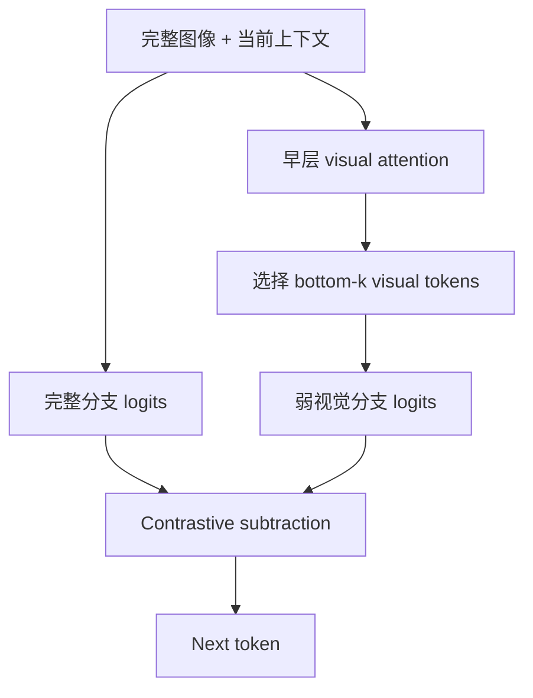

# Self-Introspective Decoding（SID）

arXiv 2024Visual Token / LogitTraining-free已精读

[arXiv](https://arxiv.org/abs/2408.02032){ .kb-button .primary }

<strong>一句话总结</strong>
SID 不用噪声或完全空白图像，而是保留模型当前认为最不重要的少量视觉 tokens，构造“仍与上下文相关但缺关键证据”的 hallucination-amplified branch，再从完整视觉 logits 中减去该分支。

## 官方方法概览图

<figure class="paper-figure">
  
  <figcaption>官方 SID 总览图，来自 arXiv v3 source 的 <code>SID.pdf</code>，展示 CT²S visual-token selection 与完整/弱视觉分支的对比解码。</figcaption>
</figure>

## 1. 论文速览

| 维度 | 内容 |
|---|---|
| 研究对象 | Caption/VQA 中 object、attribute 等视觉不一致幻觉 |
| 核心归因 | 关键视觉证据不足时，模型沿当前文本上下文调用共现 prior |
| 方法类型 | Training-free internal contrastive decoding |
| 干预位置 | 早期 decoder visual-token selection + final logits |
| 外部依赖 | 无 detector、无外部视觉模型；需访问 decoder attention |
| 主要评测 | CHAIR、POPE、SHR、MME、MMBench、质量评估 |
| 最适合角色 | 内部视觉反事实与 contrastive decoding baseline |

## 2. 研究背景与核心矛盾

VCD/ICD 等方法常用加噪图像、遮蔽或 negative prompt 生成对比分支。这些分支可能带来无关 uncertainty，甚至与当前图像/文本脱节。SID 的关键问题是：能否仅使用 LVLM 自身的 attention，从同一图像中构造一个 **context-aware weak-vision branch**？

### 假设与证据

| 假设 | 证据 | 强度 | Confound |
|---|---|---|---|
| 低 attention visual tokens 对当前生成不重要 | early-layer attention ranking | proxy | attention 不等于 causal importance |
| 只保留低重要 tokens 会暴露上下文相关 hallucination prior | 分支候选与定性样例 | 构造性证据 | 可能只是严重信息缺失/OOD |
| subtract 该分支可降低幻觉 | 多模型、多 benchmark 结果 | 输出干预 | 需控制长度/Recall 与额外 forward |

## 3. 方法详解

### 3.1 视觉 token 重要度

在第 (i) 个 decoder layer，attention tensor 为

\[
A_i\in\mathbb{R}^{B\times H\times N\times N},
\]

SID 用当前生成位置对视觉 token (v_j) 的跨 head 平均 attention：

\[
\operatorname{Score}_i(v_j)=\frac{1}{H}\sum_{h=1}^{H}A_i^{(h)}[-1,v_j].
\]

随后选择 bottom-k：

\[
v_{low}=\operatorname{BottomK}_{v_j}\operatorname{Score}_i(v_j).
\]

常见设置是保留约 10% least-important visual tokens；本地精读记录中，LLaVA-1.5/Shikra/LLaVA-NeXT 常用早期第 3 层，InstructBLIP 常用第 5 层，实际复现须以目标代码和 0/1-based indexing 为准。

### 3.2 为什么保留“低重要”而非“高重要”

这些 tokens 不是用来回答正确答案，而是用来构造错误对照。完全 blank/no-image 分支可能退化为纯语言模型；随机噪声分支可能只提高 entropy。(v_{low}) 仍来自原图，保留弱上下文联系，却移除了当前生成依赖的关键 evidence，因而更容易放大“语境上合理、图像中未必存在”的候选。

### 3.3 Contrastive branch

\[
l_{orig}=\operatorname{logit}_\theta(y_t\mid v,x,y_{<t}),
\]

\[
l_{low}=\operatorname{logit}_\theta(y_t\mid v_{low},x,y_{<t}).
\]

最终校正：

\[
l_{SID}=(1+\alpha)l_{orig}-\alpha l_{low}.
\]

如果一个 token 在弱视觉分支仍很高，它更可能主要来自语言共现；subtract 后被压低。定义

\[
\operatorname{SIDGap}_t(y)=l_{orig,t}(y)-l_{low,t}(y)
\]

即可把方法转化为 token-level visual-evidence diagnostic。

### 3.4 Pipeline

## 4. 实验设计与结果审计

### 4.1 设置

| 项目 | 内容 |
|---|---|
| Models | LLaVA-1.5、InstructBLIP、Shikra、LLaVA-NeXT |
| Object hallucination | CHAIR、POPE |
| Fine-grained | GPT-4 assisted SHR |
| General ability | MME、MMBench |
| Quality | GPT-4V assisted correctness/detailedness |
| Baselines | Sampling、Greedy、DoLa、VCD、ICD、OPERA |
| Efficiency | 比 VCD/ICD/OPERA 更轻的主张需按硬件、cache 和实现复测 |

### 4.2 主结果

| 设置 / 指标（方向） | Baseline | SID | 变化 / 解读 | 来源 |
|---|---:|---:|---|---|
| LLaVA-1.5，CHAIR，Sampling，CHAIRs / CHAIRi ↓ | 51.3 / 16.8 | **45.0 / 11.7** | 同采样设置下降 | Table 3 |
| InstructBLIP，CHAIR，Greedy，CHAIRs / CHAIRi ↓ | 54.6 / 13.6 | **42.3 / 12.4** | 跨架构方向一致 | Table 3 |
| LLaVA-1.5，POPE adversarial，Greedy Acc / F1 ↑ | 79.11 / 80.92 | **83.24 / 82.21** | 短答案任务也改善 | Table 4 |
| LLaVA-1.5，MME / MMBench ↑ | 1510.8 / 64.4 | **1520.4 / 65.0** | 未观察到通用能力下降 | Table 5 |
| POPE adversarial 全集时间 / 显存 ↓ | VCD 904 s / 16,753 MB | **668 s / 15,767 MB**（SID 10%） | 比双分支 VCD 更轻，但仍高于 Normal 494 s | Table 6 |

论文结果支持 SID 在 object/fine-grained 指标上的整体收益，并报告通用能力基本保持。重要 ablation 是 selection layer、保留比例、contrastive strength，以及 bottom-k 相对 random/top-k 的差异；若缺少 random-token 同信息量对照，便难证明收益来自“模型内省”而不是任意强视觉破坏。

### 4.3 消融与分析实验

| 实验 | 对照 / 唯一变量 | 关键结果 | 能支持什么 | 仍不能证明什么 | 来源 |
|---|---|---|---|---|---|
| Token selection | bottom-k（least important）vs random/top-k | bottom-k contrastive branch 的 hallucination 诱导/最终校准更好；top-k 更能保持原能力 | “低重要视觉 token 分支”比任意删 token 更有针对性 | attention importance 仍不是因果贡献 | Table 12–13 |
| 保留比例 | 10% vs 40% | adversarial POPE Acc 83.24 vs 83.11；时间 668 vs 704 s | 较小保留集已足够，效率更好 | 只在单模型/任务的默认设置比较 | Table 6 |
| α/β 敏感性 | contrast strength 与 plausibility truncation | SID 对较小 α、较松 β 比 VCD 稳健 | 构造分支比整体视觉扰动噪声更低 | 曲线未给多 seed CI | Figure 8 |
| 大模型迁移 | LLaVA-NeXT 与更大 backbone | CHAIR/POPE 方向保持 | 机制不完全绑定 LLaVA-1.5 | 仍是相近架构，非广泛闭源迁移 | Table 14 |

## 5. 亮点与贡献

- 对比分支来自同一图像和当前上下文，比完全无图/噪声更贴近内部反事实。
- 把 attention-based token selection 与 logit-level contrastive decoding 连接起来。
- 无外部 detector/CLIP，适合研究 LVLM 自身表示。
- SIDGap 可自然转为 hallucination detector 特征或 head-level 分解指标。

## 6. 局限、指标漏洞与审稿风险

1. **Attention importance validity**：平均所有 heads 可能掩盖少量关键视觉 heads；低 attention 不一定低 causal contribution。
2. **Token deletion OOD**：只保留 10% visual tokens 会改变序列长度/位置和分布；需 mask、replace 与 keep-position 对照。
3. **分支成本**：仍需第二分支；“更快”依赖能否复用 early-layer computation/KV cache。
4. **保守化风险**：强 subtract 可能压低长尾但真实对象，必须报 Recall/Cover。
5. **细粒度 evaluator**：SHR 的 LLM evaluator 会引入版本和 prompt 不稳定性。

## 7. 与我的研究关系

### 7.1 与 real/blank 的三分支设计

\[
VR_t=l_{real,t}-l_{blank,t},\qquad
SIDGap_t=l_{full,t}-l_{low,t}.
\]

blank 分支近似语言 prior，SID 分支近似“上下文相关但关键视觉证据缺失”。两者一起能区分纯 prior hallucination 与局部 evidence removal 后才出现的对象混淆。

### 7.2 Baseline 决策

**适合度：High。** 它比 M3ID 更贴近 visual-token/head 机制，比 OPERA 工程更轻。最小复现应先验证 bottom-k vs random-k，以及 SIDGap 对 grounded/hallucinated object token 的区分力。

### 7.3 Head-level 扩展

不要先对 heads 平均。可计算 (Score_i^{(h)}(v_j))，构造 per-head importance 或在保留视觉位置不变的条件下 patch 特定 head 的 visual value/output，从而判断 SID 的有效性是否集中在少量 heads。

## 8. 可执行的后续实验

| 实验 | RQ | Comparison | Outputs | Expected | Failure | Cost |
|---|---|---|---|---|---|---|
| E1 Branch taxonomy | blank/noise/random-k/bottom-k 有何差异？ | 四分支同 token | Δlogit、entropy、AUROC | bottom-k 更上下文相关 | OOD 程度决定结果 | Low |
| E2 Importance validity | attention bottom-k 真是低因果贡献吗？ | attention vs grad×act/patching | rank overlap、Δlogit | 部分一致 | attention proxy 失效 | Medium |
| E3 SIDGap detector | 能否区分 grounded/hall object？ | CHAIR claims | AUROC/AUPRC/CI | hallucinated gap 更小 | tokenization/label noise | Low |
| E4 Risk-gated SID | 只在对象高风险步做双分支？ | full-time vs gated | CHAIR/Recall/latency | 保收益降成本 | gate 漏检 | Medium |

## 9. 复现清单

- [ ] 明确 decoder layer 编号与 token ranges
- [ ] 固定 bottom-k 比例、α、top-k plausibility filter
- [ ] 保留 position 的 mask/replace 对照
- [ ] random-k、top-k 与 blank/noise 分支对照
- [ ] 报告 CHAIR、Recall/Cover、length、latency 与显存

## 10. 综合评分

| 维度 | 评分 | 理由 |
|---|---:|---|
| 新颖性 | 4/5 | 模型自选弱视觉反事实分支 |
| 机制证据 | 3/5 | attention proxy 与 token deletion 仍需因果验证 |
| 实验完整性 | 4/5 | 多模型、多 benchmark 与效率比较 |
| 可复现性 | 4/5 | Training-free；需 attention/双分支 hook |
| 与当前研究相关性 | 5/5 | 连接 token、head、logit 三层反事实 |

## 11. 来源边界

`requires training: no` · `inference-only: yes` · `object detector: no` · `external LLM evaluator: evaluation only` · `interpretability: medium-high` · `baseline suitability: high`

公式与 layer/比例说明来自本地详细精读卡并对照 arXiv 元数据；最终 venue、代码超参数和定量表格应在引用前核对最新版本。
