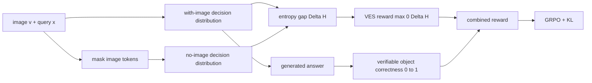

# VES-RFT

CVPR 2026Training-time alignmentGRPO已精读

[CVF 论文页](https://openaccess.thecvf.com/content/CVPR2026/html/Hou_VES-RFT_Rewarding_Visual_Evidence_Sensitivity_to_Mitigate_Hallucinations_in_Large_CVPR_2026_paper.html){ .kb-button .primary }

<strong>一句话总结</strong>
VES-RFT 对同一 query 做有图/无图两次训练前向，用图像带来的任务决策熵下降作为 VES reward，再与对象正确性 verifier 组合进 GRPO；用 2.8k 训练对即可让 LLaVA-1.5 的 POPE Accuracy 82.04→86.96、CHAIR$_S$ 55.6→42.8，同时保持测试时单次有图前向。

## 官方方法概览图

<figure class="paper-figure"><figcaption>官方方法总览（CVPR 2026 Figure 2），从 <a href="https://openaccess.thecvf.com/content/CVPR2026/papers/Hou_VES-RFT_Rewarding_Visual_Evidence_Sensitivity_to_Mitigate_Hallucinations_in_Large_CVPR_2026_paper.pdf">CVF PDF</a>第 2 页直接裁切。下半部分是 VES-RFT；上半部分是与 retraining / inference-time intervention 的范式对比。</figcaption></figure>

## 1. 论文速览

| 维度 | 内容 |
|---|---|
| 研究对象 | language prior 主导下的 object hallucination |
| 核心信号 | 同 query 有图与无图决策分布的 entropy gap |
| 方法类型 | training-time reinforcement fine-tuning；测试时无额外 pass |
| 模型 | LLaVA-1.5-7B、Qwen2.5-VL-7B |
| 训练数据 | 2.8k image–text pairs |
| 主要评测 | POPE、MS-COCO CHAIR、AMBER |
| 外部依赖 | 训练时对象 annotation/weak label verifier；无 critic |

## 2. 研究背景、核心假设与证据

若图像提供任务相关证据，模型对低维决策变量 $Z$ 应比 text-only control 更确定。作者将这一下降解释为视觉证据敏感度，并用 verifier 防止“更确定但错得更自信”。这是合理 proxy，但 entropy 变小既不充分也不必要：多义/遮挡图像可能应增加不确定性，且错误视觉 cue 也可能使分布变尖。

| 假设 | 证据 | 类型 | 风险 |
|---|---|---|---|
| 熵差可表征视觉依赖 | image/no-image 分布与样本 hallucination 的相关分析 | counterfactual correlation | no-image 不是语言先验的唯一基线 |
| 双奖励互补 | 分别去掉 VES/verifier 的组件消融 | 训练组件干预 | verifier 与 benchmark object labels 有闭环 |
| 学到的 grounding 不需测试时修补 | 单次推理及跨 POPE/CHAIR/AMBER 改善 | 端到端结果 | 只覆盖 object-centric 任务 |

## 3. 方法详解

$$
\Delta H(x,v)=H(p_\theta(z\mid x,v=\varnothing))-H(p_\theta(z\mid x,v)),\qquad
r_{ves}=\max(0,\Delta H).
$$

POPE 的 $Z$ 是首 token 上聚合后的 yes/no；CHAIR/AMBER 把对象词表 $O$ 建模为 factorized Bernoulli。总奖励为 $r=r_{verif}+\lambda r_{ves}$，默认 $\lambda=1$。GRPO 以组内相对奖励训练并加 KL regularization。训练每样本多一个 no-image forward 与 group sampling；测试时仅保留更新后的 VLM。

## 4. 实验设计与关键结果

### 4.1 设置

POPE 报 random/popular/adversarial 的 Acc/F1/Yes ratio；captioning 报 CHAIR$_S$/CHAIR$_I$，AMBER 报 Cover/HalRate/Cog。基线含 VCD、M3ID、ICD、RAR、HIO、Octopus、SFT、LLaVA-RLHF、LURE 与多种 DPO。部分数字直接引用原论文，跨方法训练数据和解码口径并不完全一致。

### 4.2 主结果

| 设置 / 指标 | Baseline | VES-RFT | 变化 | 来源 |
|---|---:|---:|---:|---|
| LLaVA，POPE Avg Acc / F1 ↑ | 82.04 / 80.43 | 86.96 / 85.61 | +4.92 / +5.18 | Table 1 |
| Qwen2.5-VL，POPE Avg Acc / F1 ↑ | 84.84 / 70.86 | 88.93 / 87.97 | +4.09 / +17.11 | Table 1；baseline F1 与各 split 值存在明显张力，宜复算 |
| LLaVA，CHAIR$_S$/$_I$ ↓ | 55.6 / 15.8 | 42.8 / 14.0 | −12.8 / −1.8 | Table 2 |
| LLaVA，AMBER HalRate / Cover | 34.7 / 51.6 | 18.9 / 50.6 | hallu −15.8，coverage −1.0 | Table 2 |
| Qwen2.5-VL，CHAIR$_S$/$_I$ ↓ | 37.0 / 9.4 | 28.7 / 7.3 | −8.3 / −2.1 | Table 2 |

### 4.3 消融与分析实验

| 实验 | 关键结果 | 支持什么 | 风险 | 来源 |
|---|---|---|---|---|
| 去掉 VES | LLaVA POPE 86.96→86.03，CHAIR$_S$ 42.8→47.6 | entropy reward 有增量 | 增量小于 verifier | Table 4 |
| 去掉 verifier | POPE 86.96→84.86，CHAIR$_S$ 42.8→51.0 | correctness reward 防止退化 | verifier 是主要收益来源之一 | Table 4 |
| Qwen 双奖励 | full 88.93/28.7；w/o VES 87.80/29.8；w/o verifier 86.23/32.9 | 两项均贡献 | 仍缺只用标准 GRPO 的强匹配对照 | Table 4 |
| 数据效率 | 2.8k 对达到 POPE 86.96 / CHAIR$_S$ 5.2（DPO 对比表的 CHAIR 口径） | 相对少数据 | Table 3 的 CHAIR 列与 Table 2 的 CHAIR$_S$ 不同，易误读 | Table 3 |
| 训练效率 | 83.12s vs SFT 48.34s/step，约 1.72× | 额外成本仅在训练 | 总 GPU-hours、group size 未完整归一 | Sec. 4.4 |

### 4.4 结果边界

可支持“双奖励在两 backbone 上改善 object hallucination，且测试时无额外计算”。不能把 $\Delta H$ 直接称为严格 conditional mutual information：论文也将其定位为便宜、对称 surrogate；此外 verifier 使用对象 reference，不能算完全 annotation-free 的总目标。

## 5. 亮点与贡献

- 把常见的 image/no-image 诊断信号转为可优化 reward，训练/推理成本边界清楚。
- 同时报 hallucination 与 coverage，能看到 AMBER coverage 的轻微损失。
- 双组件消融、DPO 数据效率和 per-step 成本均有量化。

## 6. 局限、指标漏洞与审稿风险

“VES annotation-free”只适用于熵项，联合目标仍需 verifier/reference；$Z$ 的 verbalizer/object mapping 是任务特定的。训练与评测可能共享同一对象词表/检查逻辑，存在 reward–metric alignment。只测试 7B 两类模型与 object hallucination；无多 seed/CI；部分引用基线的口径不可完全比较。Qwen POPE baseline average F1 70.86 与三个 split F1（约 85–87）不一致，必须在复现时审计。

## 7. 与我的研究关系

**Baseline 适合度：Medium。** 它是很好的 training-time 上界，但与 training-free head intervention 成本不同。最有价值的是将 VES 作为 risk/visual-reliance signal，与 token/head 级 RBC、PAS、SADT 比较，特别审查“低熵但错误”的样本。

## 8. 可执行的后续实验

| 实验 | 问题 | 比较 | 输出 | 成本 |
|---|---|---|---|---|
| E1 calibrated VES | entropy gap 是否优于 KL/JS/logit margin？ | 多种有图/无图 divergence | AUROC、reward gain | Medium |
| E2 verifier leakage | 去掉对象 annotation 后还有效吗？ | detector/VLM judge/reference-free | CHAIR、coverage | High |
| E3 token-level reward | sequence-level VES 会否掩盖局部幻觉？ | token/span VES vs global | object precision/recall | High |

## 9. 复现清单

- [x] CVF 正式 PDF、Figure 2、Tables 1–4 与限制已登记
- [ ] 截至 2026-08-21 未发现官方代码/checkpoint
- [ ] 复算 Qwen POPE F1 平均值冲突
- [ ] 冻结 verbalizers、object mappings、group size、KL 与 verifier threshold

## 10. 综合评分

| 新颖性 | 机制证据 | 实验完整性 | 可复现性 | 相关性 |
|---:|---:|---:|---:|---:|
| 4 | 3 | 4 | 3 | 4 |

## 11. 检索标签与来源边界

标签：requires training、GRPO、entropy gap、visual grounding、verifiable reward、POPE、CHAIR。事实来自 CVPR 2026 open-access 正式 PDF；Figure 2 为官方图裁切；公式解读与数据冲突审计为本站分析。截至 2026-08-21 未发现官方代码或公开评审页面。
