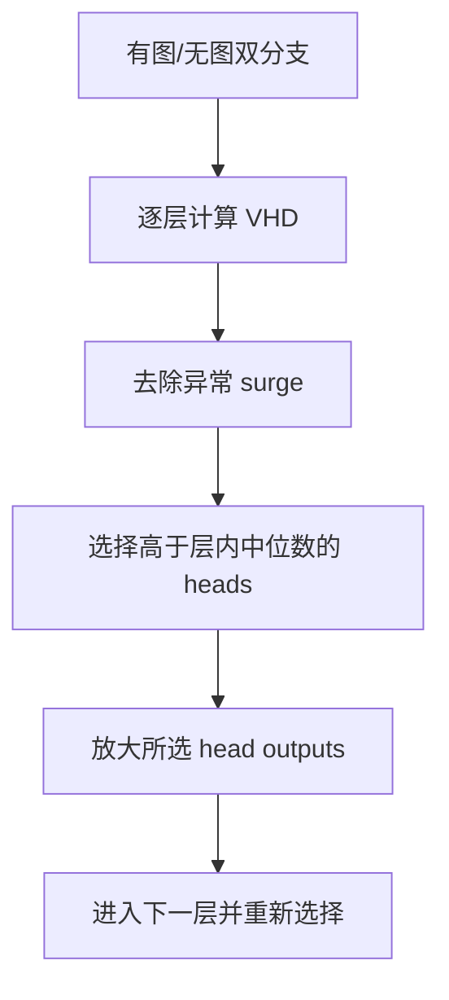

# Vision-aware Head Divergence（VHD / VHR）

ACL 2025 LongHead-levelTraining-free已精读

[ACL Anthology](https://aclanthology.org/2025.acl-long.175/){ .kb-button .primary } [官方代码](https://github.com/jinghan1he/VHR){ .kb-button }

<strong>一句话总结</strong>
VHD 直接测量每个 attention head 在有图与无图输入下的输出差异，并以 top-k VHD 聚合成 token-level visual dependence；VHR 在每个样本、每个生成步逐层选择高 VHD heads 并放大其输出。

## 官方方法概览图

<figure class="paper-figure">
  
  <figcaption>官方 VHD/VHR 框架图，来自 arXiv v3 source 的 <code>figs/framework.pdf</code>：按 VHD 选择视觉敏感 heads，再放大对应 head output。</figcaption>
</figure>

## 1. 论文速览

| 维度 | 内容 |
|---|---|
| 研究对象 | Object hallucination 与生成 token 的视觉依赖 |
| 核心归因 | 只有少量 heads 对视觉条件敏感；hallucinated words 往往对应较低 T-VHD |
| 方法类型 | Training-free analysis metric + dynamic head reinforcement |
| 干预位置 | 单 head output，经 output projection 前后的实现需按代码确认 |
| 外部依赖 | 无 detector/外部 evaluator 参与核心方法；需有图/无图双分支 |
| 主要评测 | CHAIR、POPE、LLaVA-Bench-in-the-Wild |
| 最适合角色 | Head-level visual-dependence metric 与动态 intervention baseline |

## 2. 研究背景与核心假设

Attention weight 只能说明“query 把多少权重分给 image tokens”，不能说明 value 内容与最终 residual contribution 是否因图像而改变。VHD 因此比较 head **output**，将“视觉敏感性”定义为同一 head 对视觉条件移除的响应。

| 假设 | 证据 | 强度 | Confound |
|---|---|---|---|
| Vision awareness 稀疏分布于 heads | 全层 VHD 热图 | 反事实测量 | 无图输入是 OOD；距离受 output norm 影响 |
| 低 T-VHD 与 hallucination 相关 | 500 COCO 图上的 object token 分组与显著性检验 | 统计关联 | token 类型与生成位置可能混淆 |
| 强化高 VHD heads 可减幻觉 | VHR 多模型、多 benchmark | 动态干预 | 强化也改变 residual scale 与生成风格 |

## 3. 方法详解

### 3.1 VHD

对于层 (l)、head (i)、生成 token (y_t)，论文定义：

\[
\operatorname{VHD}_{l,i}=d\Bigl(A_{l,i}(y_t\mid y_{<t},x_V,x_T),
A_{l,i}(y_t\mid y_{<t},x_T)\Bigr),
\]

其中 (A_{l,i}) 表示该 head 的输出，(x_V) 是视觉输入，(x_T) 是文本 prompt，(d) 是输出差异度量。高值表示该 head 在移除图像后明显变化，即对视觉条件敏感。

### 3.2 Token-VHD

为避免大量视觉不敏感 heads 稀释信号，论文只聚合每层/全模型中最大的 (k) 个 head divergence：

\[
\operatorname{T\mbox{-}VHD}_t=\frac{1}{k}\sum_{(l,i)\in \operatorname{TopK}}\operatorname{VHD}_{l,i,t}.
\]

这使 T-VHD 成为当前 token step 的 visual sensitivity proxy。它仍不是 correctness metric：错误视觉信号也可产生高 T-VHD。

### 3.3 VHR

论文采用 layer-by-layer select-then-reinforce，而不是先一次性选择所有层：前层被强化后会改变后层表示，重新计算能保持选择与当前 residual state 一致。还会过滤超过层内均值加标准差的异常 VHD surge，避免数值异常被误当作视觉能力。

## 4. 实验设计与关键结果

| 项目 | 内容 |
|---|---|
| Models | InstructBLIP-7B、LLaVA-1.5-7B、LLaVA-NeXT-7B |
| CHAIR | COCO 随机 500 图；CHAIRs/CHAIRi、长度；主结果为 5 个随机 split 平均 |
| POPE | popular/random/adversarial F1 平均 |
| Open-ended quality | LLaVA-Bench-in-the-Wild，GPT-4o 评价 accuracy/detailedness/naturalness |
| Baselines | Greedy、Beam、DoLa、VCD、OPERA、CODE、EAH |
| Ablations | static heads、异常值过滤、reinforced layers、scale factor |

论文报告 LLaVA-1.5 上最高可将 CHAIRs/CHAIRi 分别降低 16.36/4.61 个点，并显示强化层数增加先改善幻觉、过度强化后损害生成质量。这个拐点非常重要：VHD 不是“越强越好”，视觉敏感 head 也承担正常语言/语义功能。

## 5. 亮点与贡献

- 从 attention mass 前进到 head output counterfactual，更接近可干预变量。
- 指标和干预都按 sample/token 动态变化，避免静态通用 head set 的强假设。
- 提供多 split 平均、层数/强度 ablation 和 static-head 对照。
- 直接连接分析指标（T-VHD）与方法（VHR），易于检验 metric-action consistency。

## 6. 局限、指标漏洞与审稿风险

1. **无图分支 confound**：文本格式与视觉占位符如何处理会影响 divergence。
2. **Norm confound**：欧氏输出差异可能偏爱高 norm heads；需 cosine、relative norm 与 whitened distance 对照。
3. **视觉敏感≠视觉正确**：高 VHD 可能来自错误区域或视觉噪声。
4. **残差缩放副作用**：放大 head output 同时改变 residual norm；需 norm-matched intervention。
5. **Recall 与生成质量**：论文已观察过度强化伤害质量，复现必须画 Pareto curve。

## 7. 与我的研究关系

VHD 是 token-level logits VR 的 head-level counterpart。可建立三层链条：

\[
\Delta h^{head}_{real-blank}
\rightarrow
\Delta r^{layer}_{real-blank}
\rightarrow
\Delta l^{token}_{real-blank}.
\]

若 head divergence 高但 logit VR 低，说明视觉变化被后续层抵消；若二者都高但 token hallucinate，问题更可能是 visual-semantic misalignment；若都低，则支持 prior dominance。

**Baseline 适合度：High。** 优先复现 T-VHD 作为 analysis baseline，再评估 VHR。需要 hook head outputs 和双分支 forward，但不需训练或 detector。

## 8. 可执行的后续实验

| 实验 | RQ | Comparison | Outputs | Expected | Failure | Cost |
|---|---|---|---|---|---|---|
| E1 多距离 VHD | 结果是否被 norm 支配？ | L2/cosine/relative/whitened | AUROC、head overlap | 相对距离更稳 | 各指标差异大 | Low |
| E2 Causal chain | VHD 是否写入目标 logits？ | head patch + logit lens | Δresidual、Δlogit | 仅部分高 VHD heads有效 | 后层抵消 | Medium |
| E3 Hall onset | T-VHD 是否提前下降？ | hallucination 前 5 步 | lead time、AUPRC | onset 前出现下降 | 仅目标 token 当步变化 | Low |
| E4 Norm-matched VHR | 收益来自方向还是 scale？ | VHR vs random/norm-matched | CHAIR/Recall/quality | 定向 VHR 更优 | 纯 scale 效应 | Medium |

## 9. 复现清单

- [ ] 明确 head output 是 (AV) 还是经 (W_O) 后切片
- [ ] 固定无图/空白分支与位置编码
- [ ] 报告 VHD distance、top-k、过滤规则、强化层与 α
- [ ] 同时报 CHAIR、Recall、length、质量与显存/速度
- [ ] 使用随机 head、static head、norm-matched 对照

## 10. 综合评分

| 维度 | 评分 | 理由 |
|---|---:|---|
| 新颖性 | 4/5 | head-output 双分支差异与动态强化结合 |
| 机制证据 | 4/5 | 统计检验 + 干预；仍有 norm/OOD confound |
| 实验完整性 | 4/5 | 多模型、多 split、关键 ablation |
| 可复现性 | 4/5 | 有代码；需要模型内部 hook |
| 与当前研究相关性 | 5/5 | 正是 head-level real/blank counterfactual |

## 11. 来源边界

`requires training: no` · `inference-only: yes` · `object detector: no` · `external LLM evaluator: quality evaluation only` · `interpretability: high` · `baseline suitability: high`

公式、500 图与 5 split 设置、主要变化值和算法细节依据 ACL 论文；因果链、norm-matched 对照和与 VR 的连接属于后续研究设计。
