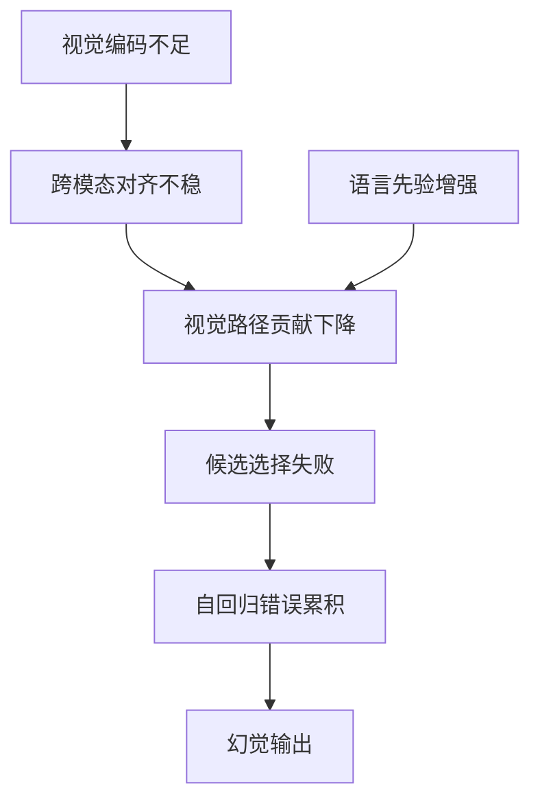

# VLM Hallucination 研究版图

单一树状文件夹无法表达一篇论文的多个角色。本库采用“页面导航 + Deep Paper Note 元数据 + tags”三层结构，使同一工作可同时被归入研究方向、资源类型和论文来源。

## 四个分类轴

| 分类轴 | 主要取值 | 研究用途 |
|---|---|---|
| Hallucination type | object、attribute、relation、counting、reasoning、long-form | 明确方法实际解决了什么错误 |
| Failure mechanism | visual encoding、alignment、language prior、selection failure、error accumulation | 比较论文的核心因果假设 |
| Intervention level | image/token、head/path、residual/MLP/KV、logit/decoding、output | 组织 baseline 与消融实验 |
| Resource type | method、survey、benchmark/metric、dataset、experiment note | 区分“方法证据”和“评测工具” |

## 机制链条

## 当前重点

1. **Token / Logit**：真实图像与空白/反事实图像下的 next-token distribution 差异。
2. **Attention Head / Path**：vision-aware heads、hallucination heads 与 I2T/T2T 路径竞争。
3. **Representation**：残差流、MLP 与 KV 中的错误语义写入和放大。
4. **Dynamic intervention**：只在实体风险窗口触发干预，降低 recall 和生成质量损失。
5. **Evaluation audit**：不允许只报告 hallucination rate，必须同时检查 recall、coverage、length、repetition 和 general capability。

## 推荐阅读顺序

=== "从 Logit 入门"

    1. [VISOR](papers/visor.md)
    2. [Same Attention, Different Truths](papers/same-attention-different-truths.md)
    3. [M3ID](papers/m3id.md)
    4. [Self-Introspective Decoding](papers/self-introspective-decoding.md)

=== "从 Head 机制入门"

    1. [Role-Break](papers/role-break-attention-heads.md)
    2. [Modular Attribution & Intervention](papers/modular-attribution-intervention.md)
    3. [Vision-aware Head Divergence](papers/vision-aware-head-divergence.md)
    4. [Intervene-All-Paths](papers/intervene-all-paths.md)

=== "从解码干预入门"

    1. [OPERA](papers/opera.md)
    2. [M3ID](papers/m3id.md)
    3. [Self-Introspective Decoding](papers/self-introspective-decoding.md)

=== "从表征编辑入门"

    1. [Beyond Global Editing](papers/beyond-global-editing.md)
    2. [VISOR](papers/visor.md)
    3. [Modular Attribution & Intervention](papers/modular-attribution-intervention.md)
