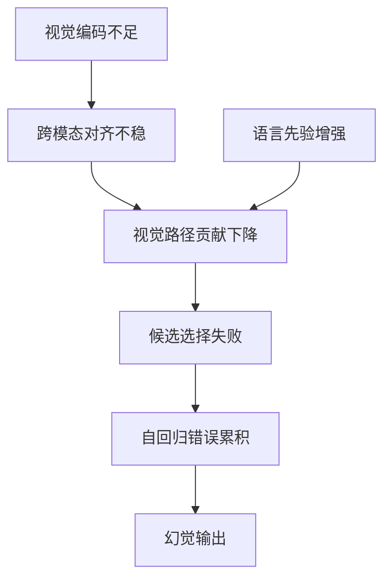

# VLM Hallucination 研究版图

单一树状文件夹无法表达一篇论文的多个角色。本库采用“页面导航 + Deep Paper Note 元数据 + tags”三层结构，使同一工作可同时被归入研究方向、资源类型和论文来源。

## 四个分类轴

| 分类轴 | 主要取值 | 研究用途 |
|---|---|---|
| Hallucination type | object、attribute、relation、counting、reasoning、long-form | 明确方法实际解决了什么错误 |
| Failure mechanism | visual encoding、alignment、language prior、selection failure、error accumulation | 比较论文的核心因果假设 |
| Intervention level | image/token、head/path、residual/MLP/KV、logit/decoding、output | 组织 baseline 与消融实验 |
| Resource type | method、survey、benchmark/metric、dataset、experiment note | 区分“方法证据”和“评测工具” |

## 机制链条

```mermaid
flowchart TD
    V[视觉编码不足] --> A[跨模态对齐不稳]
    A --> H[视觉路径贡献下降]
    P[语言先验增强] --> H
    H --> S[候选选择失败]
    S --> E[自回归错误累积]
    E --> O[幻觉输出]
```

## 当前重点

1. **Token / Logit**：真实图像与空白/反事实图像下的 next-token distribution 差异。
2. **Attention Head / Path**：vision-aware heads、hallucination heads 与 I2T/T2T 路径竞争。
3. **Representation**：残差流、MLP 与 KV 中的错误语义写入和放大。
4. **Dynamic intervention**：只在实体风险窗口触发干预，降低 recall 和生成质量损失。
5. **Evaluation audit**：不允许只报告 hallucination rate，必须同时检查 recall、coverage、length、repetition 和 general capability。

## 推荐阅读顺序

=== "从 Logit 入门"

    1. [Risk-aware Selective Prompting](papers/risk-aware-selective-prompting.md)
    2. [VISOR](papers/visor.md)
    3. [Same Attention, Different Truths](papers/same-attention-different-truths.md)
    4. [PatchGate](papers/patchgate.md)
    5. [M3ID](papers/m3id.md)
    6. [Self-Introspective Decoding](papers/self-introspective-decoding.md)
    7. [MARINE](papers/marine-image-grounded-guidance.md)

=== "从 Head 机制入门"

    1. [NOTICE](papers/notice.md)
    2. [HEAL](papers/heal-synergy-heads.md)
    3. [Dual-Pathway Circuits](papers/dual-pathway-circuits.md)
    4. [Prompt-Induced Hallucination](papers/prompt-induced-hallucination.md)
    5. [AdaIAT](papers/adaiat.md)
    6. [PAS](papers/pas-prelim-attention-score.md)
    7. [Attention-Space Contrastive Guidance](papers/attention-space-contrastive-guidance.md)
    8. [CausalLens](papers/causallens.md)
    9. [Role-Break](papers/role-break-attention-heads.md)
    10. [Modular Attribution & Intervention](papers/modular-attribution-intervention.md)
    11. [Vision-aware Head Divergence](papers/vision-aware-head-divergence.md)
    12. [Intervene-All-Paths](papers/intervene-all-paths.md)
    13. [Hallucination Begins Where Saliency Drops](papers/hallucination-begins-where-saliency-drops.md)

=== "从解码干预入门"

    1. [OPERA](papers/opera.md)
    2. [M3ID](papers/m3id.md)
    3. [Self-Introspective Decoding](papers/self-introspective-decoding.md)
    4. [MARINE](papers/marine-image-grounded-guidance.md)

=== "从表征编辑入门"

    1. [Pixels Versus Priors](papers/pixels-versus-priors.md)
    2. [MESA](papers/mesa-mitigating-entangled-steering.md)
    3. [Beyond Global Editing](papers/beyond-global-editing.md)
    4. [HulluEdit](papers/hulluedit.md)
    5. [HIRE](papers/hire-intermediate-representation-edit.md)
    6. [DMAS](papers/dynamic-multimodal-activation-steering.md)
    7. [VISOR](papers/visor.md)
    8. [Modular Attribution & Intervention](papers/modular-attribution-intervention.md)

=== "从评测与训练入门"

    1. [ROHE 与 oDPO](papers/removed-object-hallucination-odpo.md)
    2. [PAS](papers/pas-prelim-attention-score.md)
    3. [PatchGate](papers/patchgate.md)
    4. [VES-RFT](papers/ves-rft.md)
    5. [Risk-aware Selective Prompting](papers/risk-aware-selective-prompting.md)

## 从初始证据到后续输出

- [FLB](papers/first-logit-boosting.md)：首步logits → 后续候选偏置；Table 5要求区分视觉证据与冠词效应。
- [PTI](papers/prefill-time-intervention.md)：对象/背景对比方向 → 初始KV；Table 5与Supplement Figure 6要求检查F1/长度代价。

这是本站按干预位置组织的比较，不宣称两篇互引或机制相同。AdaIAT补充了“生成历史attention作为视觉证据载体”，HulluEdit补充了“逐token在线低秩子空间”路线；二者的监督、位置混淆与语义保护边界分别见Note。完整阅读路径见[CVPR矩阵](venues/vision.md#cvpr)，扫描证据见[2026-10-10核验](reading-notes/research-atlas-20261010.md)。
